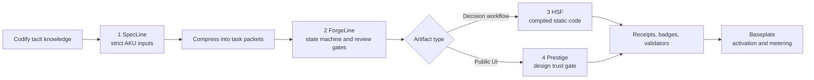

# Atomic Knowledge Unit Standard

Code Factory is designed around Knowledge Activation: convert private
institutional knowledge into compact, executable guidance that an agent can use
at the moment of action.

The practical unit is the Atomic Knowledge Unit, or AKU. An AKU is not a wiki
page. It is a small, action-ready skill with deterministic checks.

## Why AKUs

Generic agents know public patterns, not your private architecture, deployment
rituals, compliance rules, or team conventions. Without explicit activation,
they guess, fail, get corrected, and fill the context window with noise.

AKUs reduce that tax by optimizing for knowledge density:

```text
value for this task / token cost
```

High-density AKUs give the agent the exact operating rules without dumping long
manuals into the prompt.

## Seven-Part Schema

Every durable Code Factory skill should have these seven parts:

| Part | Purpose |
|---|---|
| Intent | When this unit should activate. |
| Procedure | The ordered steps the agent follows. |
| Tools | Exact CLIs, APIs, files, or functions it may use. |
| Metadata | Owner, service, environment, tier, and source of truth. |
| Governance | Permission boundaries, blast radius, compliance constraints. |
| Continuations | Where to route next on success, failure, or escalation. |
| Validators | Deterministic pre, post, and invariant checks. |

## How The Five Repos Map



## Governance Gradient

| Level | Required evidence | Good fit |
|---|---|---|
| Human-controlled | Minimal validators; human signs each step. | Production-risky or irreversible changes. |
| Supervised | Pre/post validators plus human checkpoints. | Staging, medium-risk changes, new AKUs. |
| Autonomous | Pre, post, and invariant validators with clean history. | Reversible, repeated, well-tested workflows. |

The rule is simple: more autonomy requires more deterministic evidence.

## Topology

AKUs should compose into a navigable topology:

- Registry answers: what units exist?
- Topology answers: what comes next?
- Activation policy answers: may this agent use this unit here?

That topology is the long-term shape of Code Factory: many small, validated
units that route agents through paved lanes.
