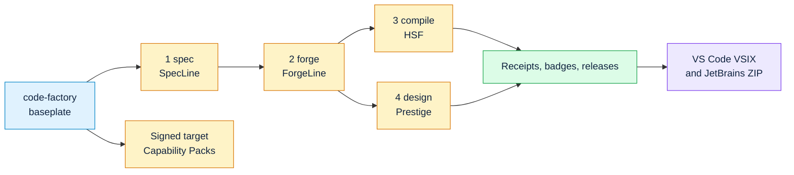

# Code Factory Publication Guide

This is the public release playbook for the five-repo Code Factory set. Publish
the baseplate first, then the numbered bricks in order.

## Repo Order



1. `code-factory`: the baseplate and public map of the ecosystem.
2. `code-factory-1-spec`: turns intent into strict specs and task packets.
3. `code-factory-2-forge`: runs the gated build state machine.
4. `code-factory-3-compile`: compiles decision workflows into deterministic Python.
5. `code-factory-4-design`: audits and improves public UI quality.

## GitHub Publish Steps

Run this inside each repo after creating an empty public GitHub repository:

```bash
git init
git add .
git commit -m "Initial public release"
git branch -M main
git remote add origin https://github.com/YOUR_ORG/REPO_NAME.git
git push -u origin main
```

Recommended GitHub topics:

```text
llm, ai-agents, prompt-injection, deterministic, workflow-engine,
software-factory, ci, python, codex, claude-code
```

Enable Issues and Discussions. Pin an issue titled `Share your spec` so users
can contribute workflow examples.

## Install And Use

```bash
pip install factoryline-code-factory==0.19.0 code-factory-1-spec==0.5.4 code-factory-2-forge==0.10.7 code-factory-3-compile==0.5.5 code-factory-4-design==0.7.4

factory doctor
factory pack list
factory create "Build a governed approval tracker" --target web --out approval-tracker
factory opinion init --root . --owner product-owner
factory plan
factory init .
factory assemble my_feature
factory meter
```

## PyPI Trusted Publishing

This repo publishes with PyPI Trusted Publishing. Release validation runs with
read-only repository access and produces one immutable artifact bundle. Only
the downstream deployment job enters the protected `pypi` GitHub environment,
receives `id-token: write` and release-write access, and exchanges its
short-lived GitHub OIDC identity for a scoped PyPI upload token. No PyPI API
token, username, or password is read by the workflow.

The publish action also emits PyPI attestations for the wheel and source
distribution. Those attestations bind the uploaded files to the GitHub Actions
identity; they do not replace the package tests, Twine checks, clean-wheel
smoke, or protected-environment approval that run before publication.

Pull requests also run the package contract: build the wheel and source
distribution, run `twine check`, install the wheel into an isolated environment
outside the source tree, invoke the CLI, and preserve the distributions as a CI
artifact.

The existing PyPI project must keep this trusted publisher registration:

```text
PyPI project name : factoryline-code-factory
Owner             : zrk222
Repository name   : code-factory
Workflow name     : publish.yml
Environment name  : pypi
```

The repository regression test rejects a publish workflow that removes the
OIDC permission/environment boundary or restores `user`, `password`,
`PYPI_TOKEN`, or `API_TOKEN` credentials. If any identity field above changes,
update PyPI first, then update the workflow in the same reviewed change.

Useful checks before release:

```bash
python -m pytest -q
python -m build
python -m twine check dist/*
pip install dist/factoryline_code_factory-*.whl
factory --help
```

Current release media:

- `docs/assets/code-factory-quickstart-v0171.mp4`: 60-second narrated quick start
  built from the exact Factory Studio capture.
- `docs/assets/code-factory-quickstart-cover-v0171.png`: video cover.
- `docs/assets/factory-studio-control-room-1080.png`: exact 1920x1080 Studio
  source frame used by the Remotion composition.
- `media/code-factory-quickstart/`: reproducible Remotion source and narration
  input. Re-render with `npm install` followed by `npm run render`.
- `docs/assets/how-it-works/`: nine owner-supplied concept illustrations with
  an ordered SHA-256 manifest. They explain the workflow; they are not UI
  screenshots or measured outcome evidence.
- `docs/HOW_IT_WORKS_VISUAL.md`: the accessible nine-stage visual walkthrough
  used by GitHub, the PyPI long description, Product Hunt preparation, and the
  Zenodo source archive.

Verify the MP4 before attaching it to a release:

The publish workflow attaches the MP4, cover, and nine concept illustrations to
every GitHub release.
The README uses an absolute raw cover URL and the versioned release-asset URL
so the same video entry renders correctly on GitHub and PyPI.

For Product Hunt, use `docs/PRODUCT_HUNT_GALLERY.md`. Product Hunt currently
requires at least two gallery images, recommends 1270 x 760, and accepts a full
YouTube URL for video entries. The supplied concepts are 1122 x 1402 portrait
PNGs, so preview them without destructive cropping before publishing.

```powershell
ffprobe -v error -show_entries format=duration -show_streams `
  docs/assets/code-factory-quickstart-v0171.mp4
```

## Claude Code And Codex

Use SpecLine to write agent instructions into the repo:

```bash
specline agent claude
specline agent codex
```

Claude Code reads the generated `CLAUDE.md`. Codex reads the generated or
updated `AGENTS.md`. After that, ask the agent to follow the Code Factory flow:

```text
Use SpecLine for the spec, ForgeLine for the build loop, HSF for deterministic
decision logic, and Prestige for public UI changes. Run the gates and report
the receipts before calling the work done.
```

For global Codex use on one machine, install the corresponding Codex skill under
your Codex skills directory and add the same policy to the global `AGENTS.md`.
Keep repository-local instructions in the public repos so contributors get the
same workflow without needing your private setup.

## Why This Saves Time And Money

Code Factory saves time by catching expensive failures earlier:

- Atomic Knowledge Units activate dense institutional guidance at the point of
  work, reducing the senior-engineer correction tax.
- SpecLine rejects ambiguity before an agent writes drifting code.
- ForgeLine forces architecture, implementation, review, runtime smoke, and
  promotion through repeatable gates.
- HSF compiles recurring decision logic into static Python, so each future run
  avoids a model call.
- Prestige catches public UI trust and conversion problems before release.
- Receipts replace hand-copied claims, so CI proves the project on every push.

The money story should stay evidence-owned: use `factory meter`, HSF receipts,
and generated badges instead of manually typing savings claims.

## Launch Links

- Hacker News Show HN: <https://news.ycombinator.com/show>
- Lobste.rs: <https://lobste.rs/>
- PyPI publishing: <https://pypi.org/>
- Zenodo new upload: <https://zenodo.org/uploads/new>
- Reddit r/Python: <https://www.reddit.com/r/Python/>
- Reddit r/LLMDevs: <https://www.reddit.com/r/LLMDevs/>
- Reddit r/AI_Agents: <https://www.reddit.com/r/AI_Agents/>
- Reddit r/programming: <https://www.reddit.com/r/programming/>

Suggested Show HN title:

```text
Show HN: A factory that compiles LLM workflows into deterministic, gated Python
```

Lead with the injection demo for the compile repo:

```text
Prompt injection cannot reach code that has no prompt.
```

Enterprise angle:

```text
The factory turns private engineering knowledge into Atomic Knowledge Units:
small, validated skills with tools, governance, continuations, and receipts.
```

## Release Checklist

Before pushing each repo:

```bash
python -m pytest -q
python -m build
```

Then remove generated local artifacts before committing:

```text
build/
dist/
*.egg-info/
__pycache__/
.pytest_cache/
```

After publishing:

1. Add the demo GIF near the top of the compile repo README.
2. Confirm PyPI published successfully so `pip install factoryline-code-factory` works.
3. Create GitHub releases for all five repos.
4. Create a Zenodo record for the architecture/release artifact.
5. Post the Show HN only after all install links and CI badges work.
