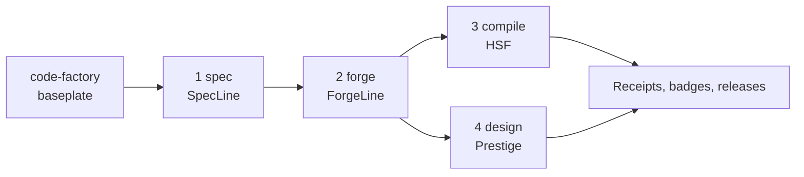

# Code Factory Publication Guide

This is the public release playbook for the five-repo Code Factory set. Publish
the baseplate first, then the numbered bricks in order.

## Repo Order



1. `code-factory`: the baseplate and public map of the ecosystem.
2. `code-factory-1-spec`: turns intent into strict specs and task packets.
3. `code-factory-2-forge`: runs the gated build state machine.
4. `code-factory-3-compile`: compiles decision workflows into deterministic Python.
5. `code-factory-4-design`: audits and improves public UI quality.

## GitHub Publish Steps

Run this inside each repo after creating an empty public GitHub repository:

```bash
git init
git add .
git commit -m "Initial public release"
git branch -M main
git remote add origin https://github.com/YOUR_ORG/REPO_NAME.git
git push -u origin main
```

Recommended GitHub topics:

```text
llm, ai-agents, prompt-injection, deterministic, workflow-engine,
software-factory, ci, python, codex, claude-code
```

Enable Issues and Discussions. Pin an issue titled `Share your spec` so users
can contribute workflow examples.

## Install And Use

```bash
pip install code-factory code-factory-1-spec code-factory-2-forge \
            code-factory-3-compile code-factory-4-design

factory doctor
factory plan
factory init .
factory assemble my_feature
factory meter
```

## Claude Code And Codex

Use SpecLine to write agent instructions into the repo:

```bash
specline agent claude
specline agent codex
```

Claude Code reads the generated `CLAUDE.md`. Codex reads the generated or
updated `AGENTS.md`. After that, ask the agent to follow the Code Factory flow:

```text
Use SpecLine for the spec, ForgeLine for the build loop, HSF for deterministic
decision logic, and Prestige for public UI changes. Run the gates and report
the receipts before calling the work done.
```

For global Codex use on one machine, install the corresponding Codex skill under
your Codex skills directory and add the same policy to the global `AGENTS.md`.
Keep repository-local instructions in the public repos so contributors get the
same workflow without needing your private setup.

## Why This Saves Time And Money

Code Factory saves time by catching expensive failures earlier:

- Atomic Knowledge Units activate dense institutional guidance at the point of
  work, reducing the senior-engineer correction tax.
- SpecLine rejects ambiguity before an agent writes drifting code.
- ForgeLine forces architecture, implementation, review, runtime smoke, and
  promotion through repeatable gates.
- HSF compiles recurring decision logic into static Python, so each future run
  avoids a model call.
- Prestige catches public UI trust and conversion problems before release.
- Receipts replace hand-copied claims, so CI proves the project on every push.

The money story should stay evidence-owned: use `factory meter`, HSF receipts,
and generated badges instead of manually typing savings claims.

## Launch Links

- Hacker News Show HN: <https://news.ycombinator.com/show>
- Lobste.rs: <https://lobste.rs/>
- PyPI publishing: <https://pypi.org/>
- Zenodo new upload: <https://zenodo.org/deposit>
- Reddit r/Python: <https://www.reddit.com/r/Python/>
- Reddit r/LLMDevs: <https://www.reddit.com/r/LLMDevs/>
- Reddit r/AI_Agents: <https://www.reddit.com/r/AI_Agents/>
- Reddit r/programming: <https://www.reddit.com/r/programming/>

Suggested Show HN title:

```text
Show HN: A factory that compiles LLM workflows into deterministic, gated Python
```

Lead with the injection demo for the compile repo:

```text
Prompt injection cannot reach code that has no prompt.
```

Enterprise angle:

```text
The factory turns private engineering knowledge into Atomic Knowledge Units:
small, validated skills with tools, governance, continuations, and receipts.
```

## Release Checklist

Before pushing each repo:

```bash
python -m pytest -q
python -m build
```

Then remove generated local artifacts before committing:

```text
build/
dist/
*.egg-info/
__pycache__/
.pytest_cache/
```

After publishing:

1. Add the demo GIF near the top of the compile repo README.
2. Publish packages to PyPI so `pip install ...` works.
3. Create GitHub releases for all five repos.
4. Create a Zenodo record for the architecture/release artifact.
5. Post the Show HN only after all install links and CI badges work.
