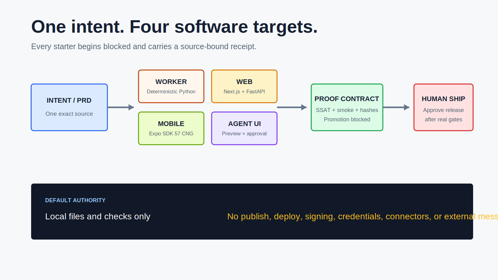
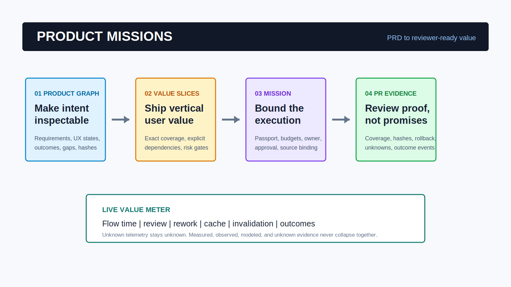
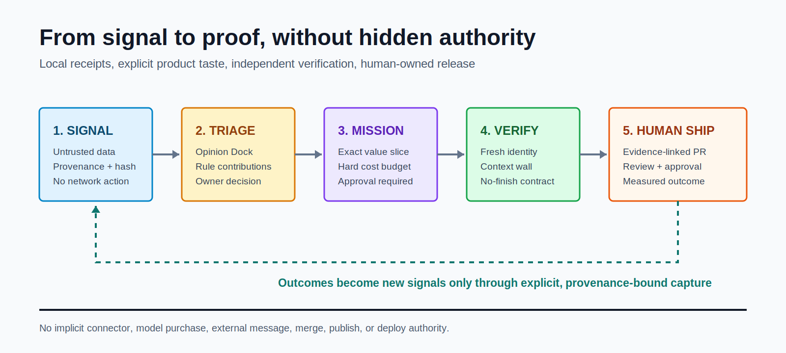
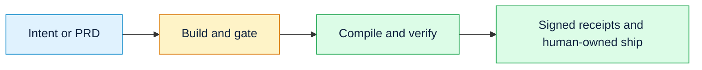

# code-factory

[](https://github.com/zrk222/code-factory/actions/workflows/ci.yml)
[](https://pypi.org/project/factoryline-code-factory/)
[](https://pypi.org/project/factoryline-code-factory/)

> One intent, seven software targets, and proof that the gates reject
> deliberately sabotaged builds.



## 60-second first run

[](https://github.com/zrk222/code-factory/releases/download/v0.17.0/code-factory-quickstart-v016.mp4)

[Watch or download the 60-second MP4](https://github.com/zrk222/code-factory/releases/download/v0.17.0/code-factory-quickstart-v016.mp4).
The absolute cover and release-asset URLs render from both GitHub and PyPI.

The one-minute walkthrough is rendered from an actual 1920x1080 Factory
Studio capture. Its focus frames point to the shipped Product Graph, value
slice, approval, proof, and Meter v2 panels; it does not substitute a mock
dashboard for the product UI.

Use Code Factory to create an app-shaped starting state, then immediately see
which requirements it refuses to certify without real tests:

```bash
pip install factoryline-code-factory==0.17.0
factory targets --json
factory create "Build a simple approval tracker with an audit log" --target web --deployment-profile local-split --out approval-tracker --purpose saas
factory coverage --root approval-tracker --json
```

The last command intentionally exits nonzero on a fresh starter. It reports
`"dominant_failure_class": "hollow_coverage"` for every product requirement
that lacks a non-hollow test. The scaffold is useful starting state, not
software the factory pretends is ready to ship.

Use the same `factory create` command with `--target cli`, `api`, `mcp`,
`worker`, `web`, `mobile`, or `agent-ui`. Select a deployment route from `factory targets --json`; the
local or preview route is the safe default. Every output starts blocked and includes a governance manifest,
SSAT, smoke hook, Mermaid map, and source-bound compile receipt. Open the local
builder with `factory studio`, or from the VS Code and JetBrains integrations.
See [Target Compiler and Factory Studio](docs/TARGET_COMPILER.md).

## Signed Capability Packs

The seven starter targets and 22 composable surface, language, capability,
data, and operations contracts now come from 29 first-party Capability Packs.
Every pack binds its complete file map to an offline DSSE Ed25519 signature and
must reject ten structural mutations before it can be installed or composed.

```powershell
factory pack list
factory pack validate factoryline/builtin_packs/target-worker
factory pack install factoryline/builtin_packs/target-worker --root .
factory pack compose factoryline/builtin_packs/target-web `
  factoryline/builtin_packs/surface-nextjs `
  factoryline/builtin_packs/language-typescript `
  factoryline/builtin_packs/capability-auth --root . --name review-portal
```

Pack installation grants no execution, network, connector, deployment,
publication, signing, or external-message authority. See
[Capability Packs](docs/CAPABILITY_PACKS.md).

For target-by-target local, preview, and release routes, prerequisites, checks,
and approval boundaries, see the [Deployment Guide](docs/DEPLOYMENT_GUIDE.md).

## Product Missions: PRD to reviewer-ready value

Version 0.17 completes the deterministic product-engineering layer above the existing
spec-to-proof pipeline. It compiles a PRD into stable requirement atoms and a
gap-audited Product Graph, assigns every requirement exactly once to a bounded
value slice, and creates a supervised, hard-budgeted mission with a hash-bound
Loop Passport. The output is an evidence-linked PR draft and a classified
outcome chain, not an agent with hidden production authority.



```powershell
factory product compile .\PRD.md --root . --json
factory product slices .\.factory\products\<project>\product_graph.json --root . --json
factory mission create .\.factory\products\<project>\value_slices.json <slice-id> `
  --root . --owner engineering-lead --executor codex --json
```

The live Meter v2 adds queue, review, rework, cache, invalidation, and outcome
telemetry while preserving unknown values as unknown. Open the same workflow in
Factory Studio or through the explicit Product Missions command in VS Code and
all supported JetBrains IDEs. See [Product Missions](docs/PRODUCT_MISSIONS.md).

## Migration Missions: no finish without proof

Large migrations can bind an executable readiness receipt before a Mission is
created. Eight lanes are checked independently: unit, integration, E2E,
lint/type, architecture, coverage/fuzz, reproducible environment, and
telemetry/security. `lane_registration_pct` is never presented as behavioral
proof; only hash-bound executed evidence contributes to
`executable_proof_pct`.

```powershell
factory migration assess .\migration-readiness.json --root . --json
factory context build --root . --json
factory mission create <value-slices.json> <slice-id> --root . `
  --owner migration-owner --executor codex `
  --readiness .\.factory\migration\readiness.json --json
```

Every mission binds falsifiable hypotheses to exact completion criteria. A
user-facing slice also receives a computer-control criterion with an exact URL,
fewer-than-four-interaction ceiling, passing assertions, and hashed visual evidence.
Independent validators cannot see creator transcripts or failed-attempt
history. See [Migration Missions](docs/MIGRATION_MISSIONS.md).

## Signal Loop: owner-governed demand to independent proof

Signal Loop accepts explicitly supplied GitHub, Slack, Sentry, social,
telemetry, internal, or manual evidence as untrusted local data. A compact
owner-controlled Opinion Dock records product taste, architecture guardrails,
temporary hands-off rules, and abstract cost/quality profiles. Explainable
triage cannot promote work until a Product Owner records a bound decision.



```powershell
factory opinion init --root . --owner product-owner --json
factory signal capture --root . --source github --authorization owner_supplied `
  --title "Export audit evidence" --body "Operators need a local export." --json
factory signal triage <signal.json> <opinion_dock.json> --root . --json
```

Complete approved facts compile into the Product Graph; incomplete facts stop
at a needs-input PRD draft. Mission owners receive an approval-ready Studio
panel or may choose **Auto-resolve safe gaps**, which is limited to deterministic
local corrections and cannot invent product intent. Independent completion
requires distinct creator/verifier identities, exact criteria, and local bound
evidence. Every rejection reports the causal stage, reason, and next action in
`factory.failure_summary.v1`. See the [Signal Loop](docs/SIGNAL_LOOP.md) and
[operations scenario matrix](docs/OPERATION_SCENARIOS.md).

For an existing repository, start with `forge adopt <feature> --root .`; after
you review its SSAT and pass the human architecture gate, use
`forge architect <feature> <ssat> --adopt-existing` to validate and receipt the
working implementation without regenerating it. See
[First Use On An Existing Repository](docs/FIRST_USE.md).

## Editor integrations

Both editor adapters run only an explicit local FactoryLine command and display
local receipt data. Neither uploads the workspace, signs a receipt, or makes a
release decision.

- **VS Code:** install the release VSIX. See [FactoryLine for VS Code](docs/VSCODE.md).
- **IntelliJ Platform:** install the release ZIP in IntelliJ IDEA, PyCharm,
  WebStorm, Rider, CLion, GoLand, RustRover, or DataGrip. The ZIP carries a
  Marketplace preflight gate; a public Marketplace listing is not claimed until
  JetBrains completes its first-upload review. See [FactoryLine for JetBrains
  IDEs](docs/INTELLIJ.md), the [Marketplace release runbook](docs/JETBRAINS_MARKETPLACE.md),
  and the [control-room boundary](docs/JETBRAINS_CONTROL_ROOM.md).

## Public workflow

Run `factory` with no arguments for a compact live view of installed bricks,
local proof counts, and the next valid commands. This agent-first home view
avoids a separate help/discovery turn while keeping `--help` available everywhere.



The detailed engineering map, mutation challenges, Passports, and replay paths
remain in the technical docs. Publicly, the product contract is simpler: the
model may help design at build time; HSF compiles eligible decision logic into
deterministic code; the generated starter does not inherit runtime model,
network, connector, credential, publish, or deploy authority.

> New: PRD-to-app building. Factoryline can now turn a PRD or prompt into a
> full-stack starter repo, then hand it to the same gated, receipted factory
> flow that powers proof-carrying PRs.


**A code factory built like Lego.** Five small, independent, open-source pieces that
snap together into one assembly line: describe a feature in plain language, and the
line checks it for ambiguity, builds it, runs a gauntlet of gates, actually *runs*
the finished code to watch it behave, compiles any decision logic into permanent
zero-cost code, and ships it with a receipt at every step.

Each piece is a separate repo you can install and use on its own. This repo is the
**baseplate** (`factory`) that lines them up. It depends on none of them.

## Five-brick workflow

For the complete component, authority, mission, verification, IDE, and
telemetry topology, see [Code Factory Architecture](docs/ARCHITECTURE.md).

```mermaid
flowchart LR
    V["VS Code"] -. "explicit local command" .-> G
    J["JetBrains IDEs"] -. "explicit local command" .-> G
    Q["Owner-supplied signal"] --> O["Opinion Dock triage"]
    O --> P
    P["PRD Product Graph"] --> S["Dependency-ordered value slices"]
    S --> M["Supervised mission passport"]
    M --> B
    A["Plain-language intent"] --> K["Signed Capability Pack"]
    K --> B["1 SpecLine: clarify and lock the spec"]
    B --> C["2 ForgeLine: build through gated phases"]
    C --> D{"What changed?"}
    D -->|"Business decision logic"| E["3 HSF: compile deterministic artifact"]
    D -->|"User-facing UI"| F["4 Prestige: design-quality gate"]
    E --> G["Receipts and signed artifacts"]
    F --> G
    C --> G
    G --> H["Ship with evidence"]
    G -. "local receipt view" .-> V
    G -. "local receipt view" .-> J
    classDef intent fill:#e0f2fe,stroke:#0284c7,color:#10233f
    classDef gate fill:#fef3c7,stroke:#d97706,color:#10233f
    classDef artifact fill:#dcfce7,stroke:#16a34a,color:#10233f
    classDef design fill:#dbeafe,stroke:#2563eb,color:#10233f
    classDef evidence fill:#ccfbf1,stroke:#0f766e,color:#10233f
    classDef editor fill:#ede9fe,stroke:#7c3aed,color:#10233f
    class A intent
    class B,C gate
    class E artifact
    class F design
    class G,H evidence
    class V,J editor
    class Q,O,P,S,M,K intent
```



Use the numbered repos like Lego bricks: start with the baseplate, add the spec
brick when intent is fuzzy, add the forge brick when you want a state machine,
add the compile brick when decisions must be deterministic, and add the design
brick when the shipped thing has a user interface.

```
intent -> [1-spec] -> spec + strict contract -> handoff
                                                   |
          [2-forge] <---- tasks / plan <----------+
              |  architect -> build -> gates -> smoke -> ship
              |-> if UI -> [4-design] design-quality gate
              +-> if decision table -> [3-compile] -> deterministic artifact
```

## The five pieces

| Repo | pip install | CLI | What it does |
|---|---|---|---|
| **code-factory** (this) | `factoryline-code-factory` | `factory` | the baseplate - snaps the bricks together, meters cost |
| **code-factory-1-spec** | `code-factory-1-spec` | `specline` | kills ambiguity *before* the AI writes code (anti-drift input contract) |
| **code-factory-2-forge** | `code-factory-2-forge` | `forge` | the assembly line: architect -> build -> gates -> **runtime smoke** -> ship |
| **code-factory-3-compile** | `code-factory-3-compile` | `hsf` | compiles a decision *once* into boring code that runs forever at zero AI cost |
| **code-factory-4-design** | `code-factory-4-design` | `prestige` | design-quality gate, for when what you ship has a face |

Numbered so the assembly order reads at a glance. Install one, some, or all.

The baseplate's PyPI distribution is named `factoryline-code-factory` because
PyPI reserves the more generic `code-factory` name. The repository and the
`factory` command deliberately keep the simpler Code Factory identity.

## Enterprise knowledge activation

Code Factory treats agent instructions as **Atomic Knowledge Units (AKUs)**:
small, high-density, validated units of institutional knowledge. The goal is to
move from "retrieve a long doc and hope the agent interprets it" to "activate the
right procedure, tools, governance, and validators at the exact step of work."

See [AKU_STANDARD.md](AKU_STANDARD.md) for the enterprise schema and how each
brick maps to codification, compression, injection, and validation.

## Install all five bricks

```bash
pip install factoryline-code-factory==0.17.0 code-factory-1-spec==0.5.4 code-factory-2-forge==0.10.7 code-factory-3-compile==0.5.5 code-factory-4-design==0.7.4
factory doctor --json
```

`factory doctor` reports two separate facts: `installation_ok` verifies the
CLIs, versions, and required commands; `workflow_ok` runs bounded,
non-mutating canaries; and `provenance_ok` requires a source commit plus a
build hash. The ForgeLine canaries exercise both ESM `.mjs` and TypeScript `.ts`
features and require measured symbols, so a Python-centric or zero-symbol QA
path cannot appear healthy. A normal package install can run correctly while
still reporting `provenance_ok: false`; strict doctor exits nonzero in that
state rather than presenting incomplete source identity as proof. Use signed
receipts or a clean source checkout when signer or source identity is required.

## Identity-signed receipts

Authenticate any existing factory receipt with Sigstore's keyless OIDC flow:

```bash
pip install "factoryline-code-factory[sigstore]"
factory receipt sign .factory/receipts/<receipt>.json
factory receipt verify .factory/receipts/<receipt>.json \
  --cert-identity "https://github.com/OWNER/REPO/.github/workflows/WORKFLOW.yml@refs/heads/main" \
  --cert-oidc-issuer "https://token.actions.githubusercontent.com"
```

Verification binds the exact receipt bytes to the expected signer identity and
issuer. Unsigned receipts remain readable but report `UNSIGNED`, never
`VERIFIED`. See [Signed Factory Receipts](docs/SIGNED_RECEIPTS.md) for the CI
workflow, expected JSON, failure behavior, and honest scope boundary.

## Local control-plane foundation

The control-plane surface adds tenant-scoped evidence, explicit role
authorization, independent human approvals, and a hash-linked audit stream:

```powershell
factory control init --db .factory/control.sqlite3
factory control evidence-put receipts/build.json --db .factory/control.sqlite3 `
  --tenant acme --subject ci-runner --roles operator
factory control audit-verify --db .factory/control.sqlite3 `
  --tenant acme --subject auditor --roles viewer
```

See [docs/CONTROL_PLANE.md](docs/CONTROL_PLANE.md) for the approval workflow
and exact boundary. This is a deterministic local foundation for future hosted
SCM, SSO/SCIM, and evidence-store adapters; it does not claim to be a hosted
multi-tenant service.

## Enterprise Receipt v2 Foundation

The optional enterprise extra adds an offline-verifiable DSSE envelope with an
Ed25519 signer identity, signed policy bundles, and signed revocation lists:

```bash
pip install "factoryline-code-factory[enterprise]"
factory enterprise keygen --out-dir .factory/keys --keyid ci-main \
  --identity "https://github.com/OWNER/REPO/.github/workflows/proof.yml@refs/heads/main" \
  --issuer "https://token.actions.githubusercontent.com"
factory enterprise receipt-seal receipt-v2.json \
  --private-key .factory/keys/ci-main.private.pem --keyid ci-main \
  --identity "https://github.com/OWNER/REPO/.github/workflows/proof.yml@refs/heads/main" \
  --issuer "https://token.actions.githubusercontent.com" --out receipt.dsse.json
factory enterprise verify receipt.dsse.json --trust-root .factory/keys/trust-root.json
```

Verification is local and fail-closed. It checks the DSSE signature, exact
payload digest, trusted key id, identity, issuer, policy digest, and supplied
revocation list without contacting a service. v1 receipts remain readable but
return `LEGACY_UNVERIFIED` in the enterprise verifier. The local control-plane
foundation is documented above; hosted SCM/SSO adapters, OSCAL packs, BBS
credentials, and zkVM proofs remain future roadmap work; see [Enterprise
Receipt v2](docs/ENTERPRISE_RECEIPTS.md).

## Loop Passport

`factory loop` makes an autonomous-loop contract reviewable before it runs. The
manifest declares its trigger, workspace scope, named skills/connectors,
allowed actions, hard token/cost/time/iteration limits, required approvals,
validators, and state machine. The generated Passport hash-binds that contract
and includes a first-class Mermaid graph.

```powershell
factory loop init dependency-audit --owner platform-team --root .
factory loop validate .factory/loops/dependency-audit.loop.json --json
factory loop passport .factory/loops/dependency-audit.loop.json --root . --json
factory loop budget .factory/loops/dependency-audit.loop.json usage.json --root . --json
factory loop verify .factory/loop-passports/dependency-audit.loop-passport.json --json
```

The budget command writes `WITHIN_BUDGET`, `BUDGET_EXCEEDED`, or
`MANIFEST_INVALID` receipts. It enforces declared ceilings over usage supplied
by a runtime adapter; it does not claim to independently enforce provider
billing, credential injection, host sandboxing, or network egress. Those are
runtime responsibilities that the Passport makes explicit for review.

## Existing Repositories And PRs

Start from inherited code with `forge adopt <feature> --root .`. It writes a
reviewable architecture baseline and, for TypeScript, an explicit mutant
manifest for `forge verify-tests-ts`. FactoryLine exposes the operational
controls professionals need: `factory overhead` reports measured per-gate wall
time, `factory override` writes an owned exception receipt, and `factory ci
init --feature <feature>` writes an opt-in GitHub PR-comment workflow.

```bash
factory doctor --json   # versions, workflow canaries, and provenance status
factory plan            # print the assembly pipeline
factory init .          # lay down the shared workspace
factory assemble my_feature   # run the line (skips any missing brick)
factory meter           # receipted cost + savings, computed on YOUR runs
factory meter --json    # current local overview for an IDE or dashboard
factory meter --watch   # refresh as measured stages finish
factory rollup my_feature      # aggregate receipt attribution for debugging
factory trace my_feature       # hash-link receipts into a proof bundle
factory verify-trace .factory/traces/my_feature.trace.json
factory replay .factory/traces/my_feature.trace.json --changed smoke/my_feature.json
factory evidence my_feature    # public-safe proof for a PR or release note
factory policy                 # write default policy-as-code thresholds
factory verify-policy --challenge policy.challenge.json # prove every policy rule is enforced
factory optimize-pr --changed specs/my_feature.md --feature my_feature
factory pr-pack my_feature     # reviewer-ready PR_EVIDENCE.md
factory app from-prd PRD.md --out my-app --purpose saas
factory challenge my_feature --trace .factory/traces/my_feature.trace.json
factory passport my_feature --trace .factory/traces/my_feature.trace.json --challenge .factory/challenges/factoryline.json
```

`factory assemble` is resumable and stops at human-owned authoring and approval
boundaries. Its JSON output names `paused_at` and the exact `next_command`; it
does not silently approve architecture or claim unfinished scaffolds are built.

For a concise existing-repository path and a first-run feedback route, see
[First Use On An Existing Repository](docs/FIRST_USE.md). The best contribution
right now is a real repo run, including where the workflow helped or failed.

See [ProofLab and the Factory Passport](docs/PROOFLAB.md) for all five challenge
commands and the generated Mermaid artifact.

For publication order, GitHub release steps, Claude Code/Codex setup, and
launch links, see [PUBLICATION_GUIDE.md](PUBLICATION_GUIDE.md).

## Instant PRD-to-App Builder

`factory app` is the one-shot app-builder workflow: PRD or prompt in,
full-stack starter out, with gates and evidence hooks already attached.
Treat the output as app-shaped starting state that must still move through
SpecLine, ForgeLine, HSF, Prestige, and Factoryline proof before release.

```bash
factory app from-prompt "Build an expense approval app with manager review, audit logs, and policy-based approvals" --out expense-approval
factory app from-prd PRD.md --stack nextjs-fastapi-postgres --purpose healthcare --out prior-auth-portal
```

It generates `app_blueprint.json`, `PRD.md`, frontend/backend/db starter files,
smoke tests, and a workflow guide. The point is not to bypass engineering
judgment; the point is to make the first app-shaped repo appear instantly while
preserving the factory contract.

See [docs/APP_BUILDER.md](docs/APP_BUILDER.md) for the visual workflow,
illustrative readiness model, generated file tree, and follow-up commands.

## PR optimization control plane

Senior review is now a factory surface. `factory optimize-pr` turns a diff into
a bounded hardening plan: changed paths, invalidated gates, design/release
checks, terminal states, and the no-auto-merge authority boundary. It is
deterministic and safe to run before opening or updating a PR.

`factory pr-pack <feature>` writes a public-safe reviewer packet from the
hash-linked trace: what changed, which receipts proved it, what the meter can
honestly measure, and which claims remain scoped. `factory policy` keeps the
team rules visible: hollow-test proof, hollow-validator proof, release
readiness, design purpose, and approval boundaries.

`factory verify-policy --challenge policy.challenge.json` completes the same
mutation doctrine for policy rules: it deletes or inverts every rule and requires
your evaluator to reject the changed policy. A rule that survives is reported as
`HOLLOW_POLICY`; see [Verify Policy](docs/VERIFY_POLICY.md).


## Why Lego, not a monolith

- **Each brick stands alone.** Install only what you need; a missing brick is skipped, not fatal.
- **Filesystem interop = maximum portability.** Bricks pass work on disk under a shared
  layout. Any IDE, agent (Codex / Claude Code / Cursor), CI runner, or OS that can run a
  subprocess drives the factory. No daemon, no network, no lock-in.
- **No hidden coupling.** The baseplate depends on none of the bricks — it shells out to
  their CLIs. Upgrade or swap a brick independently.

## Honest metering

`factory meter` makes the "saves time and money" claim *yours*, computed from your runs:

- With **no measured runs**, it refuses to print a savings percentage — no number against zero data.
- When modules don't report token usage, it labels the figure a **model**, not a measurement, and says so.
- It prints the **baseline assumption** inline, so no number hides what it's compared against.

Wall-clock time is always measured. Projections are always labeled. Nothing is fabricated.

Use `factory meter --json` for the same local overview in an IDE, or `factory
meter --watch` for a terminal that refreshes as new stages finish. To capture a
real local command without pretending it used a model:

```bash
factory meter --feature release --module codex --stage pytest \
  --capture -- python -m pytest -q
```

The capture records wall time, exit status, feature, and a run ID. It leaves
tokens **not reported** until a module supplies a standard meter block.

## Launch Measurement

Use [`scripts/capture_launch_metrics.ps1`](scripts/capture_launch_metrics.ps1)
to save raw PyPI and GitHub traffic observations as JSON receipts. It records
downloads, views, and clones without calling any of them unique users or
attributed conversions; see [Launch Measurement](docs/LAUNCH_MEASUREMENT.md).

## Proof-carrying PRs

`factory trace <feature>` writes `.factory/traces/<feature>.trace.json`: a
deterministic proof bundle over the latest compatible receipts for that feature.
Each trace node records the stage, command, receipt hash, declared artifact
hashes, previous node hash, and attribution summary. The chain head makes receipt
or artifact tampering visible.
`factory rollup <feature>` is the lower-level receipt attribution view for
debugging failed stages; `factory evidence <feature>` is the public-safe view for
PRs, release notes, and README claims.

```bash
factory trace checkout_flow
factory verify-trace .factory/traces/checkout_flow.trace.json
factory rollup checkout_flow
factory risk-diff --changed smoke/checkout_flow.json
factory replay .factory/traces/checkout_flow.trace.json --changed smoke/checkout_flow.json
factory replay .factory/traces/checkout_flow.trace.json --changed smoke/checkout_flow.json --execute
factory attest .factory/traces/checkout_flow.trace.json
factory evidence checkout_flow
```

This is the enterprise Lego layer: the factory can say which guarantee a change
invalidates, which minimum stages must rerun, whether the trace still verifies,
and what public evidence can be shown without leaking raw logs. If a smoke check
is hollow, the public evidence can say `hollow_test`; if the trace was tampered
with, `verify-trace` fails before anyone trusts the PR. `factory attest` exports
unsigned in-toto/SLSA-shaped JSON statements for teams that want supply-chain
evidence attached beside a PR, release, or wheel.

## Spec validator mutation

The assembly line now validates the spec instrument itself:

```bash
specline strict checkout_flow --json
specline verify-validators checkout_flow --json
```

`verify-validators` deletes or inverts one requirement at a time and requires
strict lint to kill the mutant. A requirement whose mutant still passes reports
`hollow_validator`: the spec looked valid, but no validator proved that
requirement mattered. In the default factory chain, this runs after
`specline:strict` and before spec gate signoff or downstream build stages.

## Cross-platform

The baseplate runs on Python 3.10-3.12. The four numbered bricks run on Python
3.11-3.12. Their CI matrices cover Ubuntu, Windows, and macOS.

## License

MIT OR Apache-2.0. Free and open source. Each brick carries both license texts.
Commercial support and integration services available — see [SUPPORT.md](SUPPORT.md).
