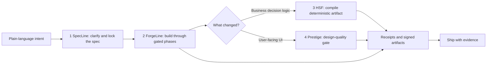

# code-factory

> New: proof-carrying PRs. Factoryline can now turn receipts into a
> hash-linked trace, verify that trace, plan the minimum replay after a change,
> and print public-safe evidence. AI code that brings receipts.

**A code factory built like Lego.** Five small, independent, open-source pieces that
snap together into one assembly line: describe a feature in plain language, and the
line checks it for ambiguity, builds it, runs a gauntlet of gates, actually *runs*
the finished code to watch it behave, compiles any decision logic into permanent
zero-cost code, and ships it — with a receipt at every step.

Each piece is a separate repo you can install and use on its own. This repo is the
**baseplate** (`factory`) that lines them up. It depends on none of them.

## Workflow at a glance



Use the numbered repos like Lego bricks: start with the baseplate, add the spec
brick when intent is fuzzy, add the forge brick when you want a state machine,
add the compile brick when decisions must be deterministic, and add the design
brick when the shipped thing has a user interface.

```
intent -> [1-spec] -> spec + strict contract -> handoff
                                                   |
          [2-forge] <---- tasks / plan <----------+
              |  architect -> build -> gates -> smoke -> ship
              |-> if UI -> [4-design] design-quality gate
              +-> if decision table -> [3-compile] -> deterministic artifact
```

## The five pieces

| Repo | pip install | CLI | What it does |
|---|---|---|---|
| **code-factory** (this) | `code-factory` | `factory` | the baseplate — snaps the bricks together, meters cost |
| **code-factory-1-spec** | `code-factory-1-spec` | `specline` | kills ambiguity *before* the AI writes code (anti-drift input contract) |
| **code-factory-2-forge** | `code-factory-2-forge` | `forge` | the assembly line: architect -> build -> gates -> **runtime smoke** -> ship |
| **code-factory-3-compile** | `code-factory-3-compile` | `hsf` | compiles a decision *once* into boring code that runs forever at zero AI cost |
| **code-factory-4-design** | `code-factory-4-design` | `prestige` | design-quality gate, for when what you ship has a face |

Numbered so the assembly order reads at a glance. Install one, some, or all.

## Enterprise knowledge activation

Code Factory treats agent instructions as **Atomic Knowledge Units (AKUs)**:
small, high-density, validated units of institutional knowledge. The goal is to
move from "retrieve a long doc and hope the agent interprets it" to "activate the
right procedure, tools, governance, and validators at the exact step of work."

See [AKU_STANDARD.md](AKU_STANDARD.md) for the enterprise schema and how each
brick maps to codification, compression, injection, and validation.

## Quick start

```bash
pip install code-factory code-factory-1-spec code-factory-2-forge \
            code-factory-3-compile code-factory-4-design

factory doctor          # which bricks are installed + how to add the rest
factory plan            # print the assembly pipeline
factory init .          # lay down the shared workspace
factory assemble my_feature   # run the line (skips any missing brick)
factory meter           # receipted cost + savings, computed on YOUR runs
factory trace my_feature       # hash-link receipts into a proof bundle
factory verify-trace .factory/traces/my_feature.trace.json
factory replay .factory/traces/my_feature.trace.json --changed smoke/my_feature.json
factory evidence my_feature    # public-safe proof for a PR or release note
```

For publication order, GitHub release steps, Claude Code/Codex setup, and
launch links, see [PUBLICATION_GUIDE.md](PUBLICATION_GUIDE.md).

## Why Lego, not a monolith

- **Each brick stands alone.** Install only what you need; a missing brick is skipped, not fatal.
- **Filesystem interop = maximum portability.** Bricks pass work on disk under a shared
  layout. Any IDE, agent (Codex / Claude Code / Cursor), CI runner, or OS that can run a
  subprocess drives the factory. No daemon, no network, no lock-in.
- **No hidden coupling.** The baseplate depends on none of the bricks — it shells out to
  their CLIs. Upgrade or swap a brick independently.

## Honest metering

`factory meter` makes the "saves time and money" claim *yours*, computed from your runs:

- With **no measured runs**, it refuses to print a savings percentage — no number against zero data.
- When modules don't report token usage, it labels the figure a **model**, not a measurement, and says so.
- It prints the **baseline assumption** inline, so no number hides what it's compared against.

Wall-clock time is always measured. Projections are always labeled. Nothing is fabricated.

## Proof-carrying PRs

`factory trace <feature>` writes `.factory/traces/<feature>.trace.json`: a
deterministic proof bundle over the latest compatible receipts for that feature.
Each trace node records the stage, command, receipt hash, declared artifact
hashes, previous node hash, and attribution summary. The chain head makes receipt
or artifact tampering visible.

```bash
factory trace checkout_flow
factory verify-trace .factory/traces/checkout_flow.trace.json
factory risk-diff --changed smoke/checkout_flow.json
factory replay .factory/traces/checkout_flow.trace.json --changed smoke/checkout_flow.json
factory replay .factory/traces/checkout_flow.trace.json --changed smoke/checkout_flow.json --execute
factory attest .factory/traces/checkout_flow.trace.json
factory evidence checkout_flow
```

This is the enterprise Lego layer: the factory can say which guarantee a change
invalidates, which minimum stages must rerun, whether the trace still verifies,
and what public evidence can be shown without leaking raw logs. If a smoke check
is hollow, the public evidence can say `hollow_test`; if the trace was tampered
with, `verify-trace` fails before anyone trusts the PR. `factory attest` exports
unsigned in-toto/SLSA-shaped JSON statements for teams that want supply-chain
evidence attached beside a PR, release, or wheel.

## Cross-platform

Every brick's CI runs on **Ubuntu, Windows, and macOS x Python 3.10-3.12**. Green everywhere,
proven publicly on every push — not "works on my machine."

## License

Apache-2.0. Free and open source. Each brick carries its own LICENSE file.
Commercial support and integration services available — see [SUPPORT.md](SUPPORT.md).
