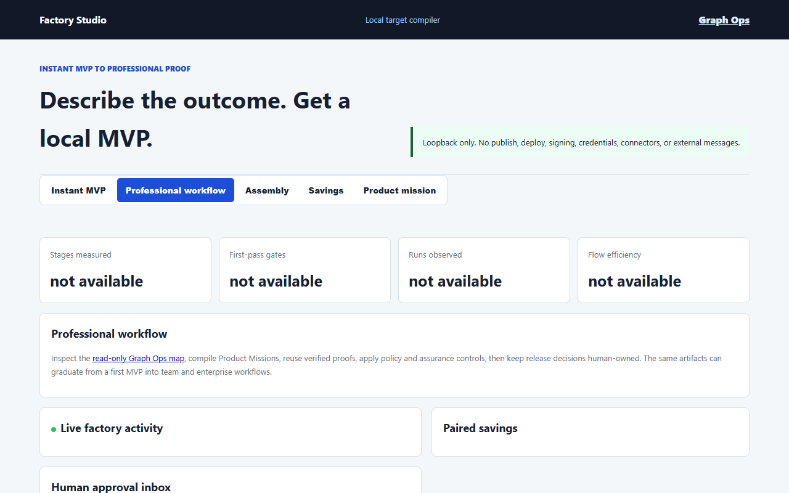
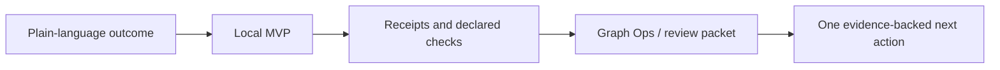

# Code Factory

[](https://github.com/zrk222/code-factory/actions/workflows/ci.yml)
[](https://pypi.org/project/factoryline-code-factory/)
[](https://pypi.org/project/factoryline-code-factory/)
[](https://huggingface.co/spaces/zrk222/code-factory)
[](https://github.com/zrk222/code-factory/stargazers)
[](https://github.com/zrk222/code-factory/releases/latest)

> **Generate a local MVP, then catch hollow tests before review.**

> **Free, local proof for AI-assisted code.** Start from a plain-language
> outcome, a fuzzy PRD, or a risky diff. Tests that only look green are not
> proof: Code Factory makes the next proof gap visible and never calls a
> starter production-ready before the relevant proof exists.

```powershell
factory mvp "Build an approval tracker" --root .
```

[See actual Factory Studio](docs/PRODUCT_VISUALS.md) or open the
[live Hugging Face Space](https://zrk222-code-factory.static.hf.space).



## What it does

- **Start a real project.** Turn one outcome into a contained web, mobile, API,
  CLI, worker, MCP, or agent-UI starting state.
- **Review what AI produced.** Turn requirements, diffs, proofs, and blockers into
  receipts, Graph Ops, and one fact-derived next action.
- **Keep "done" honest.** Challenge declared validators for hollow tests; a
  green-looking scaffold is never called production-ready by default.

## Install

```powershell
# No account, model key, or cloud connection is required for this local run.
pip install factoryline-code-factory
factory mvp "Build an approval tracker" --root .
factory studio --root .\my-mvp
```

If Code Factory helps you find a proof gap or makes an AI-assisted change easier
to review, [star Code Factory](https://github.com/zrk222/code-factory) so other
developers can find it. This optional link only opens the repository.

## Choose the job in front of you

| If you need to… | Use | You get |
| --- | --- | --- |
| Build a first slice | [`factory mvp`](docs/START_HERE.md) | A contained, app-shaped local starting state |
| Clarify a fuzzy PRD | [`factory prd grill`](docs/PRD_GRILL.md) | Source-bound questions instead of invented requirements |
| Review an AI-assisted diff | [`factory change review`](docs/DIFF_TO_PROOF_REVIEW.md) | A local risk, proof-gap, and next-action packet |
| Add evidence to a GitHub PR | [`factory github proof-review`](docs/GITHUB_PROOF_REVIEW.md) | One neutral Check and stable proof walkthrough, tied to the head commit |
| Inspect delivery state | [`factory studio`](docs/TARGET_COMPILER.md) | Graph Ops, receipts, and the next supported action |
| Verify supplied work | [Verifier Plane](docs/VERIFIER_PLANE.md) | Independent, hash-bound evidence checks |

For the short product map, read the [overview](docs/OVERVIEW.md). For a two-minute
first run, follow [Start Here](docs/START_HERE.md). For full command and contract
reference, browse the [documentation directory](docs/).

## Use Code Factory with CodeRabbit or another AI reviewer

They solve different parts of the review problem. CodeRabbit can supply AI
findings and suggestions; Code Factory makes declared local proof gaps,
coverage, and the next review action explicit. Enable the opt-in
[GitHub Proof Review](docs/GITHUB_PROOF_REVIEW.md) workflow to put one neutral,
commit-bound FactoryLine Check and walkthrough beside existing CodeRabbit
comments. It uses no CodeRabbit account, API, credential, or output as proof.

That makes Code Factory a standalone proof gate for teams that do not use an AI
reviewer, and a complementary evidence layer for teams that do. It does not
replace human review, auto-approve a pull request, or merge code.

## Use it where you work

Code Factory keeps the same local, receipt-bound workflow across the command line,
[VS Code](editors/vscode/README.md), and the [JetBrains plugin](editors/intellij/README.md).
It also provides local stdio [Cursor or OpenCode MCP](docs/AI_CLIENTS.md)
without handing an AI client permission to publish, deploy, approve, sign, or access
credentials.

FactoryLine is free through December 31, 2026. The owner-approved January 1, 2027
JetBrains plan is **$4.95 USD per month**; it is not active until the Marketplace
release and pricing gates are satisfied. See the [Marketplace control-room guide](docs/JETBRAINS_CONTROL_ROOM.md)
for compatibility, pricing, and approval boundaries.

## The proof boundary

Code Factory creates and inspects local artifacts. It does **not** silently call a
model, discover credentials, publish, deploy, sign, approve, message, or grant a
connector. Its deterministic proof receipts bind supplied byte bindings, declared
identities, and evidence; an external runner must separately prove runtime isolation
and network policy. Token, cost, and productivity claims remain unknown until a bound
measurement exists.


```mermaid
flowchart LR
  intent["Plain-language outcome"] --> mvp["Local MVP"]
  mvp --> evidence["Receipts and declared checks"]
  evidence --> review["Graph Ops / review packet"]
  review --> decision["One evidence-backed next action"]
```

Use [PRD Grill](docs/PRD_GRILL.md) before code exists, the deterministic
[contradiction gate](docs/RELEASE_NOTES_0.25.0.md) when requirements collide, [Proof Review](docs/DIFF_TO_PROOF_REVIEW.md)
when a diff arrives, and the [Verifier Plane](docs/VERIFIER_PLANE.md) when a worker
claims it is finished. The local [MCP contract](docs/MCP.md) and generated Mermaid
output map make the same proof context reusable by a client you choose.

## Go deeper when you need it

- Read [why I built Code Factory](docs/WHY_I_BUILT_CODE_FACTORY.md) for the
  founder story behind catching passing tests that fail in real use.
- Start with [PRD Grill](docs/PRD_GRILL.md), [Proof Review](docs/DIFF_TO_PROOF_REVIEW.md),
  or [Verifier Plane](docs/VERIFIER_PLANE.md) when the job calls for it.
- Browse [Graph Ops](docs/GRAPH_OPS.md), [proof reuse](docs/PROOF_REUSE.md), and
  [savings boundaries](docs/SAVINGS_TRACKER.md) for advanced evidence workflows.
- Read [The approval signal decays when AI-written code becomes routine](docs/HABITUATION_ESSAY.md)
  for the design and limits of the habituation gate.
- See the [release notes](docs/RELEASE_NOTES_0.29.0.md),
  [CHANGELOG.md](CHANGELOG.md), [release channels](docs/RELEASE_CHANNELS.md), and
  [publication guide](PUBLICATION_GUIDE.md) for versioned release detail.

## License

MIT OR Apache-2.0.
