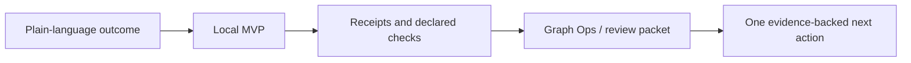

# Code Factory

[](https://github.com/zrk222/code-factory/actions/workflows/ci.yml)
[](https://pypi.org/project/factoryline-code-factory/)
[](https://pypi.org/project/factoryline-code-factory/)
[](https://huggingface.co/spaces/zrk222/code-factory)
[](https://github.com/zrk222/code-factory/stargazers)
[](https://github.com/zrk222/code-factory/releases/latest)

<!-- mcp-name: io.github.zrk222/code-factory -->

> **Catch AI-generated tests that could never fail — before review.**

> **Free, local proof for code built with AI.** Start from a plain-language
> outcome, a fuzzy PRD, or a risky diff. Code Factory binds the declared intent,
> challenges whether a test can actually reject the failure it claims to cover,
> and shows the current proof gap plus the next human decision. Tests that only
> look green are not proof: a starter is never called production-ready before
> the relevant proof exists.

```powershell
factory mvp "Build an approval tracker" --root .
```

[See actual Factory Studio](docs/PRODUCT_VISUALS.md) or open the
[live Hugging Face Space](https://zrk222-code-factory.static.hf.space).


## What it does

- **Start a real project.** Turn one outcome into a contained web, mobile, API,
  CLI, worker, MCP, or agent-UI starting state.
- **Review what AI produced.** Turn requirements, diffs, proofs, and blockers into
  receipts, Graph Ops, and one fact-derived next action.
- **Refresh the evidence that matters.** Watch a local Assembly while it runs,
  refresh the next-proof brief, and see privacy-bounded observed Git contribution
  context without pretending it is a verified directory or billing roster.
- **Keep "done" honest.** Challenge declared validators for hollow tests; a
  green-looking scaffold is never called production-ready by default.
- **Stop vague work before it starts.** Use [Intake Grill](docs/INTAKE_GRILL.md)
  to record framework, exact intent, observable acceptance evidence, and the
  external-effects boundary before a Product Mission begins.
- **Make a behavior survive its declared failure cases.** Use the supervised
  [Gauntlet](docs/GAUNTLET.md) to turn human-written E2E sabotage cases into an
  offline-verifiable Survival Card. A hollow negative check stays visible; a
  card is never a production-readiness certificate.
- **Let autonomy be earned, not assumed.** Use `factory license` to derive an
  expiry-bound local tier from independently verified governed runs. A severe
  hollow-test, hollow-validator, or scope-escape result demotes the declared
  agent automatically; it never authenticates identity or grants execution.
- **Compare agents with receipts, not vibes.** Use `factory combine` to rank
  completed, sealed, independently verified runs on the same task. It never
  starts an agent or turns a local scoreboard into a vendor-quality claim.
- **Keep decisions from becoming tribal knowledge.** Use `factory judgment` to
  track a human-promoted design decision with exact paths, a named owner,
  review date, and hash-bound proof obligations. A Change Safety Case routes
  one explicit diff to its owner; it never infers intent, promotes a decision,
  runs a test, or approves a release.

## What the latest upgrade resolves

| Common AI-assisted delivery pain | FactoryLine response | What stays under human control |
| --- | --- | --- |
| A test is green but could never catch the behavior it claims to cover | Reality Check and Gauntlet bind declared positive and negative cases, then keep hollow or blocked checks visible in a Survival Card | Which behaviors and commands to admit; whether evidence is sufficient |
| A vague PRD becomes the wrong scaffold or framework | Intake Grill records a named, byte-bound intent, framework decision, observable acceptance evidence, and external-effects posture before a mission begins | The answers, architecture choice, and decision to start work |
| An agent retries the same failed approach and burns review time | Proof-Delta requires a changed candidate plus fresh, hash-bound evidence for a retry; no-gain attempts halt | Any repair, retry admission, and final apply |
| Teams gradually trust an agent because it has been successful recently | Earned Autonomy derives an expiring local tier from governed evidence and demotes severe hollow-test or scope-escape results | Identity, permissions, execution, approval, and release authority |
| A hard-won design decision is forgotten, then a later diff silently breaks its assumptions | Engineering Judgment Capsules bind one named owner, explicit path scope, review date, and declared proof obligations; an optional human-declared Change Profile makes novel boundaries and required Senior Attention explicit before review | Proposal, independent promotion, decision reconsideration, proof execution, acceptance, merge, and release |
| A reviewer has suggestions but no shared evidence picture | Graph Ops, local receipts, and read-only MCP facts show current scope, proof debt, and the next fact-derived action | Merge, release, deployment, and provider access |
| A large/remote workspace feels opaque or sluggish | Workspace Advisor measures bounded local project shape and path-only WSL/remote signals without changing indexes, heap, caches, inspections, or remote settings | Every IDE performance change and environment setting |

These are local evidence and supervision tools, not guarantees of performance,
security, productivity, production readiness, or an automatic repair service.

**For teams:** use the [Teams and Enterprise Operations Manual](docs/ENTERPRISE_TEAMS_OPERATIONS.md)
to run the same proof-first loop with named reviewers, approved AI-change scope,
and explicit Proof Debt—without giving Code Factory merge, release, or provider authority.
The [commercial packaging guide](docs/COMMERCIAL_PACKAGING.md) keeps the free
core separate from proposed Team and Enterprise services that are not purchasable yet.
For a human-selected, customer-managed reference pilot, the local
[Team Pilot readiness gate](docs/TEAM_PILOT_LAUNCH.md) hash-binds the operating
evidence for owner review; it does not accept a customer or activate a paid service.

**Design is part of the review.** For UI-scoped work, add the optional
[Prestige Design Review](docs/PRESTIGE_DESIGN.md): a purpose-led design brief
plus review artifacts for hierarchy, responsive behavior, affordances,
consistency, and declared design tokens. It makes design quality visible; it
does not claim a conversion result, WCAG certification, or production readiness.

**Reuse a proven decision without reusing stale context.** [Factory
Continuity](docs/FACTORY_CONTINUITY.md) keeps a local, purpose-bound record of
the evidence behind prior work. Graph Ops can replay only redacted, current,
independently promoted metadata; it does not store private source, prompts,
embeddings, or transcripts, and it cannot execute a repair.

## Install

```powershell
# No account, model key, or cloud connection is required for this local run.
pip install factoryline-code-factory
factory mvp "Build an approval tracker" --root .
factory studio --root .\my-mvp
```

If Code Factory helps you find a proof gap or makes an AI-assisted change easier
to review, [star Code Factory](https://github.com/zrk222/code-factory) so other
developers can find it. This optional link only opens the repository.

## Choose the job in front of you

| If you need to… | Use | You get |
| --- | --- | --- |
| Build a first slice | [`factory mvp`](docs/START_HERE.md) | A contained, app-shaped local starting state |
| Pin down intent before work begins | [`factory intake grill`](docs/INTAKE_GRILL.md) | A source-bound framework, intent, acceptance-evidence, and safety decision worksheet |
| Clarify a fuzzy PRD | [`factory prd grill`](docs/PRD_GRILL.md) | Source-bound questions instead of invented requirements |
| Review an AI-assisted diff | [`factory change review`](docs/DIFF_TO_PROOF_REVIEW.md) | A local risk, proof-gap, and next-action packet |
| Turn a diff into the next safe proof | [`factory memory brief`](docs/DEVELOPER_MEMORY_BRIEF.md) | Refreshable actions, redacted continuity facts, and observed local Git contribution context |
| Keep an agent diff inside approved scope | [`factory plan verify`](docs/PLAN_TO_PROOF_REVIEW.md) | Exact plan alignment and explicit Proof Debt—not another AI opinion |
| Prove an E2E check can say no | [`factory e2e verify`](docs/E2E_PROOF_GATE.md) | A native positive/negative command-pair receipt that catches hollow E2E checks |
| Ask whether a behavior survives declared sabotages | [`factory gauntlet`](docs/GAUNTLET.md) | A named, one-run admission, optional redacted verified-context binding, and offline-verifiable Survival Card—never generated commands or automatic repair |
| Keep agent autonomy evidence-bound | [`factory license`](docs/AGENT_LICENSE.md) | A local, expiring tier derived from governed evidence, automatic severe-failure demotion, and no silent authority grant |
| Compare completed agent evidence fairly | [`factory combine`](docs/AGENT_LICENSE.md) | A sealed-task, offline-verifiable scoreboard—never an agent launcher or vendor leaderboard |
| Prepare a bounded Team pilot | [`factory team-pilot readiness`](docs/TEAM_PILOT_LAUNCH.md) | Hash-bound, customer-managed readiness evidence for owner review—not a checkout or service activation |
| Add evidence to a GitHub PR | [`factory github proof-review`](docs/GITHUB_PROOF_REVIEW.md) | One neutral Check and stable proof walkthrough, tied to the head commit |
| Prove a LangGraph resume path | [`factory langgraph replay-verify`](docs/LANGGRAPH_ASSURANCE.md) | Hash-only parity, duplicate-effect and parallel-write safeguards, plus a shareable incident capsule |
| Detect policy drift before a human merge | [`factory github assurance-dossier`](docs/GITHUB_ASSURANCE_DOSSIER.md) | Deterministic supplied-policy comparison, named expiring exceptions, and a merge-evidence packet |
| Inspect delivery state | [`factory studio`](docs/TARGET_COMPILER.md) | Graph Ops, receipts, and the next supported action |
| Debug why two graph runs diverged | [`factory graph forensics`](docs/GRAPH_FORENSICS.md) | Hash-sealed state lineage, concurrency findings, and a read-only recovery preview |
| Choose among competing repairs | [`factory proofsearch`](docs/PROOFSEARCH.md) | Hash-bound candidate rejection, mutation-tested evidence, a deterministic winner, and locked apply authority |
| Decide what evidence to collect next | [Evidence Frontier](docs/EVIDENCE_FRONTIER.md) | A deterministic next-test hypothesis that separates repair candidates, with execution locked |
| Admit a repair retry only with new evidence | [Proof-Delta Loop](docs/PROOF_DELTA_LOOP.md) | A changed candidate and fresh hash-bound evidence, or a deliberate no-gain halt |
| Reconsider verified prior work safely | [Factory Continuity](docs/FACTORY_CONTINUITY.md) | Purpose-bound, expiring Decision Replay metadata with independent promotion and no private content |
| Prove one user-visible behavior | [Factory Reality Check](docs/REALITY_CHECK.md) | Deep intent assertions, a deliberate failure case, and an optional named one-time re-run authorization |
| Verify supplied work | [Verifier Plane](docs/VERIFIER_PLANE.md) | Independent, hash-bound evidence checks |

For the short product map, read the [overview](docs/OVERVIEW.md). For a two-minute
first run, follow [Start Here](docs/START_HERE.md). For full command and contract
reference, browse the [documentation directory](docs/).

## Use Code Factory with CodeRabbit or another AI reviewer

They solve different parts of the review problem. CodeRabbit can supply AI
findings and suggestions; Code Factory makes declared local proof gaps,
coverage, and the next review action explicit. Enable the opt-in
[GitHub Proof Review](docs/GITHUB_PROOF_REVIEW.md) workflow to put one neutral,
commit-bound FactoryLine Check and walkthrough beside existing CodeRabbit
comments. It uses no CodeRabbit account, API, credential, or output as proof.

For agent-created pull requests, add a small human-approved
[`factory.agent_plan.v1` envelope](docs/PLAN_TO_PROOF_REVIEW.md). Plan-to-Proof
compares that plan with the exact diff and exposes **Proof Debt**: unresolved
scope, declared-test, human-routing, and existing proof obligations that must
be settled before a team makes its own merge decision.

That makes Code Factory a standalone proof layer for teams that do not use an AI
reviewer, and a complementary evidence layer for teams that do. For
agent-created pull requests, Code Factory does not replace human review,
auto-approve a pull request, or merge code.

## Use Code Factory with LangGraph

LangGraph teams can keep their own graph and checkpoint runtime, then use the
[LangGraph Assurance Bridge](docs/LANGGRAPH_ASSURANCE.md) to compare recorded
reference and resumed transitions. The free local adapter produces hash-only
parity evidence and a reviewable incident capsule when a run diverges; it does
not import LangGraph, invoke a graph, or claim production resilience. The
optional GitHub Action puts the same Proof Card in a pull-request job summary.

For Codex, Claude Code, and Deep Agents, install the
[Code Factory LangGraph plugin](docs/LANGCHAIN_MARKETPLACE.md) to add the
proof workflow and read-only local MCP facts to the coding-agent surface.

## Use Code Factory with DeepSeek Harness

The optional [DeepSeek Harness adapter](docs/DEEPSEEK_HARNESS.md) starts the
same local read-only MCP proof surface through Harness's official generic MCP
client. It lets a Harness agent inspect Graph Ops, current proof gaps, and
Earned Autonomy / Combine facts without sending source to a hosted endpoint or
gaining permission to execute, repair, approve, release, deploy, sign, or use
credentials.

## Use it where you work

Code Factory keeps the same local, receipt-bound workflow across the command line,
[VS Code](editors/vscode/README.md), and the [JetBrains plugin](editors/intellij/README.md).
It also provides local stdio [Cursor or OpenCode MCP](docs/AI_CLIENTS.md)
without handing an AI client permission to publish, deploy, approve, sign, or access
credentials.

The same local proof surface is discoverable in the [Official MCP Registry](docs/MCP_REGISTRY.md)
as `io.github.zrk222/code-factory`; registry setup starts the public PyPI
package over local stdio and never creates a hosted service or write authority.

FactoryLine's core local proof workflow remains free. The owner-approved future
JetBrains Freemium plan starts **January 1, 2027**, subject to Marketplace and
activation gates: **$5.95 USD per named seat/month** or **$60 USD per named seat/year**
for optional Memory and Enterprise Assurance entitlements. It is not
active today; no checkout, entitlement, or license enforcement exists. See the
[Marketplace control-room guide](docs/JETBRAINS_CONTROL_ROOM.md) for the exact
feature boundary and approval gates.

The matching GitHub Assurance Seat is also planned for **January 1, 2027** at
the same future price. It is for maintained, customer-managed proof operations
(commit-bound review, Proof Debt, policy drift, governed exceptions, and evidence
packets)—not source access or opaque AI-token resale. The source license and free
core are unchanged. See the [GitHub per-seat plan](docs/GITHUB_MONETIZATION_2026.md).

## The proof boundary

Code Factory creates and inspects local artifacts. It does **not** silently call a
model, discover credentials, publish, deploy, sign, approve, message, or grant a
connector. The Gauntlet executes only caller-declared E2E pairs after a named,
expiry-bound, one-run admission; all other Gauntlet paths are read-only. Its
deterministic proof receipts bind supplied byte bindings, declared identities, and
evidence; an external runner must separately prove runtime isolation and network
policy. Token, cost, and productivity claims remain unknown until a bound measurement
exists.


```mermaid
flowchart LR
  intent["Plain-language outcome"] --> mvp["Local MVP"]
  mvp --> evidence["Receipts and declared checks"]
  evidence --> review["Graph Ops / review packet"]
  review --> decision["One evidence-backed next action"]
```

Use [Intake Grill](docs/INTAKE_GRILL.md) to pin down intent before a mission,
[PRD Grill](docs/PRD_GRILL.md) before code exists, the deterministic
[contradiction gate](docs/RELEASE_NOTES_0.25.0.md) when requirements collide, [Proof Review](docs/DIFF_TO_PROOF_REVIEW.md)
when a diff arrives, and the [Verifier Plane](docs/VERIFIER_PLANE.md) when a worker
claims it is finished. Use the supervised [Gauntlet](docs/GAUNTLET.md) when a
specific behavior needs to survive explicitly reviewed failure cases. The local
[MCP contract](docs/MCP.md) and generated Mermaid output map make the same proof
context reusable by a client you choose.

## Go deeper when you need it

- Read [why I built Code Factory](docs/WHY_I_BUILT_CODE_FACTORY.md) for the
  founder story behind catching passing tests that fail in real use.
- Start with [PRD Grill](docs/PRD_GRILL.md), [Proof Review](docs/DIFF_TO_PROOF_REVIEW.md),
  or [Verifier Plane](docs/VERIFIER_PLANE.md) when the job calls for it.
- Browse [Graph Ops](docs/GRAPH_OPS.md), [Gauntlet](docs/GAUNTLET.md), [Proof-Delta Loop](docs/PROOF_DELTA_LOOP.md), [Graph Portfolio and Run Admission](docs/GRAPH_PORTFOLIO_ADMISSION.md), [Evidence Frontier](docs/EVIDENCE_FRONTIER.md), [Factory Reality Check](docs/REALITY_CHECK.md), [proof reuse](docs/PROOF_REUSE.md), and
  [LangGraph Assurance](docs/LANGGRAPH_ASSURANCE.md), and [savings boundaries](docs/SAVINGS_TRACKER.md) for advanced evidence workflows.
- Use [IDE Health and Index Continuity](docs/IDE_HEALTH.md) when a JetBrains IDE slows down and you need locally observed signals before deciding what to review.
- For UI work, read [Prestige Design Review](docs/PRESTIGE_DESIGN.md) for the
  optional design-quality lane and its explicit review boundaries.
- Read [The approval signal decays when AI-written code becomes routine](docs/HABITUATION_ESSAY.md)
  for the design and limits of the habituation gate.
- See the [release notes](docs/RELEASE_NOTES_0.42.0.md),
  [CHANGELOG.md](CHANGELOG.md), [release channels](docs/RELEASE_CHANNELS.md), and
  [publication guide](PUBLICATION_GUIDE.md) for versioned release detail.

## License

MIT OR Apache-2.0.
