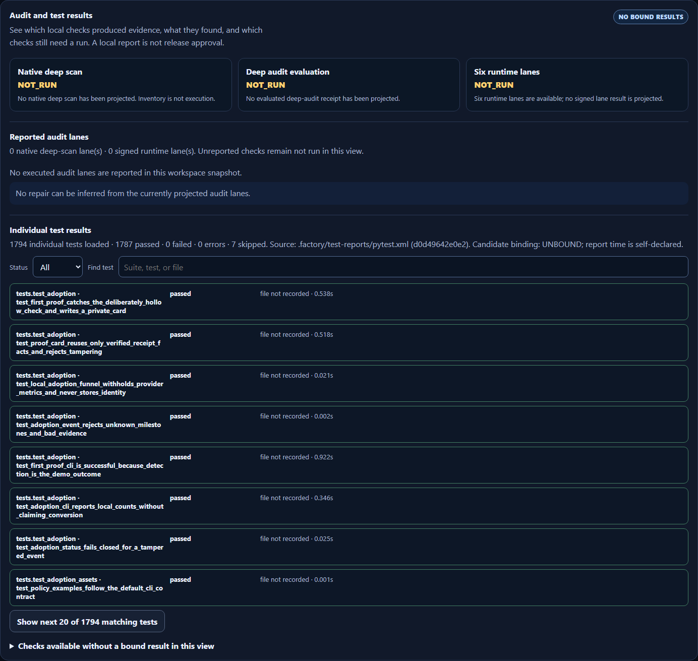
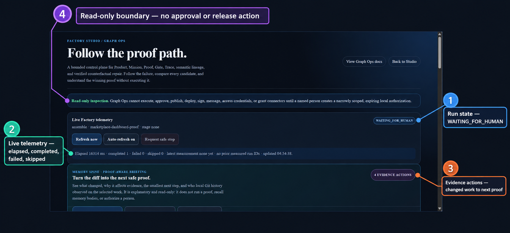

# Code Factory

Code Factory is a Python package and command-line tool for collecting local
software review evidence. It can inspect a repository, run configured checks,
and produce receipts for a human to review. It does not certify software,
guarantee that defects are absent, or approve a release.

## Graph Ops in action


This full-page local capture shows Graph Ops tracing a change from sealed
lineage through a forensic finding to a proposed recovery path. The guarded
action remains locked; the dashboard is a read-only inspection surface.


The Counterfactual Arena compares repair candidates and shows their evidence
and risk. [Winner controls](docs/assets/marketplace/graph-ops-proofsearch-controls.png)
and the [Evidence Frontier](docs/assets/marketplace/graph-ops-evidence-frontier.png)
show how a reviewer can inspect the rationale and choose the next proof.

The current Graph Ops UI also separates native deep-scan progress, evaluated
deep-audit receipts, six runtime lanes, and individual JUnit test cases. Each
panel labels its evidence state and next repair. Filter or search the recorded
tests, then load more cases as needed; an inventory or a missing report never
appears as a passing run. The JUnit reader accepts up to 10,000 cases and marks
larger or malformed reports incomplete. A JUnit report is local observation
without a current-candidate binding.



This local UI capture shows each reported test case with its status. The audit
cards keep checks without a bound result explicitly marked not run.

<details>
<summary>Supplement: annotated live Assembly telemetry</summary>



The labels explain an [original local Assembly capture](docs/assets/marketplace/factoryline-0.44-live-dashboard.png).
That pictured run is waiting for human input; it does not imply release approval
or that every check passed.

</details>

## Install and start

```powershell
python -m pip install factoryline-code-factory
factory --help
factory guide
```

Run repository commands from the project being reviewed. `factory guide` is a
read-only orientation; it does not run tests or agents.

## Inspect this repository

These commands show the current architecture policy, the bounded static
security scan, and the runtime-audit setup:

```powershell
factory architecture health --root . --json
factory audit security --root . --json
factory runtime-audit status --root . --json
```

`factory audit security` checks a limited set of source patterns. It is not a
penetration test. The runtime audit needs a separately reviewed plan and its
own environment evidence. A status of `NOT_RUN` or a clean static scan is not a
complete project audit.

To display individual tests in Graph Ops, run your suite with a JUnit report at
`.factory/test-reports/pytest.xml` (for example,
`python -m pytest --junitxml=.factory/test-reports/pytest.xml`). The local
Studio reads the report and labels its candidate binding `UNBOUND`; it does
not infer that those results still apply after source changes.

The [repository self-audit receipt](evidence/self-audit/code-factory-2026-09-24.json)
records the checks run against Code Factory, including blocked and unavailable
checks. It is local evidence for review, not an independent audit or release
approval.
<!-- mcp-name: io.github.zrk222/code-factory -->

## Release controls

Candidate preflight requires release-cadence admission and strict architecture
health. Protected main requires CI and a separate specialty AI source review;
the coordinator records that assessment, separately from test evidence. It is
not a second human approval. Provider publication and marketplace approval are
separate outcomes. See [release channels](docs/RELEASE_CHANNELS.md).

Architecture health checks growth budgets. The [2026-09-26 ForgeLine reassessment](evidence/self-audit/quality-reassessment-2026-09-26.json)
grades this checkout A (87.5/100; zero findings). Maximum branch complexity is
10, the hard limit; the static security-pattern score is 100, test-intent match
is 0.74, and documented-symbol ratio is 0.77. The earlier deep-audit
complexity-83 score uses a different metric, so the figures are not directly
comparable. Test-intent and security scores are static signals, not executed
coverage or a security certification. Historical receipts remain snapshots.

## More detail

- [Engineering review workflow](docs/PROOF_REVIEW_WORKFLOW.md)
- [GitHub Proof Review](docs/GITHUB_PROOF_REVIEW.md)
- [Commercial availability and limits](docs/COMMERCIAL_PACKAGING.md)
- [Audit condition inventory](docs/AUDIT_CONDITION_INVENTORY.md)
- [Runtime assurance limits](docs/RUNTIME_ASSURANCE.md)
- [Release channels and publication evidence](docs/RELEASE_CHANNELS.md)
- [Changelog](CHANGELOG.md)
- [Documentation index](docs/DOCUMENTATION_INDEX.json)
