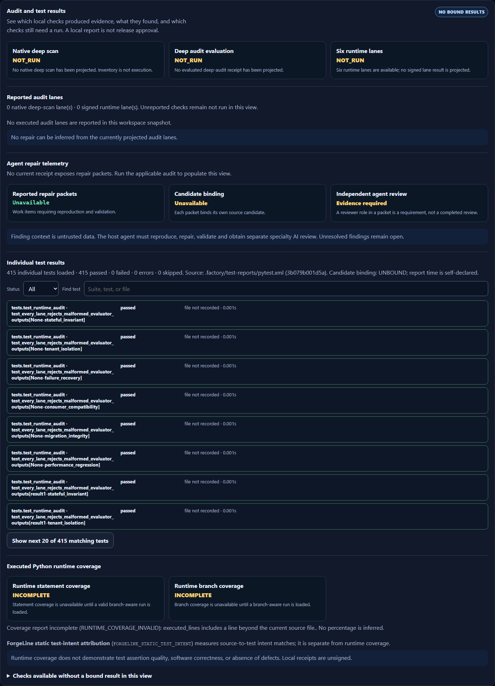
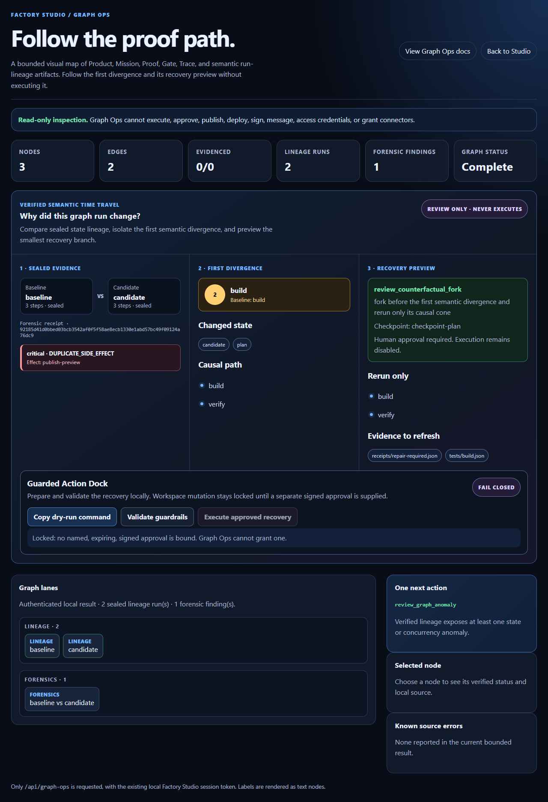
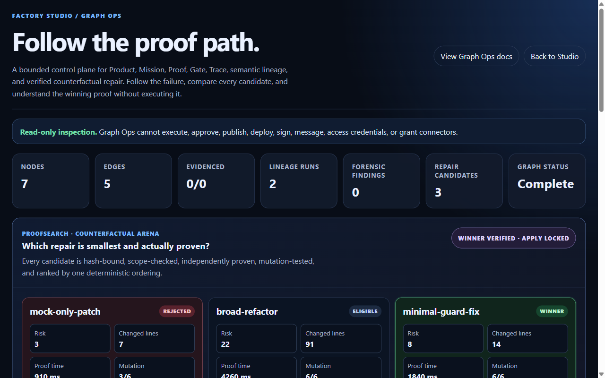
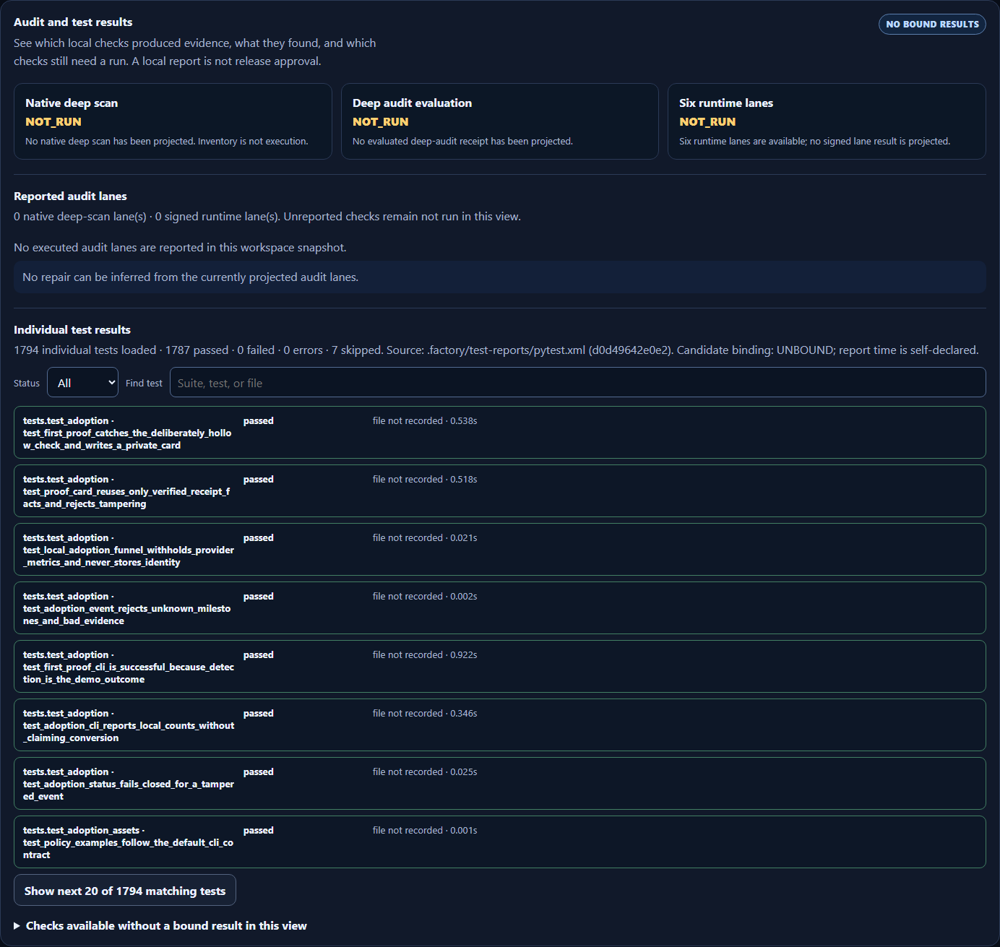
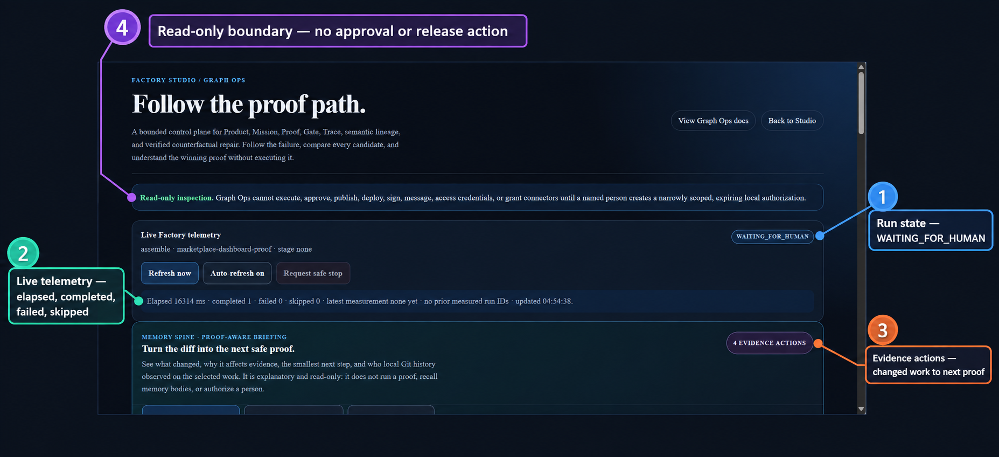

# Code Factory

## Start with your repository

```powershell
python -m pip install factoryline-code-factory
factory guide
factory scan --root .
```

The guide offers one plain-language path. The default scan inventories relative
file names and sizes; it does not read source or run tests, so its `INCOMPLETE`
result is not a code-quality verdict. For a bounded Python AST check, run
`factory audit security --root . --json`. That check reports its source
coverage and limits; it does not prove runtime behavior or that a clean
repository is safe to release. A prior ForgeLine adoption is not required.
See [Start Here](docs/START_HERE.md) for a plain-language glossary, the
optional existing-project adoption path, and the verified CI/CD boundaries.

## Latest audit telemetry preview — October 8, 2026

**Fixed:** bounded evaluator output validation across all six runtime lanes; malformed results stay incomplete. Shared imported assertion helpers and inherited test mixins are resolved by bounded static analysis.
**Changed:** audit findings carry candidate-bound repair packets with reproduction, negative-control and separate specialty AI review requirements.
**Added:** Graph Ops agent repair telemetry, evidence requirements, stop conditions and searchable individual test outcomes. Repair packets are consumed by the host agent; this view does not execute or approve repairs.



Actual local Graph Ops capture, October 8, 2026: 415 targeted tests passed. JUnit results are local and unbound; missing runtime receipts and coverage remain explicitly incomplete. Agent repair cards show candidate bindings, required evidence and separate specialty AI review requirements.


Code Factory + ForgeLine (CF/FL) is a robust, local-first code-audit factory.
It starts by collecting local software review evidence for the candidate change.
It connects requirements, architecture checks, Python AST security analysis,
behavioral test evidence, workflow integrity, specialty AI review, and
actionable repair. Its receipts support review; the tool does not certify
software, guarantee that defects are absent, or approve a release.

**Product naming:** Code Factory is the product and ForgeLine is its audit and
architecture engine. SpecLine, HSF, and Prestige are advanced internal lanes
that appear only when a project declares the corresponding scope; they are not
separate products a new user must learn before running a scan.

## Current update preview (next core release)

**Fixed:** editor audit views now expose missing and incomplete checks.
**Changed:** Junie's route connects a diff to bounded evidence and a concrete
repair handoff. **Added:** project-neutral `factory audit workflows` contracts
with hash-bound candidate and execution evidence, plus VS Code/Open VSX 1.1.2
evidence tree, JetBrains 1.1.2 CF + ForgeLine tab, and a native
[OpenCode plugin](plugins/code-factory-opencode/README.md).
**Candidate detection fixes:** the Python scanner flags tests without a local
assertion, constant-true assertions, and reflexive comparisons. Declared tenant
reads can be checked with `factory audit security --tenant-read-call db.get`.
That legacy form requires `tenant_id=tenant_id`. For positional or renamed
arguments, declare the mapping, for example
`--tenant-read-binding db.get=position:1:tenant_scope`; keyword mappings use
`db.get=keyword:tenant_id:tenant_scope`. Positional indexes start at zero. The
scanner requires the named, required function parameter to reach the declared
argument without reassignment; configure exactly one binding per read call. This
does not prove that the value is the authenticated tenant or that runtime access
is isolated.
The unchanged eight-case public regression corpus now gives 6 true positives,
2 true negatives, and no false positives or false negatives locally, with the
same tenant-read contract applied to defective, repaired, and clean inputs.
This is a small development regression result, not independent accuracy,
runtime coverage, or release approval. CI verification is still required.
**Added runtime budget admission:** `factory loop runtime` now exposes
`session`, `admit`, `settle`, and `status` operations backed by a local SQLite
ledger. It reserves estimated usage before an enrolled adapter acts, reconciles
measured usage afterward, and fails closed on malformed ledger state or
inconsistent replay receipts. The HSF classifier remains advisory; its result
never substitutes for the SQLite admission call.
**Changed:** persisted usage and replay receipts are checked against exact
fixed-point measurements, request digests, action states, and overrun markers.
**Limits:** enforcement applies only to adapters that call the runtime API;
provider billing is not queried, and a hostile process with workspace write
access can still alter the local SQLite ledger. This does not certify software
or grant release authority.

**Candidate quality receipt:** on a clean Git-tracked snapshot, ForgeLine
0.10.8 reports A (98.2/100), 1,073 of 1,093 function checks attributed to
test intent (98.17%), maximum complexity 10, and 460 Python files. This is a
static candidate measurement, not runtime coverage or certification. The
source-hashed [candidate receipt](evidence/self-audit/quality-candidate-2026-10-06.json)
records the measured scope. The published core release remains 0.47.0; this
branch is not merged or published.
No public precision, recall, or attribution benchmark is claimed here: the
attribution percentage is an internal static candidate metric, not measured
defect-detection accuracy on independent AI-generated repositories.
The [autonomous ops plan](docs/AUTONOMOUS_OPS_EDITOR_PLAN.md) explains the
proposed Observer Agent loop and its gates. These versions remain release
candidates until each channel has a verified provider publication receipt.

## Graph Ops in action



This full-page local capture shows Graph Ops tracing a change from sealed
lineage through a forensic finding to a proposed recovery path. The guarded
action remains locked; the dashboard is a read-only inspection surface.



The Counterfactual Arena compares repair candidates and shows their evidence
and risk. [Winner controls](docs/assets/marketplace/graph-ops-proofsearch-controls.png)
and the [Evidence Frontier](docs/assets/marketplace/graph-ops-evidence-frontier.png)
show how a reviewer can inspect the rationale and choose the next proof.

The current Graph Ops UI also separates native deep-scan progress, evaluated
deep-audit receipts, six runtime lanes, and individual JUnit test cases. Each
panel labels its evidence state and next repair. Filter or search the recorded
tests, then load more cases as needed; an inventory or a missing report never
appears as a passing run. The JUnit reader accepts up to 10,000 cases and marks
larger or malformed reports incomplete. A JUnit report is local observation
without a current-candidate binding.



This local UI capture shows each reported test case with its status. The audit
cards keep checks without a bound result explicitly marked not run.

<details>
<summary>Supplement: annotated live Assembly telemetry</summary>



The labels explain an [original local Assembly capture](docs/assets/marketplace/factoryline-0.44-live-dashboard.png).
That pictured run is waiting for human input; it does not imply release approval
or that every check passed.

</details>

## Add deeper audit lanes

```powershell
factory scan --root . --deep
```

Deep mode orchestrates architecture, Python security and test-oracle checks,
workflow integrity, requirements, runtime coverage, and dependency evidence.
Languages including TypeScript/JSX, Go, Rust, Java, C/C++, C#, Ruby, PHP and
Swift are inventoried explicitly; missing native analysis remains unmeasured.

For authorized native execution, use:

```powershell
factory scan --root . --deep --worker-config .factory/worker-config.json --json
```

The configuration contains workspace-relative `manifest`, `authorization`, and
`trust_root` paths plus `manifest_sha256` and `trust_root_sha256` pins. This
invokes the existing signed Docker worker engine for configured CodeQL,
Semgrep, secrets, dependency, container, runtime and fuzz lanes. Unsigned plans
are rejected. Completed workers still require independent agent review;
missing evidence and review cannot produce a passing verdict. Native execution
requires its configured images and tooling and can take longer than a minute.
Each unresolved lane includes its next action. Receipt presence alone is not
verification, and no scan claims to detect every defect.

Package metadata now uses **Production/Stable**, starting with this source
update. That release-status label is separate from detection accuracy,
independent benchmark results, and provider publication.

In an interactive terminal, `factory` optionally makes one plain PyPI version
check and caches the result for up to 24 hours, then prints a notice when a
newer version is available. It never downloads or installs the update. The
check is quiet in CI, JSON output, server/MCP, help, version, and
non-interactive runs; set `FACTORY_DISABLE_UPDATE_CHECK=1` to turn it off. The
optional request does not include a project path, account identifier, or usage
data. All audit and proof commands remain local unless an operator explicitly
uses a separate provider integration.

Run repository commands from the project being reviewed. `factory guide` is a
read-only orientation; it does not run tests or agents.

## Inspect this repository

These commands show the current architecture policy, the bounded static
security scan, and the runtime-audit setup:

```powershell
factory architecture health --root . --json
factory audit security --root . --json
factory runtime-audit status --root . --json
```

`factory audit security` checks a limited set of source patterns. It is not a
penetration test. The runtime audit needs a separately reviewed plan and its
own environment evidence. A status of `NOT_RUN` or a clean static scan is not a
complete project audit.

To display individual tests in Graph Ops, run your suite with a JUnit report at
`.factory/test-reports/pytest.xml` (for example,
`python -m pytest --junitxml=.factory/test-reports/pytest.xml`). The local
Studio reads the report and labels its candidate binding `UNBOUND`; it does
not infer that those results still apply after source changes.

The prior snapshot's [repository self-audit receipt](evidence/self-audit/quality-reassessment-2026-10-04.json)
records **A (97.9/100)** and 1,055/1,085 functions attributed to test intent
(97.24%). That static measurement applies to its recorded source digest and is
superseded for this candidate by the clean tracked-snapshot result above; it is
not runtime coverage or certification.

ForgeLine 0.10.8 computes Python complexity for public module functions and
public class methods in its recorded `metrics.scope.code_files`; names starting
with `_` are excluded. Its AST metric counts branches, boolean alternatives,
exception handlers, `with`, and assertions. Ruff C901 uses a different McCabe
metric and also checks private functions. CI therefore runs
`python -m ruff check --select C901 factoryline tests` separately at limit 10.
The ForgeLine maximum must not be read as the maximum of every Python function.
CI also checks action and reusable workflow references for immutable commit
pins; the generic workflow evidence validator alone does not inspect those refs.
<!-- mcp-name: io.github.zrk222/code-factory -->

## Release controls

Candidate preflight requires release-cadence admission and strict architecture
health. Protected main requires CI and a separate specialty AI source review;
the coordinator records that assessment, separately from test evidence. It is
not a second human approval. Provider publication and marketplace approval are
separate outcomes. See [release channels](docs/RELEASE_CHANNELS.md).

Architecture health checks growth budgets. ForgeLine's repository inventory
and feature QA are separate checks. The [current gap review](docs/AUTONOMOUS_OPS_EDITOR_PLAN.md)
records historical parser behavior; the current candidate's pinned-parser result
is listed above. CF requires ForgeLine 0.10.8 and checks real MJS, TS, and TSX
feature QA during `factory doctor --strict`. Static signals are neither
executed coverage nor a security certification.

## More detail

- [Engineering review workflow](docs/PROOF_REVIEW_WORKFLOW.md)
- [GitHub Proof Review](docs/GITHUB_PROOF_REVIEW.md)
- [Commercial availability and limits](docs/COMMERCIAL_PACKAGING.md)
- [Audit condition inventory](docs/AUDIT_CONDITION_INVENTORY.md)
- [Runtime assurance limits](docs/RUNTIME_ASSURANCE.md)
- [Release channels and publication evidence](docs/RELEASE_CHANNELS.md)
- [Changelog](CHANGELOG.md)
- [Documentation index](docs/DOCUMENTATION_INDEX.json)

## Updated video preview

[60-second CF/FL audit and repair walkthrough](https://youtu.be/covWDYhUqbM) — October 8, 2026. Silent captions, current Graph Ops captures, bounded scanner improvements and agent repair evidence requirements. The source render is in `videos/code-factory-proof-of-survival/remotion`.

## Native scanner expansion — core 0.48.0 / editor 1.1.2 source preview

**Fixed:** native scanner controls require vulnerable and safe results bound to
image, profile and source hashes. Missing evidence remains incomplete.
**Changed:** agents use one `factory scan --deep` overview and explicitly
configured native workers selected for the project's languages and risks.
JavaScript/Actions workers verify bundled compiled queries rather than rebuilding
them, and receipt discovery skips explicit file checks for unrelated logs.
**Added:** CodeQL JavaScript/TypeScript interprocedural analysis, GitHub Actions
security-extended analysis, and eight Python/JavaScript/TypeScript Semgrep
rules including local taint tracking. CodeQL controls require native flow
evidence; Semgrep community output does not establish cross-file coverage.

Code Factory is a robust code audit factory with Production/Stable package
metadata. This source preview does not establish new marketplace publication,
runtime verification of every repository, or measured detection accuracy.
