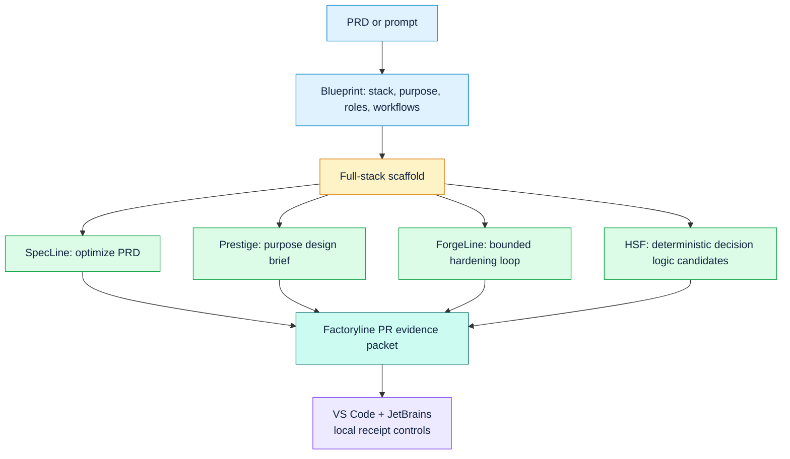

# PRD-to-App Builder

`factory app` turns a PRD or plain-English app idea into a full-stack starter
repo with a blueprint, frontend, backend, database schema, smoke test, and
factory handoff commands.


## One-Shot Command

```bash
factory app from-prd PRD.md --stack nextjs-fastapi-postgres --purpose saas --out my-app
```

Or start from a prompt:

```bash
factory app from-prompt "Build an expense approval app with manager review, audit logs, and policy-based approvals" --out expense-approval
```

## How It Works



## What Gets Generated

```text
my-app/
  PRD.md
  README.md
  app_blueprint.json
  <app>.ssat.yaml
  frontend/
    app/page.tsx
    app/globals.css
    package.json
  backend/
    main.py
    requirements.txt
  db/
    schema.sql
  smoke/
    <app>.json
  coverage/
    requirements.json
  tests/
    test_health.py
  docs/
    WORKFLOW.md
```

## Illustrative Readiness Model

The starter is designed to make the next gates obvious.

```text
PRD clarity      | NOT RUN
Architecture     | NOT RUN
Runtime smoke    | NOT RUN
Design fit       | NOT RUN
PR evidence      | NOT RUN
```

These bars are not measured gate results. They are a visual map of the
readiness dimensions the starter is prepared to hand off to the factory. Replace
them with receipt-backed evidence only after the gates run.

## Why This Is Different

Most app generators optimize for speed. `factory app` optimizes for speed plus
reviewability:

- PRD and prompt become a machine-readable `app_blueprint.json`.
- The generated repo carries smoke-test and PR-evidence hooks.
- Business-rule candidates are listed for deterministic HSF compilation.
- UI work starts with a Prestige purpose brief instead of a generic theme.
- The next commands are printed so a coding agent can harden the app through
  the existing factory gates.

## Supported Starter Stacks

```bash
factory app stacks
```

Current stacks:

- `nextjs-fastapi-postgres`
- `react-fastapi-sqlite`
- `react-fastapi-postgres`

## Recommended Follow-Up

```bash
cd my-app
specline optimize-prd PRD.md
prestige brief PRD.md --purpose saas
forge verify-tests <app-name> <app-name>.ssat.yaml --root .
factory coverage --root .
factory optimize-pr --changed app_blueprint.json --feature my-app
```

Then use the normal factory flow to add product-specific implementation,
compile deterministic decision logic, and produce a PR evidence packet.
`factory coverage` is expected to report `hollow_coverage` on a fresh starter
until product-specific smoke checks are added.
