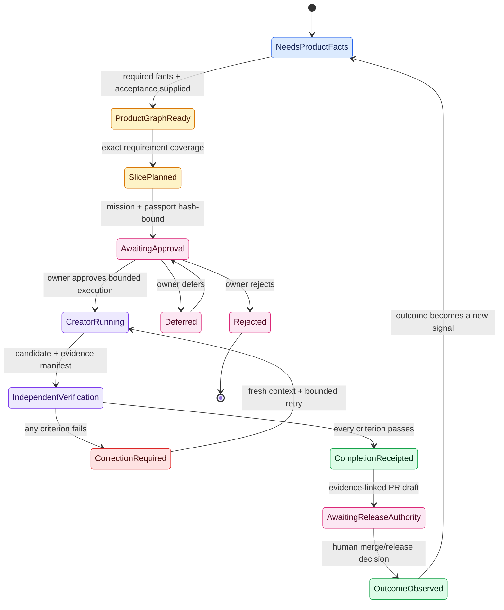
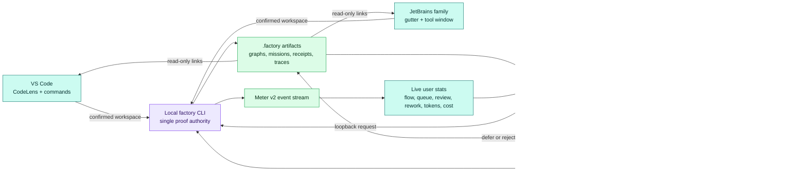

# Code Factory Architecture

These diagrams show the complete version 0.17 design. Colors have one meaning
throughout: blue is supplied input, amber is deterministic policy or planning,
pink is human authority, purple is bounded execution, green is verified
evidence, teal is observed outcome data, and red is a fail-closed correction.

## Complete system topology

```mermaid
flowchart TB
    subgraph INPUTS["Signals and product intent"]
        SIG["Owner-supplied signals<br/>GitHub, Slack, Sentry, social, telemetry"]
        PRD["PRD or plain-language intent"]
        RC["Git-tracked repository facts<br/>AutoWiki + Lore"]
        MR["Migration readiness<br/>8 executable proof lanes"]
    end

    subgraph PRODUCT["Product control"]
        SR["Provenance-bound<br/>untrusted signal receipt"]
        OD["Opinion Dock<br/>product taste + architecture rules"]
        PO{"Product Owner<br/>approve, defer, reject"}
        PG["Product Graph<br/>requirements, UX, trust, outcomes"]
        VS["Deterministic value-slice compiler<br/>exact coverage + dependencies"]
    end

    subgraph MISSION["Bounded mission"]
        MP["Mission + Loop Passport<br/>scope, worktree, roles, budgets"]
        HA{"Human approval or<br/>safe local auto-resolve"}
        CP["29 signed Capability Packs<br/>7 targets + surfaces, languages, capabilities, data, ops"]
        PC["Pack composition<br/>compatibility + 10 mutations each"]
        CR["Creator<br/>fresh minimal context"]
        WT["Isolated branch + worktree"]
    end

    subgraph FACTORY["Software factory"]
        SL["SpecLine<br/>strict spec + validator mutation"]
        FL["ForgeLine<br/>state machine + architecture gates"]
        CH{"Change kind"}
        HSF["HSF<br/>deterministic decision artifact"]
        PX["Prestige<br/>UI and design-token proof"]
    end

    subgraph VERIFY["Independent no-finish verification"]
        EM["Evidence manifest<br/>tests, lint, types, security, coverage"]
        IV["Independent verifier<br/>fresh context wall"]
        CC["Computer control<br/>URL, click ceiling, assertions, visuals"]
        NF{"Every criterion passes<br/>with hash-bound evidence?"}
        FAIL["Causal failure summary<br/>point, reason, evidence, corrective action"]
        PR["Evidence-linked PR draft<br/>risk, rollback, unproven claims"]
    end

    subgraph RELEASE["Human-owned release and learning"]
        RO{"Merge, publish, deploy,<br/>sign, message authority"}
        SHIP["GitHub, PyPI, Zenodo<br/>VS Code + JetBrains packages"]
        OUT["Classified outcomes<br/>measured, observed, modeled, unknown"]
        METER["Meter v2<br/>time, tokens, cost, retries, quality"]
        UI["Factory Studio + IDE control rooms<br/>live status and approval-ready actions"]
    end

    SIG --> SR --> OD --> PO
    PRD --> PG
    PO -->|"approved facts"| PG
    PO -->|"needs input"| FAIL
    PG --> VS --> MP
    RC --> MP
    MR --> MP
    MP --> HA --> CR --> WT
    CP --> PC --> WT
    WT --> SL --> FL --> CH
    CH -->|"decision logic"| HSF
    CH -->|"user-facing UI"| PX
    CH -->|"other code"| EM
    HSF --> EM
    PX --> EM
    FL --> EM
    EM --> IV --> CC --> NF
    NF -->|"no"| FAIL
    FAIL -->|"fresh bounded attempt"| HA
    NF -->|"yes"| PR --> RO --> SHIP
    SHIP --> OUT --> METER --> UI
    OUT -. "new evidence signal" .-> SIG
    UI -. "explicit local commands" .-> HA
    UI -. "read-only evidence links" .-> EM

    classDef input fill:#dbeafe,stroke:#2563eb,color:#172554
    classDef policy fill:#fef3c7,stroke:#d97706,color:#451a03
    classDef human fill:#fce7f3,stroke:#db2777,color:#500724
    classDef work fill:#ede9fe,stroke:#7c3aed,color:#2e1065
    classDef proof fill:#dcfce7,stroke:#16a34a,color:#052e16
    classDef outcome fill:#ccfbf1,stroke:#0f766e,color:#042f2e
    classDef fail fill:#fee2e2,stroke:#dc2626,color:#450a0a
    class SIG,PRD,RC,MR,SR input
    class OD,PG,VS,SL,FL,CH,NF policy
    class PO,HA,RO human
    class MP,CP,PC,CR,WT,HSF,PX,IV,CC work
    class EM,PR,SHIP proof
    class OUT,METER,UI outcome
    class FAIL fail
```

## Mission and no-finish state machine

The state transition is receipt-driven. A creator cannot move itself from
verification to completion, and completion grants no merge or release authority.

## Studio, IDE, CLI, and telemetry interaction

The IDEs and Studio are control surfaces, not alternate receipt authorities.
They invoke explicit local CLI commands and display local artifacts; they do
not upload source, infer approval, or bypass the no-finish and release gates.
