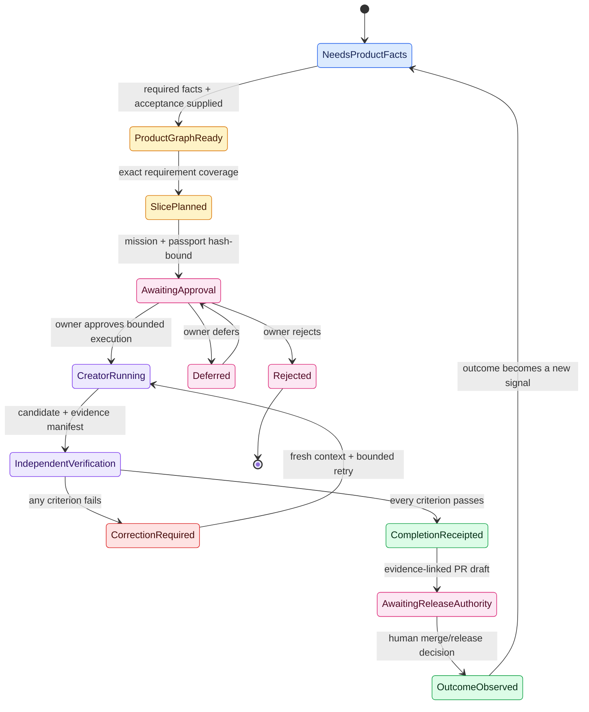
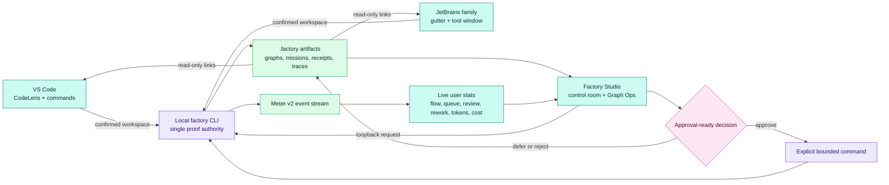

# Code Factory Architecture

These diagrams show the complete version 0.18 design. Colors have one meaning
throughout: blue is supplied input, amber is deterministic policy or planning,
pink is human authority, purple is bounded execution, green is verified
evidence, teal is observed outcome data, and red is a fail-closed correction.

## Canonical module and evidence map

`architecture-boundaries.json` is the source of truth for package ownership and
specialist boundaries. The supported domains are `core`, `verification`,
`agent_protocols`, `graph_ops`, `appforge`, and `enterprise`. The manifest lists
the owning team for every specialist domain; unknown modules remain core until a
human-reviewed boundary change classifies them. Experimental adapters are
explicitly opt-in and require a claim-bound receipt plus human release review.

The executable control surfaces are the authoritative behavior references:

| Capability | Executable surface | Evidence boundary |
| --- | --- | --- |
| Agentic control plane | `factoryline/agentic_control.py` and `factory agent control` | Metadata only; no model, source, merge, or release authority |
| Graph Ops Mission Control | `factoryline/graph_ops.py` and `factory graph ops --json` | Read-only graph, receipts, markers, and next fact-derived action |
| Audit engine | `factoryline/review_audits.py` and `factory audit {patterns,guard-paths,security,evals}` | Static/fixture-backed analysis; not a penetration test or approval |
| Full-stack/AppForge assurance | `factoryline/full_stack_ux_harness.py` and `factory quality-harness` | Local evidence normalization; provider submission remains human-owned |

Release notes and the current version are maintained in `CHANGELOG.md` and
`docs/RELEASE_CHANNELS.md`. New architecture documents should link to one of
these executable surfaces or record a dated architecture decision; superseded
narratives should be indexed here or archived rather than copied into another
capability-specific document.

### Structural-debt controls

Three repository contracts make that rule executable:

- `docs/DOCUMENTATION_INDEX.json` classifies root and `docs/` Markdown as
  canonical, historical, or indexed and requires canonical entries to point to
  an executable surface or a decision record. Unclassified Markdown blocks the
  architecture gate when the policy requires the index.
- `release-train.json` names the core, VS Code, and JetBrains channels,
  requires their version-source and changelog files, and distinguishes
  prepared, verified, uploaded, processing, published, pending-review,
  blocked, and unconfigured states. Upload or moderation is never silently
  promoted to publication.
- `architecture-boundaries.json` explicitly maps the specialist domains and
  the remaining `factoryline/*.py` core surface to named owners. Experimental
  adapters stay opt-in and cannot become an authority source by being listed.
  Architecture health reports both `total_factoryline_modules` and
  `core_modules`; only modules classified as `core` count against the core
  surface budget. This keeps a successful CLI or specialist-pack extraction
  from manufacturing false core debt while preserving the total surface for
  review.

`factory architecture health --json` validates all three contracts alongside
the measured CLI, module, documentation, and release-cadence budgets. An
accepted baseline debt record preserves the remaining monolith and historical
release churn as visible, expiring review debt; it does not rename that debt
healthy or authorize publication.

### AI-native blueprint contracts

`factoryline/blueprint.py` supplies the bounded contracts described in the
AI-native factory blueprint. Retain/Recall/Reflect records are local,
hash-bound observations; librarian promotion preserves source provenance and
forces contested claims into human review. Production signals become
`agent_proposed` intent proposals rather than tasks, approvals, or release
decisions. Typed team plans describe model tiers, dependencies, and polling
metadata without dispatching workers. Access profiles declare read/write,
read-only, and masked paths, but deliberately do not claim Docker, kernel, or
runtime isolation. `factory blueprint status` and the read-only
`factory.blueprint_status` MCP tool expose only verified local receipt counts.
These contracts add deterministic inspectability without pretending that an
external model, provider, sandbox, or orchestration runtime ran.

The same boundary now supports an explicit artifact chain: `Intent` captures
the why, `Spec` the what, and `Plan` the how. `factory blueprint artifact-chain
build` seals the three documents, changed-file scope, work order, risks, and
proof-of-completion commands into one lineage receipt. `verify` recomputes the
document and chain hashes and fails on drift; it never runs the listed commands
or grants execution or release authority.

`factory update --manifest .factory/update-manifest.json` and the read-only
`factory.update_status` MCP tool provide the in-product update notice. The
manifest is local and explicit: CF compares versions and shows a deterministic
`UPDATE_AVAILABLE` or `UP_TO_DATE` result, but never downloads, installs,
restarts, contacts a provider, or publishes on a user's behalf.

Task cards now have a deterministic board projection. `project_task_board`
verifies each hash-bound card, rejects unknown dependencies and cycles, and
maps cards to `triage`, `ready`, `running`, `review`, `blocked`, or `done`
lanes. The `factory.task_board_status` MCP fact exposes dependency edges and
fact-derived next actions, while its 60-second dispatcher value is metadata
only: no lease, dispatch, model, branch, merge, or release authority is
granted.

## Complete system topology

```mermaid
flowchart TB
    subgraph INPUTS["Signals and product intent"]
        SIG["Owner-supplied signals<br/>GitHub, Slack, Sentry, social, telemetry"]
        PRD["PRD or plain-language intent"]
        RC["Git-tracked repository facts<br/>AutoWiki + Lore"]
        MR["Migration readiness<br/>8 executable proof lanes"]
    end

    subgraph PRODUCT["Product control"]
        SR["Provenance-bound<br/>untrusted signal receipt"]
        OD["Opinion Dock<br/>product taste + architecture rules"]
        PO{"Product Owner<br/>approve, defer, reject"}
        PG["Product Graph<br/>requirements, UX, trust, outcomes"]
        VS["Deterministic value-slice compiler<br/>exact coverage + dependencies"]
    end

    subgraph MISSION["Bounded mission"]
        MP["Mission + Loop Passport<br/>scope, worktree, roles, budgets"]
        HA{"Human approval or<br/>safe local auto-resolve"}
        CP["29 signed Capability Packs<br/>7 targets + surfaces, languages, capabilities, data, ops"]
        PC["Pack composition<br/>compatibility + 10 mutations each"]
        CR["Creator<br/>fresh minimal context"]
        WT["Isolated branch + worktree"]
    end

    subgraph FACTORY["Software factory"]
        SL["SpecLine<br/>strict spec + validator mutation"]
        FL["ForgeLine<br/>state machine + architecture gates"]
        CH{"Change kind"}
        HSF["HSF<br/>deterministic decision artifact"]
        PX["Prestige<br/>UI and design-token proof"]
    end

    subgraph VERIFY["Independent no-finish verification"]
        EM["Evidence manifest<br/>tests, lint, types, security, coverage"]
        IV["Independent verifier<br/>fresh context wall"]
        CC["Computer control<br/>URL, click ceiling, assertions, visuals"]
        NF{"Every criterion passes<br/>with hash-bound evidence?"}
        FAIL["Causal failure summary<br/>point, reason, evidence, corrective action"]
        PR["Evidence-linked PR draft<br/>risk, rollback, unproven claims"]
    end

    subgraph RELEASE["Human-owned release and learning"]
        RO{"Merge, publish, deploy,<br/>sign, message authority"}
        SHIP["GitHub, PyPI, Zenodo, Hugging Face<br/>VS Code + JetBrains packages"]
        OUT["Classified outcomes<br/>measured, observed, modeled, unknown"]
        METER["Meter v2<br/>time, tokens, cost, retries, quality"]
    UI["Factory Studio + IDE control rooms<br/>live status, Graph Ops, and approval-ready actions"]
    end

    SIG --> SR --> OD --> PO
    PRD --> PG
    PO -->|"approved facts"| PG
    PO -->|"needs input"| FAIL
    PG --> VS --> MP
    RC --> MP
    MR --> MP
    MP --> HA --> CR --> WT
    CP --> PC --> WT
    WT --> SL --> FL --> CH
    CH -->|"decision logic"| HSF
    CH -->|"user-facing UI"| PX
    CH -->|"other code"| EM
    HSF --> EM
    PX --> EM
    FL --> EM
    EM --> IV --> CC --> NF
    NF -->|"no"| FAIL
    FAIL -->|"fresh bounded attempt"| HA
    NF -->|"yes"| PR --> RO --> SHIP
    SHIP --> OUT --> METER --> UI
    OUT -. "new evidence signal" .-> SIG
    UI -. "explicit local commands" .-> HA
    UI -. "read-only evidence links" .-> EM

    classDef input fill:#dbeafe,stroke:#2563eb,color:#172554
    classDef policy fill:#fef3c7,stroke:#d97706,color:#451a03
    classDef human fill:#fce7f3,stroke:#db2777,color:#500724
    classDef work fill:#ede9fe,stroke:#7c3aed,color:#2e1065
    classDef proof fill:#dcfce7,stroke:#16a34a,color:#052e16
    classDef outcome fill:#ccfbf1,stroke:#0f766e,color:#042f2e
    classDef fail fill:#fee2e2,stroke:#dc2626,color:#450a0a
    class SIG,PRD,RC,MR,SR input
    class OD,PG,VS,SL,FL,CH,NF policy
    class PO,HA,RO human
    class MP,CP,PC,CR,WT,HSF,PX,IV,CC work
    class EM,PR,SHIP proof
    class OUT,METER,UI outcome
    class FAIL fail
```

## Mission and no-finish state machine

```mermaid
stateDiagram-v2
    [*] --> NeedsProductFacts
    NeedsProductFacts --> ProductGraphReady: required facts + acceptance supplied
    ProductGraphReady --> SlicePlanned: exact requirement coverage
    SlicePlanned --> AwaitingApproval: mission + passport hash-bound
    AwaitingApproval --> CreatorRunning: owner approves bounded execution
    AwaitingApproval --> Deferred: owner defers
    AwaitingApproval --> Rejected: owner rejects
    CreatorRunning --> IndependentVerification: candidate + evidence manifest
    IndependentVerification --> CorrectionRequired: any criterion fails
    CorrectionRequired --> CreatorRunning: fresh context + bounded retry
    IndependentVerification --> CompletionReceipted: every criterion passes
    CompletionReceipted --> AwaitingReleaseAuthority: evidence-linked PR draft
    AwaitingReleaseAuthority --> OutcomeObserved: human merge/release decision
    OutcomeObserved --> NeedsProductFacts: outcome becomes a new signal
    Deferred --> AwaitingApproval
    Rejected --> [*]
    classDef input fill:#dbeafe,stroke:#2563eb,color:#172554
    classDef plan fill:#fef3c7,stroke:#d97706,color:#451a03
    classDef human fill:#fce7f3,stroke:#db2777,color:#500724
    classDef work fill:#ede9fe,stroke:#7c3aed,color:#2e1065
    classDef proof fill:#dcfce7,stroke:#16a34a,color:#052e16
    classDef fail fill:#fee2e2,stroke:#dc2626,color:#450a0a
    class NeedsProductFacts input
    class ProductGraphReady,SlicePlanned plan
    class AwaitingApproval,AwaitingReleaseAuthority,Deferred,Rejected human
    class CreatorRunning,IndependentVerification work
    class CompletionReceipted,OutcomeObserved proof
    class CorrectionRequired fail
```

The state transition is receipt-driven. A creator cannot move itself from
verification to completion, and completion grants no merge or release authority.

## Studio, IDE, CLI, and telemetry interaction

```mermaid
flowchart LR
    VSC["VS Code<br/>CodeLens + commands"]
    JB["JetBrains family<br/>gutter + tool window"]
    ST["Factory Studio<br/>control room + Graph Ops"]
    CLI["Local factory CLI<br/>single proof authority"]
    ART[".factory artifacts<br/>graphs, missions, receipts, traces"]
    M2["Meter v2 event stream"]
    DASH["Live user stats<br/>flow, queue, review, rework, tokens, cost"]
    DEC{"Approval-ready decision"}
    EXEC["Explicit bounded command"]

    VSC -->|"confirmed workspace"| CLI
    JB -->|"confirmed workspace"| CLI
    ST -->|"loopback request"| CLI
    CLI --> ART
    ART -->|"read-only links"| VSC
    ART -->|"read-only links"| JB
    ART --> ST
    CLI --> M2 --> DASH
    DASH --> ST
    ST --> DEC
    DEC -->|"approve"| EXEC --> CLI
    DEC -->|"defer or reject"| ART

    classDef surface fill:#ccfbf1,stroke:#0f766e,color:#042f2e
    classDef authority fill:#fce7f3,stroke:#db2777,color:#500724
    classDef engine fill:#ede9fe,stroke:#7c3aed,color:#2e1065
    classDef evidence fill:#dcfce7,stroke:#16a34a,color:#052e16
    classDef action fill:#fef3c7,stroke:#d97706,color:#451a03
    class VSC,JB,ST,DASH surface
    class DEC authority
    class CLI,EXEC engine
    class ART,M2 evidence
```

The IDEs and Studio are control surfaces, not alternate receipt authorities.
They invoke explicit local CLI commands and display local artifacts; they do
not upload source, infer approval, or bypass the no-finish and release gates.
Graph Ops is a bounded read-only overlay over those same artifacts, not a new
authority source. See [Unified Graph Ops](GRAPH_OPS.md).

## Release-cadence guard

Architecture health reports immutable tag history and projects a forward
admission decision from `release-train.json`. The release limits and exception
owner must match `architecture-policy.json`; missing/invalid history or a
policy mismatch fails closed. Release-candidate preflight enforces the same
decision with `E_RELEASE_CADENCE_BLOCKED` and includes the exact
`next_eligible_at` timestamp. The guard never deletes, rewrites, or hides
historical tags. No automatic exception bypass exists: a release exception
requires a separately reviewed human-authority decision and must not be
inferred from a healthy architecture report.
