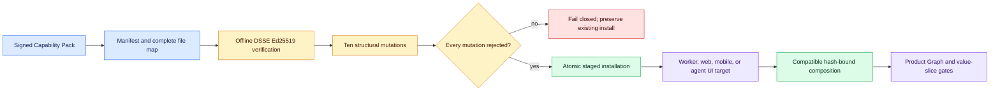
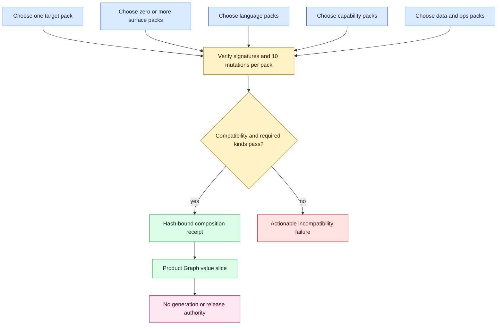

# Capability Packs

Capability Packs make Code Factory targets extensible without turning pack
installation into execution authority. Version 0.17.3 includes 29 signed packs:
seven runnable starter targets plus surface, language, capability, data, and
operations contracts that can be validated and composed before implementation.



See [Code Factory Architecture](ARCHITECTURE.md) for the full component and
authority topology.

```powershell
factory pack list
factory pack validate factoryline/builtin_packs/target-worker
factory pack install factoryline/builtin_packs/target-worker --root .
factory pack compose factoryline/builtin_packs/target-web `
  factoryline/builtin_packs/surface-nextjs `
  factoryline/builtin_packs/language-typescript `
  factoryline/builtin_packs/capability-auth --root . --name review-portal
```

Validation checks canonical UTF-8/LF file hashes against an offline DSSE
Ed25519 signature, then proves the structural validator rejects ten mutations:
required-field deletion, kind replacement, canary removal, accessibility-state
removal, deployment removal, generator mismatch, validator removal, golden
removal, migration-policy relaxation, and provided-capability removal.
Text-file verification is stable across Git's CRLF/LF checkout normalization;
binary files remain byte-exact.
Every pack must include nonempty validators, goldens, and canaries; all standard
UX states; and a migration policy that denies breaking changes, requires human
review, and requires rollback.

Installation writes only below `.factory/packs/<pack-id>`. Existing installs are
preserved unless `--force` is explicit. Force replacement stages the new pack,
backs up the old pack, swaps atomically, and restores the backup on failure.

Composition validates every signature and mutation suite, rejects duplicate or
conflicting packs, enforces required pack kinds and compatible targets, and
writes `.factory/pack-compositions/<name>.json` atomically. The composition is a
review plan: `generate`, `execute`, `deploy`, and `publish` authority all remain
`false` until a Product Graph value slice and independent proof bind the work.

## Built-in catalog

| Kind | Packs |
| --- | --- |
| Target | CLI, API, MCP, worker, web, Expo mobile, supervised agent UI |
| Surface | React, Next.js, Expo, Manifest V3 browser extension |
| Language | Python, TypeScript/JavaScript ESM, Java, Kotlin, .NET/C#, Go, Rust, C/C++ |
| Capability | auth, billing, search, import/export, accessibility, i18n, offline/sync |
| Data | data pipelines, evaluation harnesses |
| Operations | admin and operator control rooms |

The CLI, API, and MCP target packs are executable starter generators. Other
packs are explicit integration contracts: their adapter, validators, goldens,
canaries, UX states, migration policy, deployment profiles, compatibility, and
provided capabilities are reviewable before product code is generated. A
composition never pretends those product-specific integrations already exist.



## Authority boundary

A verified pack may describe a generator. It cannot execute agents, call a
model, access a connector, use credentials, deploy, publish, sign a release, or
send an external message. Those actions remain separate reviewed workflows.

## Pack layout

```text
pack.yaml
generator/adapter.json
validators/manifest.json
goldens/manifest.json
canaries/manifest.json
ux-states/manifest.json
migration-policy.json
pack.trust.json
pack.signature.json
```
