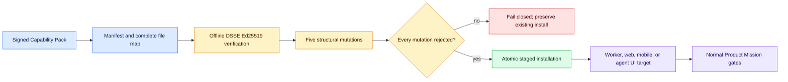

# Capability Packs

Capability Packs make Code Factory targets extensible without turning pack
installation into execution authority. Version 0.16.0 includes signed packs for
headless workers, web apps, Expo mobile apps, and supervised agent UIs.



See [Code Factory Architecture](ARCHITECTURE.md) for the full component and
authority topology.

```powershell
factory pack list
factory pack validate factoryline/builtin_packs/target-worker
factory pack install factoryline/builtin_packs/target-worker --root .
```

Validation checks the exact current file hashes against an offline DSSE
Ed25519 signature, then proves the structural validator rejects four mutations.
Every pack must include nonempty validators, goldens, and canaries; all standard
UX states; and a migration policy that denies breaking changes, requires human
review, and requires rollback.

Installation writes only below `.factory/packs/<pack-id>`. Existing installs are
preserved unless `--force` is explicit. Force replacement stages the new pack,
backs up the old pack, swaps atomically, and restores the backup on failure.

## Authority boundary

A verified pack may describe a generator. It cannot execute agents, call a
model, access a connector, use credentials, deploy, publish, sign a release, or
send an external message. Those actions remain separate reviewed workflows.

## Pack layout

```text
pack.yaml
generator/adapter.json
validators/manifest.json
goldens/manifest.json
canaries/manifest.json
ux-states/manifest.json
migration-policy.json
pack.trust.json
pack.signature.json
```
