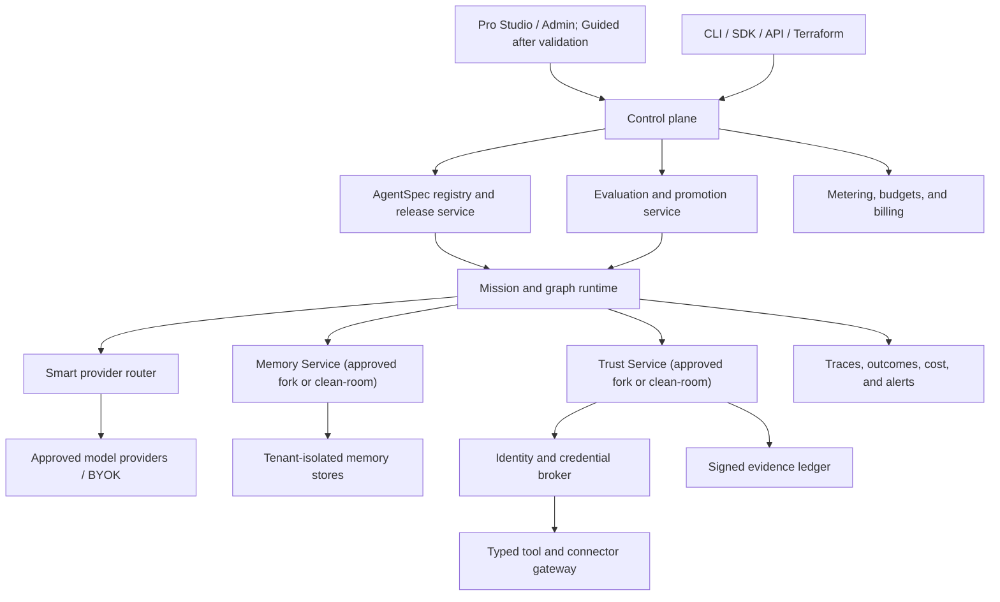

# Code Factory Agent Cloud — Product Requirements Document

**Status:** Proposed
**Version:** 0.2
**Date:** 2026-07-20
**Owner:** Code Factory
**Working title:** Code Factory Agent Cloud

## 1. Executive summary

Code Factory Agent Cloud launches as one governed product: **PR Assurance Agent**. It reviews proposed code changes, runs declared gates, prepares findings, and produces independently verifiable evidence before a human approves merge or deployment.

The launch product is built on a reusable platform kernel: Code Factory's proof-first mission runtime plus two independently governed services implemented either as approved WizeMe forks or clean-room Code Factory components:

- **Memory Service:** durable, attributable agent memory with lifecycle controls.
- **Trust Service:** policy enforcement, delegated authority, approvals, and signed evidence.

The product promise is stated in one sentence:

> Describe a job. Get an agent that remembers correctly, acts only within explicit authority, stays inside budget, and proves what it did.

The long-term product serves two modes over the same underlying `AgentSpec` and runtime:

- **Launch mode — Pro/Admin:** CLI/API, Git integration, BYOK, policy, approvals, observability, and signed receipts for technical design partners.
- **Post-validation mode — Guided:** job templates, plain-language setup, safe defaults, simulations, and explicit approval prompts after the runtime succeeds with design partners.

This is not a generic chatbot builder or a horizontal agent platform at launch. PR Assurance is the product; the reusable Memory, Trust, runtime, and receipt components are its platform kernel. Additional agent categories are roadmap hypotheses until the first product demonstrates customer value, safe operation, and acceptable economics.

## 2. Decision and product thesis

### 2.1 Decision

Proceed to a four-week discovery and architecture phase with a hard go/no-go review. Do not begin the hosted multi-tenant build until:

1. WizeMe fork rights and provenance are approved, or clean-room implementations are selected;
2. five qualified design partners confirm the PR-assurance problem;
3. three commit to a controlled pilot; and
4. at least two accept a documented paid price range.

### 2.2 Thesis

Agent builders have reduced creation steps, but enterprises still struggle with five operational gaps:

1. memory that is relevant, attributable, erasable, and tenant-safe;
2. authority that is explicit, least-privileged, and revocable;
3. deterministic evaluation before and after deployment;
4. predictable cost and provider portability;
5. evidence that explains what an agent knew, decided, and changed.

Code Factory can differentiate by making memory an input to decisions—never a source of authority—and by producing cryptographically verifiable receipts for consequential actions.

## 3. Market evidence and opportunity

### 3.1 Demand signals

- McKinsey reports that 23% of surveyed organizations are scaling an agentic AI system somewhere in the enterprise and another 39% are experimenting. IT and knowledge management are among the most common functions for agent use. [The State of AI 2025](https://www.mckinsey.com/capabilities/quantumblack/our-insights/the-state-of-ai)
- Menlo Ventures estimates 2025 enterprise generative-AI spending at $37 billion, including approximately $18 billion for infrastructure and $750 million for agent platforms. [The State of Generative AI in the Enterprise 2025](https://menlovc.com/perspective/2025-the-state-of-generative-ai-in-the-enterprise/)
- IDC forecasts worldwide AI spending to exceed $631 billion by 2028. This is a broad contextual ceiling, not Code Factory's addressable market. [IDC Worldwide AI and Generative AI Spending Outlook](https://www.idc.com/resource-center/blog/idcs-worldwide-ai-and-generative-ai-spending-industry-outlook/)
- Gartner predicts that more than 40% of agentic-AI projects will be canceled by the end of 2027 because of escalating cost, unclear business value, or inadequate risk controls. These failure modes map directly to Code Factory's proposed budget, verification, and trust controls. [Gartner, June 2025](https://www.gartner.com/en/newsroom/press-releases/2025-06-25-gartner-predicts-over-40-percent-of-agentic-ai-projects-will-be-canceled-by-end-of-2027)

### 3.2 Market context and investment threshold

The IDC and Menlo figures establish that AI infrastructure and agent platforms are funded categories; they do not prove demand for Code Factory. The PRD therefore does not use a top-down TAM-to-SOM projection as an investment decision.

Phase 0 continues only when primary customer evidence meets all of these thresholds:

| Evidence | Threshold |
|---|---:|
| Qualified PR-assurance interviews | 15 |
| Organizations confirming the problem and current measurable cost | 5 |
| Organizations committing staff and repository access to a controlled pilot | 3 |
| Organizations accepting a written paid pilot range | 2 |
| Required annual contract value indicated by the two price-qualified organizations | $15k–$50k each |

After ten design partners, the company shall publish an internal bottom-up model using observed sales cycle, conversion, deployment effort, retention, model cost, infrastructure cost, and gross margin. Until then, market figures remain contextual research only.

## 4. Target customers and jobs to be done

### 4.1 Post-validation Guided builder

**Profile:** operator, founder, analyst, customer-service lead, or domain expert with little agent-engineering experience.

**Job:** “Turn this repeatable job into a dependable assistant without learning orchestration frameworks or exposing company data.”

Needs:

- outcome-based templates instead of a blank graph canvas;
- plain-language permissions and memory controls;
- test data, previews, and explanations;
- a visible cost ceiling and kill switch;
- one-click deployment after checks pass.

### 4.2 Professional builder

**Profile:** application or AI engineer building internal agents.

**Job:** “Ship a provider-portable agent with durable state, tests, human approval, and operational telemetry.”

Needs:

- declarative `AgentSpec`, API, SDK, CLI, and Git integration;
- custom tools, validators, memory policies, and model routing;
- local/cloud parity and reproducible environments;
- trace replay, evaluation gates, and release promotion.

### 4.3 Enterprise platform and risk team

**Profile:** platform engineering, security, compliance, architecture, and FinOps.

**Job:** “Allow teams to deploy agents while retaining control over identity, data, models, cost, and evidence.”

Needs:

- SSO, SCIM, RBAC/ABAC, separation of duties, and service identities;
- tenant isolation, regional controls, customer-managed keys, and private execution;
- agent inventory, ownership, expiry, policy, and audit export;
- provider allowlists, BYOK, quotas, cost attribution, and emergency revocation;
- high availability, disaster recovery, contracted service response, and procurement artifacts.

## 5. Goals and non-goals

### 5.1 Goals

1. A technical design partner can connect a repository and complete a first verified PR-assurance run in under 30 minutes.
2. Every consequential tool action is authorized at execution time and produces a signed receipt.
3. Every durable memory has tenant, subject, source, purpose, provenance, retention, and deletion metadata.
4. Users can bring provider keys and route across approved models without changing the agent definition.
5. Hard cost limits are enforced at the gateway, not merely displayed in the UI.
6. The same agent artifact powers Pro/Admin in v1 and shall power Guided mode after the Phase 2 exit gate without a schema rewrite.
7. Agent behavior is testable, replayable, versioned, and promotable through environments.

### 5.2 Non-goals for v1

- a general-purpose consumer assistant;
- autonomous payments or financial transfers;
- autonomous hiring, credit, medical, or legal determinations;
- unreviewed production deployments;
- a marketplace for arbitrary unverified tools;
- training foundation models;
- replacing full workflow-automation platforms across every connector category;
- promising completion of open-ended tasks at a fixed price before enough operating data exists.
- consumer applications or consumer acquisition in v1;
- B2C or C2C production templates in v1;
- a public horizontal agent-builder platform in v1;
- autonomous merge or production deployment in v1.

## 6. Launch use case and roadmap hypotheses

| Priority | Use case | Why it fits | Default authority |
|---|---|---|---|
| Launch | Governed software maintenance and PR assurance | Code Factory already has missions, validators, provider routing, and receipts | Read repository and write isolated branch; human approves merge/deploy |
| Post-v1 pilot | Compliance evidence collector | Bounded sources and objectively verifiable outputs | Read systems; write isolated evidence workspace |
| Post-v1 pilot | Customer-service case triage and response drafting | Quality checks and human review are definable | Draft only; human sends |
| Research | Internal knowledge-and-action agent | Memory creates compounding value but expands data-governance scope | Read by default; approval for writes |
| Research | Research and reporting agent | Sources, citations, freshness, and receipt chains are measurable | Read web/data; write isolated report |
| Research | Sales and CRM hygiene | High repetition but connector and identity complexity | Suggest changes; approval to commit |
| Research | Finance close and reconciliation assistance | Strong value and deterministic checks, but high sensitivity | Read/reconcile; no autonomous transfer |

Only PR Assurance is committed for v1. Other use cases are discovery hypotheses and receive no production implementation until the launch product passes its commercial, safety, and operating gates. Future use cases are admitted only when they score well on frequency, value, verifiability, reversibility, bounded tools, and manageable data sensitivity.

### 6.1 Post-v1 template research portfolio

The table below preserves B2B, B2C, and C2C product hypotheses requested during discovery. It is not the v1 build list. A candidate becomes a committed template only after customer validation and must then include an `AgentSpec`, setup wizard, connector scopes, test pack, budget defaults, risk classification, expected outcomes, and an upgrade path.

| Motion | Template | Outcome | Base tier | Premium Memory + Trust value |
|---|---|---|---|---|
| B2B | PR Assurance Agent | reviews a change, runs gates, drafts findings, and assembles evidence | Launch product | remembers architecture decisions; policy-gates merge/deploy; signs evidence |
| B2B | Compliance Evidence Agent | collects control evidence and drafts an audit packet | Business | remembers control history; enforces separation of duties and retention |
| B2B | Customer Service Agent | triages cases, retrieves answers, and drafts responses | Team | remembers customer context with purpose limits; approval-gates external sends |
| B2B | Account Research Agent | prepares sourced account briefs and CRM suggestions | Team | retains approved account facts; limits CRM changes and proves sources |
| B2B | Vendor Risk Agent | gathers questionnaires, policies, and risk deltas | Business | retains review history; applies policy and approval chains |
| B2B | IT Service Desk Agent | answers requests and proposes bounded remediation | Business | user/device memory; identity-bound authority and action receipts |
| B2C | Personal Learning Coach | creates plans, quizzes, and progress summaries | Builder | remembers goals and learning history with user-controlled deletion |
| B2C | Purchase Research Agent | compares products against explicit preferences | Builder | remembers durable preferences; proves sources and affiliate disclosures |
| B2C | Travel Planning Agent | builds and revises itineraries and checklists | Builder | remembers constraints; approval-gates bookings and sensitive actions |
| B2C | Family Admin Agent | coordinates calendars, documents, and reminders | Team | household-scoped memory, guardian controls, and delegated permissions |
| C2C | Marketplace Listing Agent | drafts, checks, and publishes a listing | Builder | remembers seller preferences; approval-gates publication and messages |
| C2C | Community Moderator Agent | triages reports and recommends moderation actions | Team | remembers precedents with expiry; policy-bound actions and appeal receipts |
| C2C | Peer Exchange Coordinator | matches requests/offers and coordinates handoff | Team | consent-scoped reputation memory; trust rules for contact and disputes |

Templates involving long-lived personal/company context, multi-party identity, external side effects, regulated data, delegated authority, or independently verifiable evidence require the complete Memory and Trust control set. They cannot be configured without those controls. Commercial packaging charges for governance depth, retention, scale, private deployment, and contracted operations—not for foundational safety.

### 6.2 Template admission and tier rules

Every template is scored before publication:

- **Memory need:** none, run-only, durable personal, durable organizational, or multi-party.
- **Authority:** read, draft, propose, write with approval, or bounded autonomous.
- **Risk:** low, moderate, high, or prohibited.
- **Verification:** deterministic, rubric, human, external confirmation, or combined.
- **Reversibility:** reversible, compensating action, or irreversible.
- **Data class:** public, internal, confidential, regulated, or prohibited.

Any future template with durable organizational/multi-party memory, write authority, high risk, regulated data, or compliance claims requires both services, governed tenancy, adversarial tests, and admin policy. A template that cannot define a reliable validator is not eligible for bounded autonomy.

## 7. Product experience

### 7.1 Post-validation Guided mode

Guided mode is not a Phase 1 dependency. It begins only after the PR Assurance runtime, policies, receipts, and pilot economics pass the private-alpha gates.

1. **Choose a job:** select a curated template such as “triage customer cases” or describe a job in plain language.
2. **Connect sources:** OAuth connection wizard explains exactly what data and actions are requested.
3. **Set memory:** user chooses what the agent may remember, for whom, for how long, and sees examples.
4. **Set authority:** user selects read-only, propose, approval-required, or bounded-autonomous actions.
5. **Set budget:** per-run and monthly hard caps, quality/cost preference, and allowed providers.
6. **Test:** generated happy-path, edge-case, adversarial, and privacy cases run in a sandbox.
7. **Review:** visual timeline shows inputs, recalled memory, decisions, proposed actions, cost, and receipts.
8. **Publish:** checklist blocks deployment until required tests, ownership, and emergency controls exist.
9. **Operate:** users can pause, revoke, replay, forget, export, and explain an agent from one control room.

The UI uses progressive disclosure. It never requires users to understand graphs, embeddings, capability tokens, or model identifiers to complete the safe path.

#### Post-v1 “Build-a-pizza” composer

The primary custom setup is a constrained ingredient composer:

1. **Crust — job:** start from a template or name the outcome.
2. **Sauce — knowledge:** choose approved files, apps, sites, or databases.
3. **Cheese — memory:** none, this run, personal, team, or governed premium memory.
4. **Toppings — skills/tools:** add compatible actions from a typed catalog.
5. **Oven — model and runtime:** choose Economy, Balanced, or Highest Quality; admins map these to allowed providers.
6. **Safety seal — trust:** read-only, draft, ask before acting, or bounded autonomy.
7. **Size — budget:** choose a clear per-run/monthly ceiling.
8. **Taste test — verification:** run supplied examples and generated edge cases before publishing.

The composer continuously displays price, risk, required tier, and missing prerequisites. Incompatible ingredients are disabled with a plain-language reason. Selecting durable memory or consequential actions automatically enables the required Memory and Trust controls. No plan or payment choice can bypass required controls.

The final screen says what the agent **can read**, **can remember**, **can do**, **must ask about**, **can cost**, and **how success is checked**. Advanced users can switch to the graph or specification without losing the guided configuration.

### 7.2 Launch Pro/Admin mode

- YAML/JSON `AgentSpec`, CLI, REST API, SDK, and Terraform provider;
- graph editor with versioned nodes, edges, checkpoints, and validators;
- policy-as-code, model/tool allowlists, environment promotion, and four-eyes approval;
- GitOps sync, pull-request previews, canaries, release rings, and rollback;
- fleet inventory with owner, business purpose, risk tier, version, last evaluation, and expiry;
- SIEM, OpenTelemetry, evidence-bundle, and compliance-control exports.

## 8. Functional requirements

This section defines the target-state product contract. V1 implementation scope is limited by Section 18 and the delivery phases: PR Assurance, Pro/Admin operation, GitHub, two model providers, and the Memory/Trust contract paths. Guided composition, broad connectors, Terraform, and enterprise administration remain post-validation requirements.

### 8.1 Agent definition and lifecycle

- **AGT-001:** The platform shall store every agent as a versioned, exportable `AgentSpec`.
- **AGT-002:** `AgentSpec` shall reference prompts, graph/workflow, tools, model policy, memory policy, authority policy, validators, budgets, owner, and risk tier.
- **AGT-003:** Editing through Guided or Pro mode shall update the same canonical artifact.
- **AGT-004:** Draft, test, approved, deployed, suspended, retired, and expired states shall be explicit.
- **AGT-005:** Deployment shall require an owner, purpose, risk tier, budget, validator set, and emergency stop.
- **AGT-006:** Export shall include the agent definition, compatible fork schema versions, and non-secret references.

### 8.2 WizeMe Memory Fork

- **MEM-001:** Memory shall be an independently deployable service behind a stable interface.
- **MEM-002:** Every memory write shall carry tenant, agent, subject, source, timestamp, purpose, provenance, confidence, retention, and policy version.
- **MEM-003:** Retrieval shall enforce tenant, subject, purpose, and agent scope before ranking.
- **MEM-004:** Memory shall provide remember, inspect, explain, correct, expire, delete, export, and legal-hold operations.
- **MEM-005:** Users shall be able to answer “Why does this agent know this?” from the UI and API.
- **MEM-006:** Retrieved memory shall be treated as untrusted context and shall never grant tool authority.
- **MEM-007:** The service shall defend against memory poisoning, indirect prompt injection, and cross-session persistence attacks with source labeling, sanitization, anomaly checks, and write policy. OWASP identifies persistent memory corruption and exfiltration as agent-specific risks. [OWASP Agent Memory Guard](https://owasp.org/www-project-agent-memory-guard/)
- **MEM-008:** A deletion request shall remove or cryptographically tombstone all eligible derived records and produce a deletion receipt.
- **MEM-009:** The service shall provide local, hosted, and customer-controlled storage adapters.

### 8.3 WizeMe Trust Fork

- **TRU-001:** Trust shall be an independently deployable policy and evidence service.
- **TRU-002:** Every tool call shall be checked at execution time against tenant, agent, user/service identity, delegated scope, resource, risk, environment, budget, and policy version.
- **TRU-003:** Authority shall use short-lived, audience-bound capability grants; raw human credentials shall not be shared with agents.
- **TRU-004:** Policies shall provide deny, allow, require approval, constrain parameters, rate-limit, and require-validator decisions.
- **TRU-005:** Consequential actions shall emit signed, tamper-evident receipts linked to inputs, policy, model, tool, result, and prior receipt.
- **TRU-006:** Emergency revocation shall stop new privileged actions without waiting for an agent process to exit.
- **TRU-007:** Approval requests shall show the exact proposed action, affected resources, recalled memory, estimated cost, and reversible/irreversible status.
- **TRU-008:** The service shall enforce separation of duties and four-eyes approval for high-risk actions.
- **TRU-009:** Trust decisions shall be deterministic for identical normalized inputs and policy versions.

### 8.4 Runtime, routing, and cost

- **RUN-001:** The runtime shall execute bounded graphs with checkpoints, retry limits, deadlines, and loop budgets.
- **RUN-002:** Every worker/validator handoff shall use a declared input/output contract and isolated context.
- **RUN-003:** The smart router shall provide BYOK and managed-key routes plus provider/model allowlists, residency, quality, latency, price, cache-affinity, and fallback rules.
- **RUN-004:** Provider routing shall remain separate from provider invocation and credential custody.
- **RUN-005:** Per-run, per-agent, per-team, and per-tenant hard spend limits shall be enforced before a paid call is issued.
- **RUN-006:** The system shall reserve estimated call cost, reconcile actual cost, and refuse a call when the remaining budget cannot cover the reservation.
- **RUN-007:** Model switching shall account for cache-break cost and must not weaken policy or evaluation requirements.
- **RUN-008:** A quality/cost control may select among admin-approved routes; it shall not silently opt into an unapproved provider.
- **RUN-009:** Users shall see estimated range, accrued cost, remaining budget, routing reason, and termination reason.

### 8.5 Tools and connectors

- **TOL-001:** Connectors shall expose typed, narrowly scoped actions rather than arbitrary credential access.
- **TOL-002:** Tools shall declare side effects, reversibility, data classes, scopes, idempotency behavior, and rate limits.
- **TOL-003:** Write tools shall provide dry run or preview when technically possible.
- **TOL-004:** Duplicate/replayed action requests shall be detected by idempotency key and receipt lineage.
- **TOL-005:** Connector credentials shall be held in a secret broker and exchanged for short-lived tokens where supported.
- **TOL-006:** Untrusted tool output shall be labeled and isolated from system policy.

### 8.6 Evaluation and release

- **EVA-001:** Each template shall ship with deterministic, model-judged, adversarial, privacy, and cost tests as appropriate.
- **EVA-002:** Builders shall define acceptance thresholds and required validators before deployment.
- **EVA-003:** Releases shall be promoted through development, test, canary, and production environments with immutable versions.
- **EVA-004:** Production traces may be converted to redacted regression cases only under an explicit data policy.
- **EVA-005:** Re-evaluation shall be required after model, prompt, tool, memory schema, trust policy, or dependency changes.
- **EVA-006:** The platform shall distinguish test evidence from production evidence and never present LLM judgment as deterministic proof.
- **EVA-007:** Deterministic validators are mandatory release gates for authorization, identity, tenant isolation, budgets, signatures, schemas, builds, declared tests, and exact postconditions.
- **EVA-008:** Model-judged evaluations may score relevance, completeness, tone, or other semantic quality; they shall be labeled heuristic and cannot authorize actions or satisfy security, compliance, signature, budget, or isolation requirements.
- **EVA-009:** A high-risk semantic decision requires human approval or an independently observable deterministic postcondition in addition to any model score.
- **EVA-010:** Evaluators execute with read-only access to the candidate artifact and cannot mutate the registry entry, test fixture, policy, threshold, or evidence they judge.

### 8.7 Enterprise administration

- **ENT-001:** Enterprise plans shall provide OIDC/SAML SSO, SCIM, RBAC, attribute-based conditions, and service accounts.
- **ENT-002:** The platform shall provide a hosted control plane with customer-controlled execution and data planes.
- **ENT-003:** Enterprise customers shall configure region, retention, encryption keys, model providers, tool catalogs, and egress policy.
- **ENT-004:** Audit exports shall integrate with SIEM and include actor, agent, policy, memory provenance, action, result, and receipt verification state.
- **ENT-005:** The platform shall expose inventory, ownership, stale-agent, untested-change, excessive-authority, and budget-risk reports.
- **ENT-006:** Legal hold, data export, tenant deletion, and offboarding shall be documented, testable workflows.

## 9. Memory and Trust implementation strategy

Memory and Trust shall be independently governed services. The preferred implementation is a provenance-approved WizeMe fork. The mandatory fallback is a clean-room Code Factory implementation behind the same versioned contracts. Neither path may copy source folders into the SaaS monolith.

### 9.1 Week 1–2 implementation decision

Before code is forked or reimplemented:

1. identify canonical upstream repositories and commit SHAs;
2. verify ownership, license, contributor terms, patents, trademarks, third-party notices, and training/data rights;
3. preserve Git history and required attribution;
4. produce dependency SBOMs and vulnerability baselines;
5. document upstream security-reporting and release channels;
6. obtain written approval for any private or non-permissive code reuse;
7. freeze the service contracts used by both the fork and clean-room paths; and
8. record the fork-versus-clean-room decision by the end of Week 2.

The repositories were not available in the current Code Factory workspace during preparation of this PRD. If rights, provenance, or security review is not approved by the Week 2 gate, the project automatically selects clean-room implementation. Discovery does not wait until Week 6 for this decision.

### 9.2 Service boundaries

| Service | Proposed package/service | Owns | Must not own |
|---|---|---|---|
| Memory | `factory-memory-core` | memory records, retrieval, provenance, retention, deletion, storage adapters | action permissions, provider secrets, billing |
| Trust | `factory-trust-core` | policy decisions, capability grants, approvals, revocation, receipt signing/verification | semantic memory ranking, model prompts, raw connector credentials |

The initial boundary artifacts live under `products/agent-cloud/forks/`. No source file, schema, migration, credential, database, or asset is read from or written to a WizeMe application directory during this PRD phase. A future import must be an explicit, provenance-reviewed fork operation into these isolated repositories/folders. A clean-room implementation must use behavior and interface requirements without copying restricted source.

### 9.3 Governance rules

- Each service implementation has an independent repository, package namespace, semantic version, security policy, changelog, SBOM, signing key, and release pipeline.
- The SaaS consumes both through versioned interfaces and contract tests.
- No shared database tables, encryption keys, or administrator credentials are permitted between the services.
- Schema migrations are forward-compatible for at least one prior major version and include export/rollback procedures.
- When a fork is approved, upstream sync occurs through reviewed merge proposals. Security fixes are prioritized; feature sync requires an architecture decision record. Clean-room implementations have no upstream-sync path.
- A compatibility matrix records Code Factory runtime, Memory API, Trust API, and receipt-schema versions.
- Customers can export memory and verify receipts without retaining a Code Factory subscription.
- Fork telemetry is opt-in, tenant-scoped, documented, and never includes raw memory or secrets.

### 9.4 Exit criteria for service readiness

- provenance and license review approved for the fork path, or clean-room implementation selected;
- fork or clean-room decision recorded by the Week 2 gate;
- API contracts and threat models approved;
- cross-tenant, deletion, revocation, replay, rollback, and signature mutation tests passing;
- signed artifacts, SBOM, reproducible build evidence, and incident owner established;
- migration tool successfully round-trips an approved anonymized fixture.

### 9.5 Clean-room surgery requirement

When either service selects `clean_room`, the implementation shall follow [`products/agent-cloud/CLEAN_ROOM_SURGERY.md`](../products/agent-cloud/CLEAN_ROOM_SURGERY.md) and activate the accompanying AKU. The WizeMe application folder remains outside the authorized workspace. Contracts and adversarial test vectors are written before implementation; clean builds execute without a WizeMe path mounted; contamination stops work and requires legal/security clearance. A clean-room implementation is never described or released as a WizeMe fork.

## 10. System architecture

### 10.1 Plane separation

- **Control plane:** tenancy, agent definitions, policy administration, releases, inventory, billing.
- **Execution plane:** sandboxed graph execution, workers, validators, routing, and tool mediation.
- **Memory plane:** scoped memory storage/retrieval and lifecycle.
- **Trust/evidence plane:** authorization, approvals, revocation, signing, and verification.

Memory can influence a proposed decision. Only Trust can authorize an action. The runtime cannot bypass either service for privileged operations.

### 10.2 Core domain objects

- `Tenant`, `Workspace`, `Principal`, `Role`, `Agent`, `AgentVersion`, `Deployment`
- `Mission`, `Run`, `Step`, `Validator`, `Outcome`
- `MemoryRecord`, `MemoryPolicy`, `MemoryEvent`, `DeletionReceipt`
- `Policy`, `CapabilityGrant`, `Approval`, `Revocation`, `ActionReceipt`
- `ProviderRoute`, `CredentialRef`, `Budget`, `CostReservation`, `UsageEvent`
- `Tool`, `Connector`, `Action`, `Environment`, `EvidenceBundle`

## 11. Security, privacy, and compliance requirements

The governance model shall map to the NIST AI Risk Management Framework and its Generative AI Profile. [NIST AI RMF](https://www.nist.gov/itl/ai-risk-management-framework)

Minimum controls:

- zero-trust service authentication and least-privilege authorization;
- tenant isolation at application, database, cache, queue, object-store, and key layers;
- encryption in transit and at rest, with enterprise customer-managed-key option;
- immutable security audit stream separated from user-editable traces;
- data classification, DLP/redaction, residency, retention, export, and erasure;
- sandboxed tool execution, network egress policy, malware scanning, and dependency controls;
- prompt-injection, tool-poisoning, memory-poisoning, confused-deputy, replay, and delegation tests;
- incident response, key rotation, vulnerability disclosure, penetration testing, and disaster exercises;
- subprocessor inventory and data-processing terms;
- legal review against applicable EU AI Act and sector-specific obligations before launch in each market. [European Commission AI regulatory framework](https://digital-strategy.ec.europa.eu/en/policies/regulatory-framework-ai)

### 11.1 Required threat-model invariants

1. A memory record cannot expand capability.
2. A model response cannot invoke a tool outside an active capability grant.
3. A human's connector credential cannot become a reusable agent secret.
4. A tenant identifier supplied by a client is never sufficient authorization.
5. An approval is bound to exact normalized action parameters and expires.
6. A receipt remains independently verifiable after account closure.
7. A budget race cannot allow concurrent calls to exceed a hard ceiling.
8. An evaluator cannot modify the artifact it judges in the same context.

## 12. Competitive landscape

| Category / product | Strength | Gap Code Factory can target |
|---|---|---|
| [LangSmith / LangGraph Platform](https://www.langchain.com/langsmith/deployment) | Mature graph runtime, observability, evaluations, deployment, human-in-the-loop | Make signed evidence and Memory/Trust service isolation the core product rather than add-ons |
| [OpenAI Workspace Agents](https://openai.com/business/workspace-agents/) and [Frontier](https://openai.com/business/frontier/) | Strong models, no-code creation, connectors, enterprise controls | Provider neutrality, BYOK, customer-controlled execution, portable `AgentSpec`, independent receipts |
| [Microsoft Copilot Studio](https://www.microsoft.com/en-us/microsoft-365/copilot/pricing/copilot-studio) | Microsoft distribution and broad business integration | Cross-cloud/provider portability and software-delivery assurance |
| [Google Vertex AI Agent Builder](https://docs.cloud.google.com/agent-builder) | Managed Google Cloud agent stack and governance | Cloud-neutral control and simpler guided path |
| [AWS Bedrock AgentCore](https://aws.amazon.com/bedrock/agentcore/pricing/) | Modular runtime, memory, identity, gateway, observability, and policy | Multi-cloud UX, independently verifiable receipts, opinionated end-to-end builder |
| [Salesforce Agentforce](https://help.salesforce.com/s/articleView?id=004811240&language=en_US&type=1) | CRM-native data/actions and outcome-oriented pricing | Non-CRM jobs, BYOK, portable governance |
| [Dify](https://dify.ai/pricing/dify-enterprise) | Accessible visual workflows, knowledge, tools, self-hosting | Assurance-grade policy, evidence, and release gates |
| [Zapier Agents](https://help.zapier.com/hc/en-us/articles/24393442652557-Build-an-agent-in-Zapier-Agents) | Novice experience and thousands of app integrations | Deep mission validation, enterprise trust, durable provenance |
| [Mem0](https://mem0.ai/pricing) | Focused managed memory and developer adoption | Integrated authority, receipts, evaluation, and full lifecycle |
| [Zep](https://www.getzep.com/pricing/) | Temporal context graph and enterprise deployment options | Unified builder/runtime/trust experience |
| [Letta](https://docs.letta.com/guides/cloud/plans) | Stateful agents and memory-first runtime | Policy enforcement, signed action evidence, guided enterprise operations |

OpenAI announced on June 3, 2026 that Agent Builder and its Evals product will be wound down after November 30, 2026, while directing developers toward the Agents SDK and Workspace Agents. This highlights both demand and platform-dependency risk; Code Factory should compete on portable artifacts rather than temporary UI features. Source verified on 2026-07-20. [OpenAI AgentKit update](https://openai.com/index/introducing-agentkit/)

### 12.1 Defensible differentiation

The moat cannot be “we also have a canvas.” It must be the accumulated operating system around safe outcomes:

- one portable specification across guided and professional experiences;
- hard separation of memory and authority;
- signed, independently verifiable action and deletion receipts;
- provider-neutral routing with enforceable cost rails;
- reproducible eval and release pipelines;
- high-quality templates with real validators and operational data;
- transparent fork governance and customer-controlled deployment.

## 13. Barriers and mitigations

| Barrier | Consequence | Mitigation / gate |
|---|---|---|
| WizeMe fork rights or provenance unclear | Legal/security launch blocker | Sprint 0 audit; clean-room rewrite if necessary |
| Memory poisoning and prompt injection | Persistent compromise or exfiltration | Provenance, untrusted-context labels, write gates, anomaly detection, adversarial suite |
| Connector credential sprawl | Excess authority and breach risk | Brokered OAuth, short-lived grants, typed tools, no shared human credentials |
| Model and provider drift | Silent quality regressions | Version pinning, continuous eval, canaries, automatic rollback |
| Unpredictable inference cost | Customer distrust and failed margins | Reservations, hard caps, cache-aware routing, pass-through visibility |
| Weak deterministic feedback | Agents appear complete without correct outcomes | Readiness score, required validators, bounded use-case admission |
| Enterprise procurement | Slow sales and blocked deployment | SOC 2 roadmap, security packet, DPA, SLA, BYOC, audit exports |
| Integration network effects | Incumbents win on connector count | Start with 5–8 high-value connectors; typed action quality over breadth |
| Novice complexity | Low activation and unsafe setup | Job templates, progressive disclosure, simulations, safe defaults |
| Enterprise customization | Services-heavy, non-repeatable deployments | Stable extension interfaces, policy packs, template inheritance, partner program |
| Trust claims without proof | Reputational risk | Public verification tools, reproducible builds, third-party assessment |

## 14. Packaging and pricing hypothesis

Pricing remains a discovery hypothesis. Phase 0 tests paid PR Assurance pilots before public self-service packaging is built.

| Plan | Proposed price | Included focus |
|---|---:|---|
| Open/local | $0 | local PR Assurance workflow and receipt verification; no hosted SLA |
| Paid pilot | $15k–$50k fixed term | one bounded repository workflow, onboarding, measured baseline, and weekly review |
| Team cloud, post-validation | $299/month base | shared PR Assurance, approvals, environments, BYOK, and metered runs |
| Business, post-validation | $1,500/month base | SSO, audit export, organizational memory, advanced policy/routing, retention controls |
| Enterprise, post-validation | $50k–$150k+ annual | SCIM, BYOC/private plane, customer-managed keys, SLA, governance, and contracted services |

### 14.1 Universal safety versus premium governance

Every plan receives tenant isolation, secret protection, hard budgets, runtime authorization, approval for consequential actions, and tamper-evident audit events. These controls are not optional add-ons.

Business and Enterprise charge for governance depth and operating scale: durable organizational memory, configurable retention, legal hold, separation of duties, signed evidence history, private execution, customer-managed keys, SCIM, SIEM export, contractual availability, and service-response commitments. A workflow that requires one of these controls cannot be published on a tier that lacks it.

Managed model and infrastructure consumption should be itemized. BYOK customers pay platform/runtime charges without hidden model markup. Gross-margin reporting must separate subscription margin from pass-through inference spend.

Competitive anchors include LangSmith Plus at $39 per user per month plus usage, Mem0 Starter at $19 and Pro at $249 per month, and Copilot Studio capacity sold in message packs. These provide category context only. Code Factory pricing shall be tested against verified PR-review outcomes and avoided engineering/review cost, not feature counts. [LangSmith pricing](https://www.langchain.com/pricing), [Mem0 pricing](https://mem0.ai/pricing), [Copilot Studio pricing](https://www.microsoft.com/en-us/microsoft-365/copilot/pricing/copilot-studio)

## 15. Go-to-market

### 15.1 Initial wedge

Sell one outcome: **“Every important pull request arrives with verified evidence before a human approves it.”** Code Factory has existing developer distribution, IDE surfaces, mission graphs, provider routing, and receipt primitives. Do not market a general agent platform during v1. Expand into compliance evidence only after PR Assurance passes its safety, retention, and paid-pilot gates.

### 15.2 Design-partner program

Recruit five qualified PR-assurance design partners. Require:

- named executive and technical owners;
- measurable current baseline for time, cost, errors, and review load;
- permission to use redacted outcome telemetry;
- weekly review and incident participation;
- no safety-critical autonomous action in the pilot.

The Phase 0 commercial gate additionally requires three controlled-pilot commitments and two organizations that accept a written $15k–$50k paid-pilot range. Failure to meet either threshold stops the hosted build and returns the project to customer discovery.

### 15.3 Distribution

- Code Factory CLI, PyPI, GitHub, VS Code, and JetBrains as builder entry points;
- one verified PR Assurance template;
- open receipt verifier and local development runtime;
- enterprise direct sales after repeatable design-partner outcomes;
- systems-integrator channel only after deployment interfaces stabilize.

## 16. Delivery plan

### Phase 0 — due diligence, contracts, and demand (4 weeks)

- decide approved-fork versus clean-room implementation by the end of Week 2;
- interview at least 15 prospective PR-assurance buyers/operators;
- validate five design partners, three controlled-pilot commitments, and two paid-price acceptances;
- finalize AgentSpec, fork APIs, tenancy model, threat model, and cost ledger;
- prototype the PR Assurance Pro/Admin journey without production multi-tenant investment.

**Exit:** architecture decision records, selected fork or clean-room path, passing API contract prototypes, five validated partners, three pilot commitments, and two accepted paid-pilot ranges. Missing any exit condition produces a no-go decision.

### Phase 1 — single-tenant vertical slice (6–8 weeks)

- one PR Assurance AgentSpec and repository workflow;
- single-tenant mission runner with read-only registry administration;
- selected Memory and Trust implementations behind frozen contracts;
- BYOK for two model providers;
- GitHub connector with read, branch write, and approval-gated merge proposal;
- deterministic gates, labeled model-quality evaluations, replay, hard budgets, receipts, pause/revoke, and a technical control-room timeline;
- Pro/Admin configuration only; no general visual composer or Terraform provider.

**Exit:** 100 internal runs; all privileged actions receipted; zero accepted approval-bypass, replay, signature-mutation, or budget-overrun cases; and successful rollback to the prior AgentSpec version.

### Phase 2 — security alpha and controlled multi-tenancy (12–16 weeks)

- tenant administration, OIDC, roles, audit export, metering, and billing preview;
- GitHub as the only required production connector;
- customer-controlled execution pilot;
- memory correction/deletion/export and provenance UI;
- canary releases, model-change re-evaluation, incident tooling, and service-response runbooks.

**Exit:** at least three active pilots; 60% weekly active-agent rate; 80% successful eligible PR-assurance outcomes; two paid customers; zero accepted cross-tenant, approval-bypass, or hard-budget-overrun cases; and an exercised incident/recovery runbook.

### Phase 3 — limited enterprise availability (target 9–12 months from project start)

- paid packaging, customer service, status page, DPA, security packet, backups, and DR exercise;
- SAML/OIDC, SCIM, advanced policy, KMS integration, SIEM export;
- PR Assurance certification and public receipt verification;
- external penetration test and SOC 2 readiness assessment.

**Exit:** launch review approves security, reliability, customer-service readiness, legal, unit economics, and rollback readiness.

### Phase 4 — general availability

GA is an outcome gate, not a calendar date. Required evidence includes repeatable PR Assurance acquisition, acceptable retention, stable unit economics, verified recovery, no unresolved critical findings, referenceable customer value, and a documented decision on whether a second template is justified.

## 17. Success metrics and service objectives

These are target requirements, not current Code Factory performance claims.

### Launch-product activation and value

- median time from authenticated repository connection to first verified PR-assurance run: <30 minutes;
- technical onboarding completion among accepted pilots: ≥80%;
- first PR Assurance baseline evaluation pass before activation: ≥80%;
- 30-day retained active workspaces after paid conversion: ≥40%;
- successful eligible PR-assurance outcomes: ≥80%;
- measurable review-time or escaped-defect reduction in ≥70% of active pilot workflows.

### Trust and safety

- privileged actions with verifiable receipt: 100%;
- durable memory writes with required provenance/lifecycle fields: 100%;
- accepted cross-tenant access in adversarial suite: 0;
- accepted approval bypass or replay in adversarial suite: 0;
- hard-budget overruns: 0;
- emergency revocation reflected at the tool gateway: p99 <5 seconds;
- eligible deletion workflows completed and receipted within stated policy window: 100%.

### Reliability and economics

- Business availability target after limited availability: 99.9%;
- enterprise RPO target: ≤5 minutes; RTO target: ≤60 minutes;
- platform gross-margin target excluding pass-through inference: ≥75%;
- blended gross-margin target: ≥60%;
- supportable connector defect and incident budgets established before GA.

## 18. Acceptance criteria for v1

V1 is complete only when all are demonstrated with repeatable evidence:

1. A technical design partner connects an authorized GitHub repository and completes a verified PR-assurance run in under 30 minutes.
2. A developer exports the PR Assurance AgentSpec, changes it through Git, and re-imports it without semantic drift.
3. Memory recall is tenant/subject/purpose scoped, explainable, correctable, and deletable.
4. A memory-poisoning fixture cannot grant authority or bypass a deterministic validator.
5. Trust rejects expired, replayed, wrong-audience, wrong-resource, and over-budget capabilities.
6. Every privileged branch-write action and approval has a verifiable receipt with policy and artifact lineage.
7. Concurrent provider calls cannot exceed a hard budget under race testing.
8. Changing model/provider triggers required evaluation, labels model judgment as heuristic, and respects the allowlist.
9. The selected Memory and Trust implementations build, test, sign, migrate, roll back, and release independently, whether forked or clean-room.
10. The project records five validated design partners, three pilot commitments, and two accepted paid-pilot ranges before controlled multi-tenant implementation begins.
11. Customer-controlled execution does not expose provider or connector secrets to the hosted control plane.
12. Tenant offboarding exports AgentSpecs and evidence, deletes eligible data, and emits a completion receipt.
13. Disaster recovery, emergency revoke, key rotation, and incident communication exercises pass before limited enterprise availability.

## 19. Open decisions

1. What are the canonical WizeMe upstream repositories, owners, licenses, and contribution obligations?
2. Does the Week 2 decision approve WizeMe forks or select clean-room implementations?
3. Will approved forks or clean-room services remain public, source-available, or private?
4. Which first five design partners and workflow baselines justify continued investment?
5. Which two model providers are required for alpha?
6. Which data classes are prohibited from the hosted plane?
7. Is the evidence ledger customer-hosted, SaaS-hosted, or dual-write?
8. What portion of usage is pass-through versus platform metering?
9. Which compliance commitments are required by the first paying customer?
10. Which memory representation is portable enough to avoid a second form of lock-in?
11. What is the product name after trademark and domain review?

## 20. Research and decision log

This PRD uses current public sources for directional market and competitor evidence. Market forecasts vary materially by category definition, geography, and whether services are included. All revenue scenarios are internal assumptions and must be revised with primary customer evidence.

Key references:

- [Menlo Ventures — The State of Generative AI in the Enterprise 2025](https://menlovc.com/perspective/2025-the-state-of-generative-ai-in-the-enterprise/)
- [McKinsey — The State of AI 2025](https://www.mckinsey.com/capabilities/quantumblack/our-insights/the-state-of-ai)
- [IDC — Worldwide AI and Generative AI Spending Outlook](https://www.idc.com/resource-center/blog/idcs-worldwide-ai-and-generative-ai-spending-industry-outlook/)
- [Gartner — Agentic AI project cancellation prediction](https://www.gartner.com/en/newsroom/press-releases/2025-06-25-gartner-predicts-over-40-percent-of-agentic-ai-projects-will-be-canceled-by-end-of-2027)
- [NIST AI Risk Management Framework](https://www.nist.gov/itl/ai-risk-management-framework)
- [OWASP Agent Memory Guard](https://owasp.org/www-project-agent-memory-guard/)
- [European Commission — AI regulatory framework](https://digital-strategy.ec.europa.eu/en/policies/regulatory-framework-ai)
