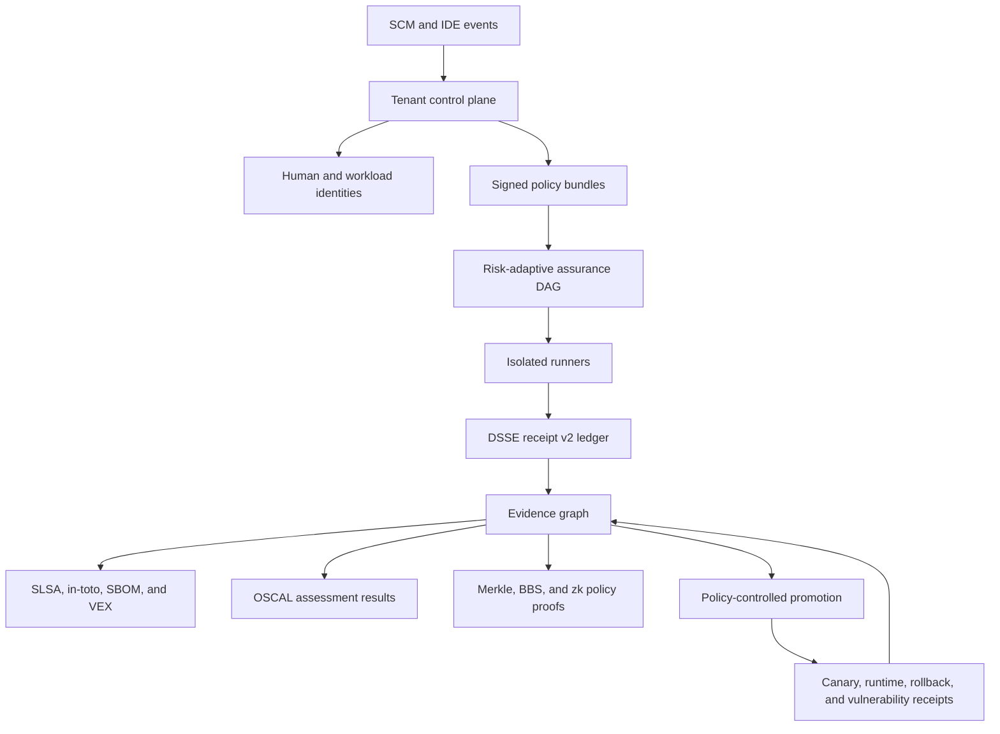

# Code Factory Enterprise Vision

This document preserves the long-range enterprise architecture. It is a vision
and fundraising artifact, not the current build plan. The adoption sequence is
developer-first: prove demand for the existing five-brick workflow, ship signed
receipts as the first trust upgrade, and promote later phases only from observed
user and customer needs.

## Trust rules

- A digest proves content identity, not issuer identity.
- A receipt becomes enterprise evidence only after signature and policy checks.
- Every decision binds the exact policy, subject, tenant, and signer identities.
- Legacy v1 receipts remain readable but cannot satisfy signed-evidence policy.
- Overrides preserve failed gate state and require authenticated, expiring approval.
- Offline verification performs no network calls and needs only the evidence bundle
  plus its trust roots.
- Privacy proofs disclose the minimum claims required by the verifier.

## Eventual delivery order

1. Receipt v2, DSSE, identity, policy, revocation, and offline verification.
2. Tenant control plane, evidence store, SSO/SCIM adapters, authorization, and SCM apps.
3. Assurance graph, adaptive gates, isolated runners, SBOM/VEX, policy mutation,
   and private challenge sets.
4. OpenTelemetry, deployment and rollback evidence, vulnerability response, SIEM,
   and ticketing connectors.
5. OSCAL and versioned NIST SSDF, OWASP ASVS, SOC 2, ISO 27001, and customer packs.
6. Merkle selective disclosure, BBS credentials, and a bounded zkVM policy proof pilot.

## Current implementation status

The following local foundations are now shipped in FactoryLine 0.10.1:

| Plane | Shipped foundation | Not claimed yet |
| --- | --- | --- |
| Enterprise trust | Receipt v2, DSSE/Ed25519, identity metadata, policy binding, revocation, offline verification | Sigstore-backed enterprise key lifecycle or centralized trust service |
| Control | Tenant-scoped SQLite evidence, deny-by-default roles, approvals, audit chain, REST adapter, verified-claim normalizers | Hosted availability, SSO/SCIM, provider signature verification, SCM apps, external KMS |
| Assurance | Evidence graph, risk DAG, process-boundary runner, SBOM/VEX-shaped artifacts, policy mutation, digest-only challenge manifest | Kernel/container isolation, complete SBOM discovery, remote private challenge service |
| Operations | Measured spans, canary/rollback decisions, vulnerability receipts, metadata-only connector envelopes | OpenTelemetry export, SIEM/ticket delivery, ticket lifecycle automation |
| Compliance | Versioned baseline packs and OSCAL-shaped assessment exports | Complete standard coverage, auditor validation, certification |
| Privacy | Merkle selective disclosure and backend status guards | BBS credentials and zkVM proofs until reviewed backends are installed and integrated |

Public claims must come from released commands, receipts, CI runs, or generated
artifacts. A local foundation is not a hosted enterprise service, and a
baseline control mapping is not a compliance certification.
