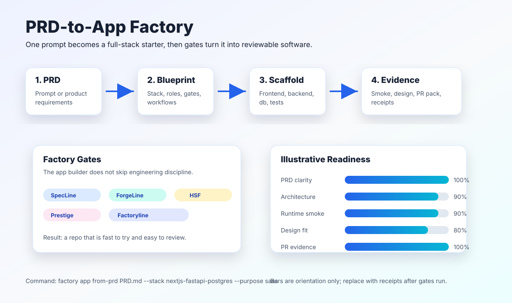

# Teams and Enterprise Operations Manual

Code Factory is useful at two speeds:

- **Vibe coding / solo work:** move from a plain-language idea to an inspectable
  local starter quickly, then make the missing proof visible before a demo or
  review.
- **Professional teams:** bind AI-assisted work to an approved scope, visible
  evidence obligations, and a human merge decision—without handing an agent
  publishing, credential, or approval authority.

It is not a managed enterprise platform, a SOC 2 certification, a runtime
sandbox, an identity provider, or a replacement for a team’s SDLC policy. It is
a local-first proof layer that makes the policy and evidence gaps easier to see.

For the availability and commercial boundary, read [Commercial packaging]
(COMMERCIAL_PACKAGING.md). The free local core is available now; Team Proof Hub
is design-partner only, and Enterprise Assurance is discovery-only. Neither is
a purchasable managed service today.

For up to three human-selected potential Team Proof Hub partners, use the
[Team Pilot readiness gate](TEAM_PILOT_LAUNCH.md) to bind non-secret selection,
security, retention, support, and commercial-review evidence before an owner
reviews an external, customer-managed reference pilot. It cannot accept a
partner, change an offer, process payment, provision access, or operate a
managed service.

## Pick the operating mode

| Mode | Use it when | Start here | Human decision remains |
| --- | --- | --- | --- |
| Solo MVP | You need a working local starting point fast | `factory mvp "Build an approval tracker" --root .` | Whether the result is fit for real users |
| AI-assisted change | A coding agent produced a diff | `factory change review --root . --base origin/main` | Whether the diff is correct and accepted |
| Plan-to-Proof | A team approved a bounded agent plan | `factory plan verify --plan .factory/agent-plan.json --root .` | Scope change, proof settlement, and merge |
| Independent verification | A worker says a task is complete | `factory verifier session` then `factory verifier verify` | Runner isolation, evidence suitability, and acceptance |
| GitHub review | The pull request needs portable proof context | `factory github plan-proof-review` or `factory github proof-review` | Branch protection and pull-request merge |

## The team loop

```mermaid
flowchart LR
  brief["Brief or PRD"] --> clarify["PRD Grill / CDTE"]
  clarify --> plan["Human-approved agent plan"]
  plan --> worker["Worker changes declared paths"]
  worker --> design["Prestige Design Review (UI scope)"]
  design --> review["Plan-to-Proof + Diff-to-Proof"]
  review --> debt["Proof Debt / evidence gaps"]
  debt --> verifier["Independent verifier evidence"]
  verifier --> human["Human PR and release decision"]
```



## Design is a first-class review lane

For a UI-scoped change, add the optional **Prestige Design Review** before the
team settles Proof Debt. Prestige starts from the product's purpose (for
example, developer tool or SaaS), then produces reviewer-visible design
artifacts for hierarchy, responsive behavior, affordances, visual consistency,
and declared design tokens. Deterministic findings are useful gates; heuristic
critique is a reviewer prompt, not a claim about conversion or accessibility
conformance.

```powershell
pip install code-factory-4-design
prestige init --root .
prestige pr app.html --design DESIGN.md --root . --out-dir .prestige/pr
```

When UI scope is declared and `prestige` is installed, FactoryLine's assembly
chain includes its design-quality score stage. It still does not publish,
approve, or certify the interface. Read [Prestige Design Review](PRESTIGE_DESIGN.md)
for the workflow and boundaries.



1. **Clarify first.** Use `factory prd grill` to write source-bound questions;
   use `factory cdte scan` when NFRs may contradict. Neither command writes a
   product decision or begins a build.
2. **Approve a small plan.** Store a strict
   [`factory.agent_plan.v1`](PLAN_TO_PROOF_REVIEW.md) in
   `.factory/agent-plan.json`. It records changed paths, declared test paths,
   review tier, and a named owner for deep review. The provider label is only
   team metadata—it is not an integration or approval from that provider.
3. **Let the worker implement.** The worker may use the team’s chosen agent,
   local model, IDE, or provider. Code Factory does not discover keys or take
   control of the agent.
4. **Inspect the diff, then its debt.** `factory plan verify` first catches
   scope drift, missing declared test-path changes, and deep-review routing. It
   preserves the existing Diff-to-Proof gaps and emits deterministic Proof Debt
   settlement instructions. A changed test file is never called an executed or
   non-hollow test.
5. **Verify independently where the risk warrants it.** Verifier Plane binds
   distinct worker and verifier identities, immutable check files, evidence,
   and declared budgets. It validates supplied receipts; the external runner
   remains responsible for environment, sandbox, network, and credential
   controls.
6. **Make the team’s own decision.** Humans retain source changes, review
   disposition, merge, release, deployment, access, and rollback decisions.

## Preserve engineering judgment across people and agents

Use an **Engineering Judgment Capsule** when a design trade-off must survive a
handoff, an agent rerun, or a later change. A proposing human records exact
scope, owner, review date, rationale references, and proof obligations; a
different named human promotes it. Before review, compile a deterministic
Safety Case from the explicit changed paths and hash-bound proof receipts.

- `RED` means a matching decision is missing declared proof evidence.
- `AMBER` means the named owner must review an exact bound decision.
- `GREEN` means no active tracked Capsule matched; it is never approval.
- `BLACK` means the decision store is invalid and was not replaced by an
  inferred or historical substitute.

The Capsule is a review-routing artifact, not a policy engine. It cannot infer
intent, run a test, apply a repair, merge, publish, deploy, or grant access.
See [Engineering Judgment Safety Case](ENGINEERING_JUDGMENT.md).

## Role map

| Role | Does | Does not delegate to Code Factory |
| --- | --- | --- |
| Product owner | Answers PRD questions and accepts trade-offs | Requirement invention or final business approval |
| Engineering lead | Approves plan scope and review tier | Automatic scope expansion |
| Worker / coding agent | Proposes and implements a bounded diff | Self-certification of production readiness |
| Verifier | Supplies separate evidence under the session contract | Source modification or merge authority |
| Reviewer | Reads proof debt, diff, and external review feedback | Blind acceptance of green-looking tests |
| Release owner | Applies the organization’s release controls | Publishing or deployment by the proof tool |

## PR handoff with CodeRabbit or another reviewer

The optional GitHub workflow posts one neutral, commit-bound
`FactoryLine / Proof Review` Check and one stable walkthrough comment. When an
agent plan is present, it carries the Plan-to-Proof facts and Proof Debt; when
there is no plan, it retains the existing Diff-to-Proof flow.

CodeRabbit can read completed GitHub Checks under its own configuration. This is
interoperability, not a credentialed integration: Code Factory never calls a
CodeRabbit API, reads its comments, or treats an AI suggestion as evidence. See
[CodeRabbit interoperability](CODERABBIT_INTEROP.md) and
[GitHub Proof Review](GITHUB_PROOF_REVIEW.md).

## Evidence and retention

| Artifact | Purpose | Boundary |
| --- | --- | --- |
| Agent plan | Scope and named review routing | Requires a human-approved state; not an agent transcript |
| Plan-to-Proof packet | Exact scope alignment and proof debt | Analysis-only; optional local JSON/Markdown/Mermaid output |
| Diff-to-Proof packet | Existing graph, coverage, proof, and risk gaps | Analysis-only; no test execution |
| Verifier receipt | Bound supplied worker/verifier evidence | Does not prove the runner’s isolation by itself |
| GitHub Check/comment | Portable review context | Neutral; it does not set branch protection or merge |

Keep artifacts only under your own project’s retention and data-classification
rules. Code Factory does not provide a hosted evidence vault, SSO/SCIM, managed
KMS, or a data-retention policy.

## Rollout in one repository

1. Run the commands locally in report-only mode for a few pull requests.
2. Start with `light` or `standard` plan items; use `deep` only where a named
   human reviewer has accepted that responsibility.
3. Add the optional GitHub workflow after the team agrees on the comment/check
   visibility and fork boundary.
4. Review real Proof Debt patterns before changing any branch rule. Treat the
   tool’s facts as inputs to policy, not policy itself.
5. Add Verifier Plane only after the team can provide an independent verifier
   and evidence source appropriate for the service being changed.

## Non-negotiable control boundary

Code Factory does not silently call a model, discover credentials, upload
project code, publish, deploy, sign, approve, merge, send messages, or grant a
connector. It also does not claim saved time, reduced token cost, production
readiness, or compliance certification without project-specific evidence.

For the complete product map, see [Overview](OVERVIEW.md). For the exact
Plan-to-Proof schema and results, see [Plan-to-Proof Review](PLAN_TO_PROOF_REVIEW.md).
