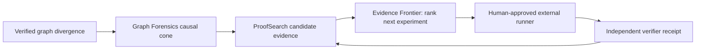

# Evidence Frontier: prove the next thing that matters

Evidence Frontier is a deterministic, local loop-planning layer for Graph Ops.
It answers a narrow question before a runner changes anything:

> Which supplied experiment separates the largest number of still-viable repair hypotheses?

It is not an autonomous repair engine. It does not generate a patch, execute a
command, create a worktree, mutate a checkpoint, approve a result, merge,
publish, deploy, sign, message, access credentials, or grant a connector.

## Where it fits



Graph Ops holds the local facts and their lineage. Evidence Frontier holds a
bounded loop decision: a single proposed experiment, a declared stop condition,
and no execution authority. A separate runner and independent verifier remain
responsible for producing any new evidence.

## Plan and verify

Create a `factory.evidence-frontier-request.v1` request. It binds the exact
current ProofSearch evaluation bytes and supplies 1 through 64 experiment
hypotheses. Each hypothesis predicts `pass`, `fail`, or `unknown` for every
eligible candidate. Those predictions are explicitly **unverified**.

```powershell
factory proofsearch frontier plan .factory/proofsearch/frontier.request.json `
  --root . `
  --out .factory/proofsearch/frontier.frontier.json `
  --json

factory proofsearch frontier verify .factory/proofsearch/frontier.frontier.json `
  --root . --json
```

An experiment is scored by its exact `separation_count`: the number of
unordered eligible-candidate pairs for which the experiment declares two
different, non-unknown outcomes. Ties use a hash-bound historical elapsed-time
observation when supplied, then experiment identifier. No expected probability,
time saving, token saving, cost saving, or productivity result is inferred.

If every supplied experiment has a separation count of zero, the receipt returns
`EVIDENCE_FRONTIER_NO_DISCRIMINATING_EXPERIMENT` and leaves
`next_experiment` null. The loop halts rather than inventing another test.

## Example request shape

```json
{
  "schema": "factory.evidence-frontier-request.v1",
  "evaluation": {
    "path": ".factory/proofsearch/repair.evaluation.json",
    "sha256": "<sha256 of the evaluation file>"
  },
  "max_experiments": 4,
  "experiments": [
    {
      "experiment_id": "checkout-contract-test",
      "kind": "test",
      "description": "Run the declared checkout contract test only.",
      "predictions": {
        "repair-a": "pass",
        "repair-b": "fail"
      },
      "measurement": null
    }
  ]
}
```

## Graph Ops controls

The Unified Graph Ops view renders Evidence Frontier as typed `evidence_frontier`
and `evidence_experiment` nodes. It shows rank, separation count, available
historical evidence, and one disabled **Run next experiment** control. Users can
copy the verifier command, export the displayed decision, and validate that every
authority field is locked.

This is intentionally a supervised control plane. A future runner integration
must bind predeclared commands, named approval, isolated execution, an external
verifier receipt, explicit budgets, and idempotency before it can change any
workspace state.
