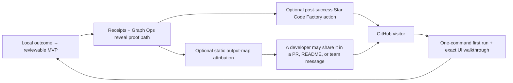

# GitHub discovery and community launch kit

This kit makes the free, local-first project easier to evaluate and share. It
does not send posts, edit a user's project, collect analytics, buy attention,
or manufacture stars. Treat every public claim as either product behaviour
covered by source/tests or as an explicitly labelled draft.

## Repository first view

Lead with the low-friction value that a developer can verify:

> **Why pay for opaque app generators?** Create a reviewable MVP starting
> state in minutes—with source-bound receipts, a clear proof path, and an
> output you can extend when you’re ready.

The intended next action is one local command:

```powershell
pip install factoryline-code-factory==0.27.0
factory mvp "Build an approval tracker" --root .
factory studio --root .\my-mvp
```

The README then shows the shipped UI walkthrough and an optional GitHub-star
link. It makes no star-count, download, conversion, productivity, or causal
growth claim.

## Ethical compounding loop



Every arrow that leaves Code Factory is voluntary. The editor action opens the
repository only when selected. The output map contains a copyable attribution
but does not post it or modify any user file beyond the output map itself.

## GitHub social preview asset

`docs/assets/github-social-preview-1280x640.png` is a 1280×640 crop from the
actual Factory Studio Graph Ops capture. It is source-ready, not proof that a live Open Graph image is configured.

Repository owner handoff:

1. Open **GitHub repository Settings → General → Social preview**.
2. Upload `docs/assets/github-social-preview-1280x640.png`.
3. Save, then inspect a fresh GitHub share/debug view to confirm the live card.
4. Record the public URL and observation time before claiming it is live.

## Community launch drafts — owner submission only

These are drafts, not automated messages. Before submitting, the owner must
review the target's current rules, disclose their connection to Code Factory,
replace any stale release links, and respond personally to questions. Do not
cross-post identical copy, solicit votes, use alternate accounts, or post
again after removal.

Code Factory does not submit, vote on, or coordinate votes. The owner decides
whether to submit a reviewed draft from their own account.

### Show HN

**Title**

```text
Show HN: Code Factory – Create a reviewable MVP in minutes, with receipts
```

**Draft body**

```text
I built Code Factory because I wanted a faster way to turn a plain-language
outcome into a local starting state without pretending that generated code is
ready to ship.

The first run is `factory mvp "Build an approval tracker" --root .`. It writes
an app-shaped scaffold plus a source-bound receipt and Mermaid output map.
Graph Ops then shows which requirements have evidence, what remains blocked,
and one fact-derived next action. The local MCP server exposes the same
read-only inspection facts for coding agents.

It is free and open source. It does not upload source, call a starter
production-ready, execute a release, or ask for credentials. I would value
skeptical feedback on the proof model, the generated MVP path, and what would
make the local experience useful in a real team.

Repository: https://github.com/zrk222/code-factory
```

### Indie Hackers

**Title**

```text
I made a free, local-first way to start a reviewable MVP instead of another opaque app generator
```

**Draft body**

```text
I am the founder/maintainer of Code Factory. The narrow idea is simple: a
plain-language outcome should get you to an app-shaped, reviewable starting
state in minutes, but generated code should not be labeled production-ready
until product-specific proof exists.

The first command creates a contained MVP. It also records source-bound
evidence and writes a Mermaid output map. Graph Ops makes the requirements,
receipts, gates, and next evidence step visible. The project is free and open
source; it is designed to grow from a first MVP into more rigorous team and
enterprise workflows without silently gaining release, credential, or
publishing authority.

I am looking for blunt feedback from builders and engineering leaders: where
would this reduce handoff friction, and where would the proof model get in the
way?

Repository: https://github.com/zrk222/code-factory
```

## Reddit enterprise-operations lane — candidates, not preapproval

The goal is useful technical discussion, not broad promotion. Check every
target's current rules, pinned threads, and moderator direction immediately
before posting. Use an owner account with clear founder disclosure; prefer a
focused question or the community's dedicated promotional thread.

| Community | Appropriate angle | Current evidence / safe route |
| --- | --- | --- |
| [`r/devops`](https://www.reddit.com/r/devops/) | CI evidence, local proof reuse, guarded release boundaries, and team review | A current weekly self-promotion thread was observed on 2026-08-03. Use that thread only; state founder affiliation and ask for implementation feedback. |
| [`r/platformengineering`](https://www.reddit.com/r/platformengineering/) | Developer-platform golden paths that do not hide proof or grant deploy authority | A dedicated monthly self-promotion thread is documented, but the evidence is old. Recheck pinned posts before commenting; never use a standalone pitch unless moderators explicitly permit it. |
| [`r/sre`](https://www.reddit.com/r/sre/) | What evidence should exist before an AI-assisted change can be trusted in operations | Relevant community, but no current promotional permission is established by this kit. Use a technical discussion only after current rule review or moderator approval. |
| [`r/kubernetes`](https://www.reddit.com/r/kubernetes/) | How teams keep AI-generated delivery artifacts inspectable and evidence-bound around cluster workflows | The community's published guidance disfavors low-effort self-promotion and requires clear commercial affiliation. Do not post a product pitch; ask moderators first or contribute a self-contained technical discussion with disclosure. |

Suggested `r/devops` thread comment:

```text
Disclosure: I maintain Code Factory, a free local-first project. I built it
around a narrow question: what evidence should an AI-assisted change carry
before a team treats it as reviewable? It can create a contained MVP, keep the
receipt and Mermaid artifact map local, and expose a read-only Graph Ops view;
it does not publish or deploy. I would value feedback on whether this proof
model fits your CI/review workflow and what evidence is missing.

https://github.com/zrk222/code-factory
```

Do not use the Reddit list as a claim that a post is permitted. The `r/devops`
weekly thread observation and the `r/platformengineering` monthly-thread rule
are only routing hints; the current pinned thread and rules control. The
`r/kubernetes` route is deliberately conservative because its guidance
requires valuable discussion and affiliation disclosure.

## Measurement boundary

Track each public action separately and label it as `draft`, `submitted`,
`published`, `removed`, or `not_observed`. GitHub stars, Marketplace downloads,
traffic, external referrals, and product savings are different measures. Do
not infer any one of them from the others or claim attribution without a
source-specific receipt.
