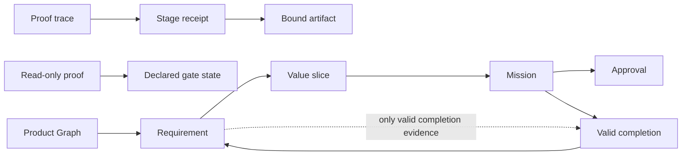

# Unified Graph Ops

`factory graph ops` is a local, deterministic inspection layer over the
artifacts Code Factory already knows how to verify. It does not create a new
database, agent runtime, or authority source.



## Use it

```powershell
factory graph ops --root . --json
factory graph ops --root . --mermaid
factory graph impact --root . --changed src/app.py --json
factory studio --root .
```

Open `http://127.0.0.1:<port>/graph-ops` from Studio, or select **Unified
Graph Ops** from either editor integration. The page has graph totals, typed
lanes, selected-node detail, source-error visibility, an explicit empty state,
and exactly one fact-derived next action.

The JSON schema is `factory.graph-ops.v1`. Its `graph_sha256` covers canonical
ordering of the graph result. Results are bounded to 500 nodes, 1,000 edges,
and 1,048,576 bytes per source. Malformed, oversized, missing, or path-escaping
inputs yield a partial result with compact source errors rather than invented
links.

## Evidence and priority

Requirements are evidenced only when a mission completion receipt verifies
against its mission, validation manifest, and evidence hashes. A green build,
node label, filename, or graph position never creates coverage.

The recommendation is selected in this exact order:

1. `initialize_graph` — no readable local graph nodes.
2. `rerun_invalid_proof` — a content-addressed proof is stale.
3. `resolve_blocked_gate` — a declared proof plan contains `BLOCK`.
4. `run_required_validation` — a declared proof plan contains `RUN`.
5. `collect_completion_evidence` — a requirement lacks valid completion evidence.
6. `review_verified_graph` — all represented requirements have valid completion evidence.

Graph Ops does not execute validation, change a plan disposition, approve a
mission, publish, deploy, sign, send a message, access a credential, or grant a
connector. The authoritative Product Mission ledger, proof receipts, and trace
verifiers remain separate; Graph Ops only renders their current local facts.

## Exact change impact

`factory graph impact --changed <path>` is the fast professional path after a
change. It follows only explicit `input_to` artifact edges from the supplied
workspace-relative paths to recorded proof receipts, then shows three distinct
sets: matched proofs, verified-current matches, and stale matched proofs that
belong in the rerun set. It also names declared gates already linked to those
proofs.

It does not use filename heuristics to declare a proof irrelevant, run a gate,
or silently skip validation. An unmatched path is reported as unmatched rather
than being claimed safe. This is an impact map, not a measured time or token
savings claim.

## Measurement boundary

Graph Ops does not claim time, token, cost, or productivity savings. Continue
to use paired savings receipts for those values; missing observations remain
unknown.
