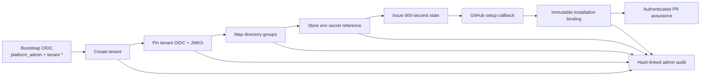

# Hosted control plane

Version 0.19 adds a supervised tenant lifecycle to the hosted PR-assurance
adapter. It is a deployable reference control plane, not a managed service.

## Authority model



- Bootstrap tenant creation requires a verified `platform_admin` principal
  whose tenant claim is exactly `*`.
- Tenant `admin` principals may configure only their verified tenant.
- Tenant `viewer` principals may load only their tenant overview.
- The GitHub setup callback has no general authority. It can consume one
  unexpired state and bind one installation in one PostgreSQL transaction.
- The `/console` surface is read-only. It cannot mutate configuration, approve
  a change, publish a release, operate a connector, or retrieve secret values.

## Bootstrap configuration

The bootstrap issuer remains an environment boundary so the first tenant can
be created without trusting an unauthenticated setup route:

```text
FACTORY_OIDC_ISSUER=https://id.example.com
FACTORY_OIDC_AUDIENCE=code-factory-control
FACTORY_JWKS_URL=https://id.example.com/.well-known/jwks.json
FACTORY_ROLE_MAP_JSON={"platform-owners":"platform_admin"}
```

`FACTORY_WEBHOOK_SECRETS_JSON` and
`FACTORY_INSTALLATION_TENANTS_JSON` are optional legacy bootstrap maps. New
tenants should use the control-plane lifecycle.

## Onboarding API

All administrative routes require a short-lived OIDC Bearer token. The setup
callback is bounded by its one-time state instead.

```text
POST /v1/admin/tenants
PUT  /v1/admin/tenants/{tenant_id}/identity
PUT  /v1/admin/tenants/{tenant_id}/roles
PUT  /v1/admin/tenants/{tenant_id}/secrets/{purpose}
POST /v1/admin/tenants/{tenant_id}/installation-state
POST /v1/github/installations/callback
GET  /v1/admin/tenants/{tenant_id}/overview
GET  /console
```

The onboarding order is intentional:

1. A bootstrap platform administrator creates the tenant.
2. The platform administrator pins the tenant's HTTPS issuer, audience, and
   credential-free HTTPS JWKS URL.
3. It atomically replaces the tenant's group-to-role map.
4. It stores an `env://UPPERCASE_NAME` reference for purpose
   `github_webhook`. PostgreSQL receives only the reference.
5. It issues a state backed by 32 random bytes. Only the SHA-256 digest is
   stored, and the state expires after 600 seconds.
6. GitHub returns the plaintext state and positive installation id to the
   callback. The state is consumed once and the installation cannot move to a
   different tenant.

## Dynamic identity and secrets

Tenant tokens are decoded before verification only to obtain a tenant lookup
hint. The selected tenant configuration grants no authority until the adapter
verifies RS256 signature, exact issuer, audience, expiry, not-before, tenant,
groups, and token identifier. Missing tenant identity or role configuration
fails closed; it does not fall back to bootstrap authority.

The reference secret resolver accepts only `env://NAME` references and resolves
them at webhook request time. Resolved bytes are never returned, stored, or
added to structured operation events. Production deployments may replace this
resolver with a reviewed managed-secret adapter that preserves the same
interface and redaction contract.

## PostgreSQL boundary

Identity, role mapping, secret-reference, and administrative-audit tables
enable and force RLS using transaction-local `factory.tenant_id`. Installation
routing and one-time state lookup are global routing indexes; callers cannot
query them directly through the public API. Administrative audit writes take a
tenant advisory transaction lock so concurrent mutations preserve one hash
chain.

The overview returns only allowlisted status fields: tenant display/status,
identity configured, role counts, installation ids, secret purposes, approval
and outbox counts, and the most recent 20 audit events. It never returns token
material, secret references, secret values, webhook bodies, or private keys.

## Operator console

Open `/console`, enter the tenant id and a short-lived OIDC token, and select
**Inspect tenant evidence**. The token is copied into a JavaScript variable for
one GET request and the password input is cleared immediately. The page uses no
persistent browser token storage and sets `Cache-Control: no-store` plus a
restrictive Content Security Policy.

## Evidence and limits

The lane is classified `supervised`: every configuration mutation needs
verified human authority, and the GitHub callback has one bounded transition.
It proves the declared tenant, identity, RLS, replay, redaction, and audit-chain
contracts in the supplied environment. It does not claim SCIM, SAML enrollment,
managed KMS, HA, disaster recovery, SOC 2, or an SLA.
