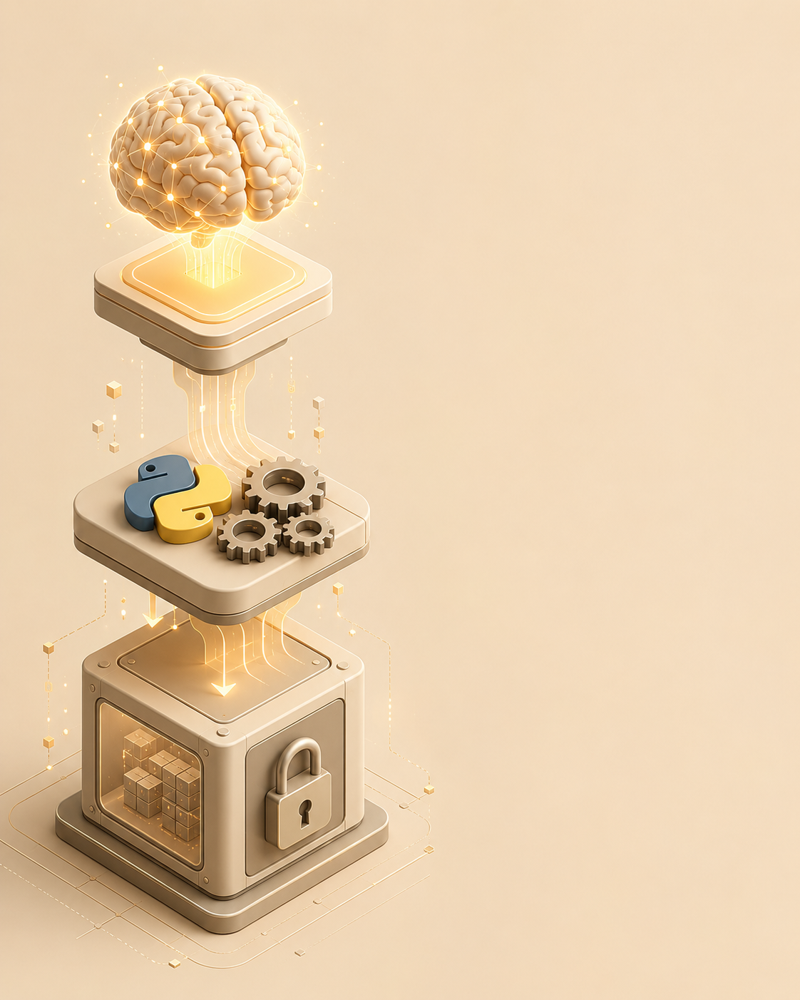
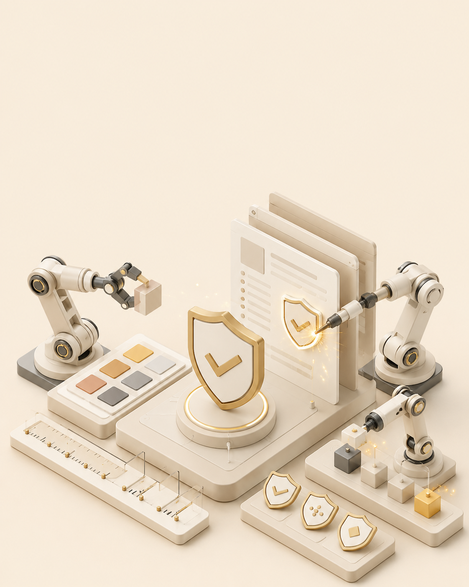
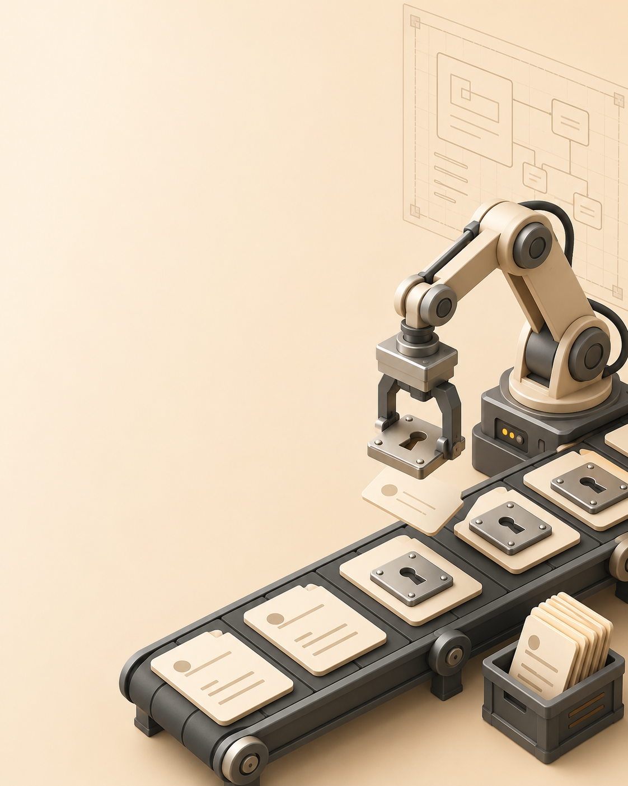
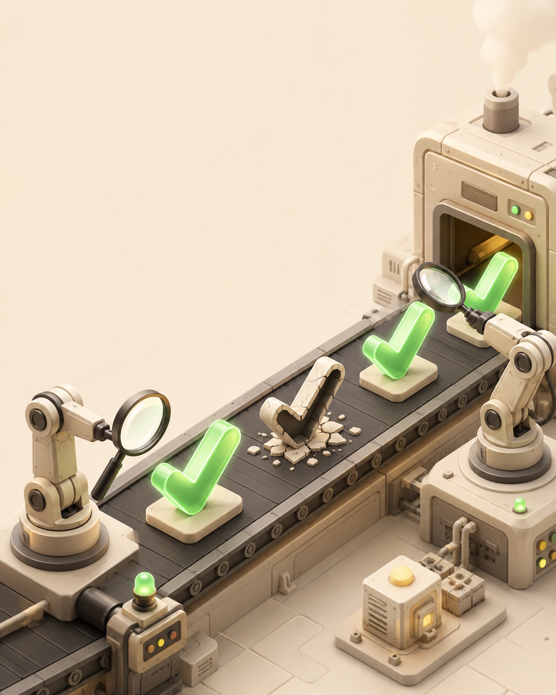
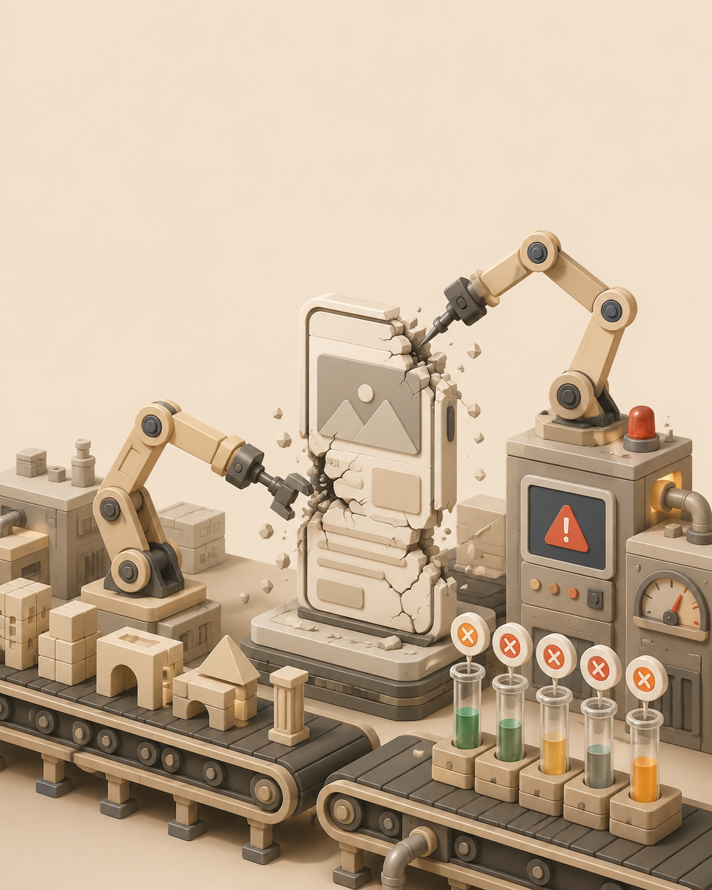
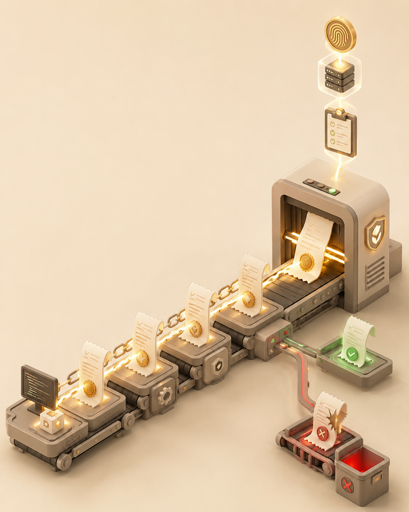
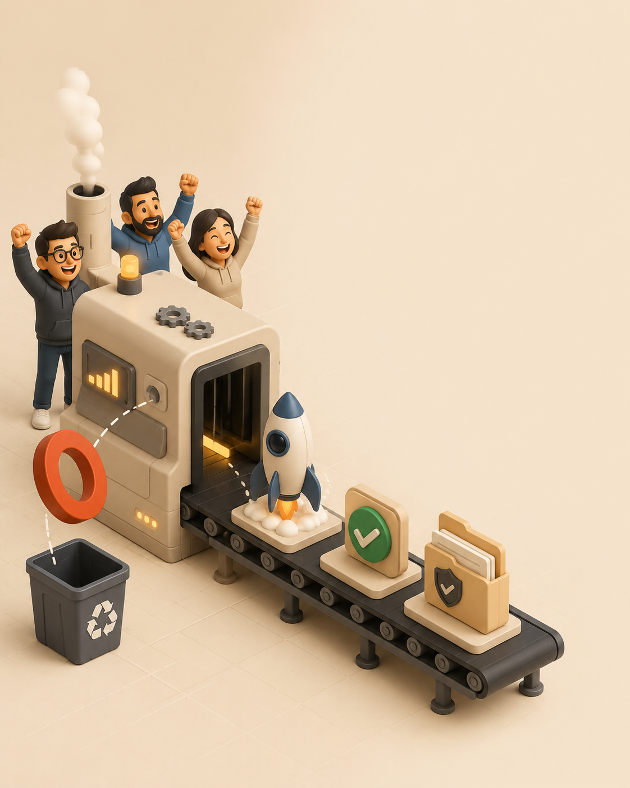

# How Code Factory Works

## Concept illustrations

These owner-supplied concept illustrations explain the proof-first workflow.
They are not UI screenshots or measured outcome evidence. For the literal
product demonstration, use the [exact shipped UI quick start](https://github.com/zrk222/code-factory/releases/download/v0.17.1/code-factory-quickstart-v0171.mp4).

### 1. From idea to blueprint

Turn intent into an explicit, reviewable product blueprint before implementation begins.

### 2. Shape the product

Bind requirements to a concrete product shape, target, and dependency order.

### 3. Compile recurring decisions

Move repeated decision logic into deterministic, inspectable code with explicit boundaries.

### 4. Apply security contracts

Make trust, identity, and release-policy expectations explicit and reviewable.

### 5. Keep authority bounded

Separate workflow evidence from credentials, deployment, publication, and approval authority.

### 6. Challenge the gate

Deliberately break the control and require the validator to catch the failure.

### 7. Route failures back

Attribute failures to the earliest responsible stage and preserve concrete evidence.

### 8. Link signed proof

Hash-link reviewed artifacts and receipts while failed evidence remains visibly rejected.

### 9. Release after proof

Ship only after the required gates pass and the human-controlled release boundary is satisfied.

The ordered filenames, dimensions, SHA-256 digests, alt text, and captions are
bound in [`manifest.json`](assets/how-it-works/manifest.json).
