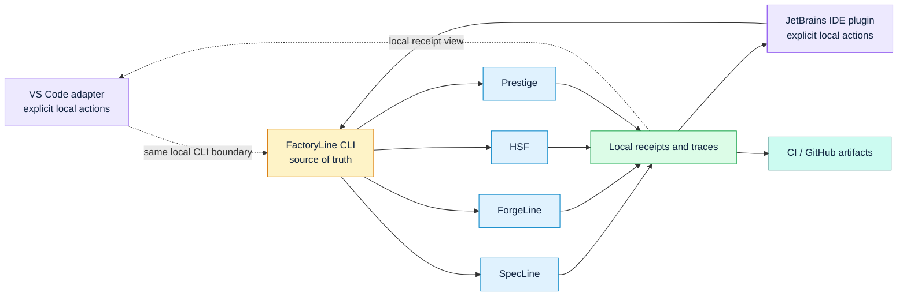

# JetBrains Control Room Contract

The JetBrains plugin is a control room, not a second implementation of Code
Factory. FactoryLine CLI receipts remain the only proof authority.

## Shipped In The Initial Adapter

- A FactoryLine tool window with explicit assembly, verification, proof-impact,
  receipt-view, and receipt-signature-state actions.
- Direct executable invocation through IntelliJ Platform APIs, never a shell.
- Explicit local-workspace confirmation and bounded feature-name checks before an operation starts.
- A local JSON receipt viewer that shows the actual receipt rather than a
  synthetic pass badge.
- A fail-closed trust label: receipt content is `unassessed` until an explicit
  verification path establishes the relevant claim.
- Changed-proof analysis through `factory risk-diff` and signature state through
  `factory receipt status`.
- Plugin Verifier CI across IntelliJ IDEA, PyCharm, WebStorm, Rider, CLion,
  GoLand, RustRover, and DataGrip.
- One Mission Operations entry point for graph initialization, status, history,
  verification, Mermaid export, guarded event recording, and provider routing.
- Workspace-contained mission, policy, receipt, and payload paths; command
  output redaction for common token and secret shapes.
- JetBrains is passed as an explicit routing selector. Policies may reference
  credential environment-variable names, but the plugin has no raw-key input.

## Deliberately Not Claimed Yet

The initial receipt schema does not consistently carry file/symbol locations,
so the adapter does not invent gutter findings, PSI navigation, diff overlays,
SARIF locations, or a before-commit gate. Those are follow-on features after
the CLI exports deterministic location-bearing findings and freshness data.

Likewise, the adapter does not include a GitHub API client, TeamCity runner,
MCP server, local daemon client, remote artifact store, issue tracker client,
or an automated policy override. Existing CLI/CI surfaces remain the correct
integration boundary: `factory ci init` can create the opt-in GitHub PR-comment
workflow, and `factory control` remains the separately governed local
control-plane adapter.

## Security Boundary

- The IDE may request a verification operation; it never declares verification.
- The IDE does not hold release-signing credentials or silently sign evidence.
- Receipt presence and receipt signature state are distinct from identity
  verification. Identity verification remains an explicit `factory receipt
  verify` operation with an expected OIDC identity and issuer.
- Missing, invalid, stale, or unparseable proof is shown as unknown/unassessed,
  never as green.
- Any future exception path must be a versioned FactoryLine override receipt
  with ownership, reason, and expiry. The editor will not add an ignore button.

## Next Contract Needed For Native Findings

To safely add gutter states, contract navigation, SARIF export/import, and
review overlays, a receipt must provide stable fields for:

- finding code and severity
- repository and commit identity
- source path plus optional symbol/range
- contract, evaluator, and policy hashes
- mutation result and affected test
- parent receipt and signer verification result
- source/dependency/tool freshness inputs

Until those fields are validated at the CLI boundary, the plugin stays a thin,
auditable control room rather than creating an unreliable second authority.
