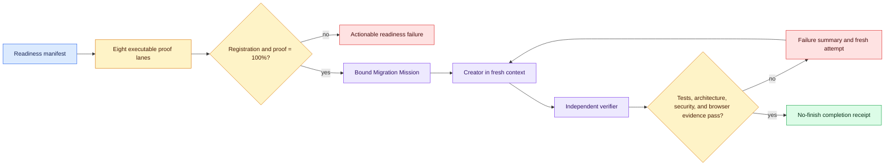

# Migration Missions

Migration Missions extend Product Missions with executable agent-readiness
proof. They are designed for large modernization work where a worker must not
report completion until independent software evidence proves every outcome.



See [Code Factory Architecture](ARCHITECTURE.md) for the complete interaction
between readiness, repository context, Product Missions, verification, release,
and telemetry.

## Readiness manifest

Create `migration-readiness.json` with schema
`factory.migration.readiness-input.v1`. Every check declares an argv command,
whether it passed, and one or more local evidence files. Required categories:

```text
unit, integration, e2e, lint_type, architecture,
coverage_fuzz, environment, telemetry_security
```

The `environment` category also requires `reproducibility_runs` with at least
two runs and every run passing. Code Factory validates evidence files and
binds their SHA-256 hashes; it does not execute arbitrary manifest commands.

```json
{
  "schema": "factory.migration.readiness-input.v1",
  "project": "billing-modernization",
  "checks": [{
    "id": "unit-suite",
    "category": "unit",
    "command": ["python", "-m", "pytest", "-q", "tests/unit"],
    "passed": true,
    "evidence": ["artifacts/unit-junit.xml"]
  }]
}
```

```powershell
factory migration assess .\migration-readiness.json --root . --json
factory migration verify .\.factory\migration\readiness.json --json
```

`lane_registration_pct` describes configuration coverage.
`executable_proof_pct` describes hash-bound passing evidence. A Migration
Mission requires both to reach 100 percent.

## Computer-control evidence

User-facing slices include one `browser_control` completion criterion. The
independent verifier supplies exactly one `factory.browser-flow.evidence.v1`
receipt containing the bound mission and criterion IDs, matching verifier
identity, exact expected and observed URLs, fewer than four passing interactions,
passing assertions, and at least one local visual artifact.

`factory mission close` refuses completion when any field or artifact is
missing, any assertion fails, the URL differs, or the click ceiling is exceeded.
The receipt proves the declared flow evidence. It does not prove that an
untrusted external adapter accurately reported hidden browser state.

## Fresh attempts and routing

Each Mission declares a fresh-session policy, forbids prior attempt context,
and permits only hash-bound outcome summaries across attempts. A deterministic
risk map selects abstract economy, balanced, or frontier tiers for creator and
verifier roles. Provider choice belongs to an authorized external adapter;
the Mission hard token, time, iteration, and dollar budgets still fail closed.

## AutoWiki and Lore

```powershell
factory context build --root . --json
factory context verify .\.factory\context\context-receipt.json --json
```

AutoWiki classifies the tracked repository shape, summarizes components and
file types, links ADRs, and provides a dense human onboarding path. Lore records
reviewed ADR titles, component origin commits, contributors, and recent Git
history in a celebratory but factual form. A generated 4–6 minute video
storyboard is marked `planned` until an authorized renderer and voice provider
produce the media. None of these artifacts infer private reasoning.

When present and valid before Mission creation, the context receipt is bound to
the Mission and later drift invalidates it.

## Scope boundary

Code Factory creates and verifies contracts and local receipts. It does not
spawn model workers, guarantee inference-cost reductions, authenticate a model
provider, run arbitrary readiness commands, merge code, or deploy a migration.
Those actions remain explicit adapter and human-owned responsibilities.
