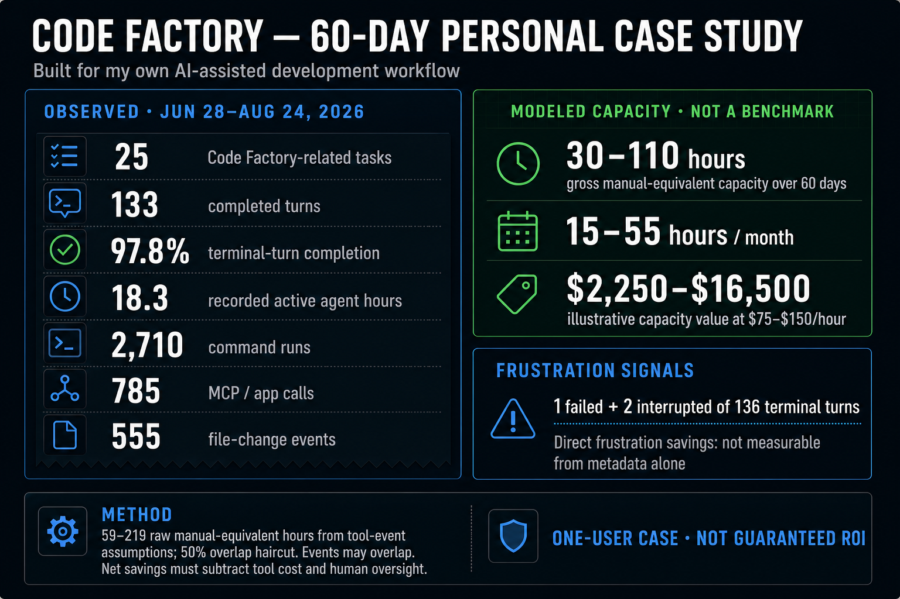

# FactoryLine outcomes and savings model

This planning model answers the practical buyer question—“what might this save
us?”—without presenting an estimate as measured FactoryLine performance.

## Starting range per AI-assisted pull request

| Avoidable work | Low planning input | Typical planning input | High planning input |
| --- | ---: | ---: | ---: |
| Reconstructing intent, changed scope, proof state, and the next action | 10 min | 20 min | 30 min |
| One preventable clarification, hollow-validator, or out-of-plan rework loop | 15 min | 40 min | 90 min |
| **Total planning range** | **25 min** | **60 min** | **120 min** |

The 25–120 minute band is a scenario, not a benchmark. Replace both rows with
your own median observations after a baseline period.

## Monthly capacity and cost scenarios

Formula:

`monthly hours = AI-assisted PRs × minutes avoided per PR ÷ 60`

`planning value = monthly hours × team-supplied loaded hourly cost`

| AI-assisted PRs / month | Low: 25 min at $75/h | Typical: 60 min at $100/h | High: 120 min at $150/h |
| ---: | ---: | ---: | ---: |
| 25 | 10.4 h / about $780 | 25 h / $2,500 | 50 h / $7,500 |
| 50 | 20.8 h / about $1,560 | 50 h / $5,000 | 100 h / $15,000 |
| 100 | 41.7 h / about $3,125 | 100 h / $10,000 | 200 h / $30,000 |

These values describe recoverable engineering capacity, not guaranteed cash
savings. Cash savings exist only if the organization actually avoids spend;
otherwise the outcome is capacity redirected to delivery, review, or risk work.

## Frustration and rework indicators

Track the operational signals people actually feel:

- reviewer minutes spent reconstructing the request and current proof state;
- clarification or rework loops per AI-assisted PR;
- PRs returned because a declared validator could not reject the failure;
- time from “ready for review” to the first evidence-backed decision;
- repeated manual screenshots, summaries, and status handoffs;
- incidents involving resumed, duplicate, or out-of-plan effects.

Compare a baseline window with a FactoryLine window of similar repository and
change complexity. Record the sample size and confidence; do not extrapolate a
small pilot into a universal productivity claim.

## Role-level expectation

| Role | Most likely time or frustration reduction |
| --- | --- |
| Novice | Less time guessing what “proof” means and fewer dead-end green checks |
| Junior | Fewer acceptance-criteria clarification loops and a clearer review handoff |
| Senior / staff | Faster risk orientation, first-divergence analysis, and repair comparison |
| Team | Less repeated evidence gathering and fewer inconsistent status summaries |
| Enterprise | More reusable audit evidence and fewer manual policy or release-packet handoffs |

For measured reporting, use the [Savings Tracker](SAVINGS_TRACKER.md). If a
baseline or observation is unavailable, report the saving as unavailable.

## Personal 60-day case study

The initial product was built for its creator's own workflow, so the first
worked example uses local Codex metadata from 28 June through 24 August 2026.
The FactoryLine-related slice matched thread title, working directory, or first
request text against `factory`, `factoryline`, or `code-factory`.

### Observed metadata

| Observed signal | Value |
| --- | ---: |
| FactoryLine-related threads | 25 |
| Completed turns | 133 |
| Failed / interrupted terminal turns | 1 / 2 |
| Terminal-turn completion | 97.8% of 136 terminal turns |
| Recorded active agent time | 18.33 hours |
| User messages | 263 |
| Command executions | 2,710 |
| MCP / app calls | 785 |
| File-change events | 555 |
| Web-search events | 39 |
| Image-view events | 169 |

`completed` is a turn status, not proof that the user's whole goal succeeded.
Thread matching can omit related work or include a thread that only mentions
FactoryLine; this is a one-user observational slice.

### Counterfactual capacity model

The raw manual-equivalent range applies these explicit planning assumptions:

- command execution: 0.5–2 minutes each;
- MCP / app call: 1–3 minutes each;
- file-change event: 2–8 minutes each;
- web search: 3–10 minutes each;
- image view: 1–3 minutes each.

Those inputs produce about 59–219 raw hours. Because the event types overlap
and some actions would be batched manually, the displayed range applies a 50%
overlap haircut and rounds to **30–110 hours over 60 days**, or **15–55 hours
per month**. At a team-supplied loaded cost of $75–$150/hour, that is an
illustrative gross capacity value of **$2,250–$16,500 over 60 days**.

This is not verified cash saved. Net savings must subtract tool costs, human
oversight, unsuccessful work, and any time that would not otherwise have been
spent. Direct frustration savings cannot be inferred from metadata alone; the
failed/interrupted counts and coordination volume are only starting proxies.

