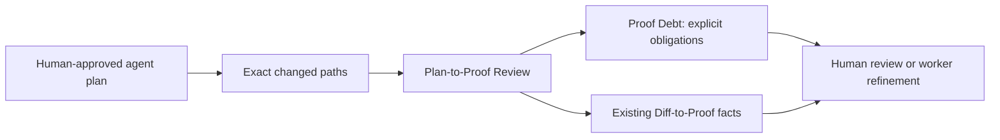

# Plan-to-Proof Review

AI coding systems can produce a plan, a clean diff, and a confident summary.
Those are useful artifacts, but none alone says whether the actual change stayed
within the approved scope or what evidence is still owed. **Plan-to-Proof
Review** turns a compact, human-approved plan into a deterministic review packet
for the exact changed paths.

```powershell
factory plan verify `
  --root . `
  --plan .factory/agent-plan.json `
  --changed src/approval_service.py `
  --changed tests/test_approval_service.py `
  --out-dir .factory/plan-proof-review `
  --json
```

The command does not execute a test, call an agent provider, read an AI
transcript, change source, or decide that a pull request may merge. It reuses
the local Diff-to-Proof facts and reports the smallest fact-derived next action.

## The envelope

Copy [`examples/agent-plan.json`](../examples/agent-plan.json) to
`.factory/agent-plan.json` and edit it before the agent changes code.

```json
{
  "schema": "factory.agent_plan.v1",
  "provider": "generic",
  "plan_id": "approval-tracker-slice-1",
  "approval": {"state": "approved", "approved_by": "Engineering Lead"},
  "items": [
    {
      "id": "approval-service",
      "paths": ["src/approval_service.py"],
      "test_paths": ["tests/test_approval_service.py"],
      "review_tier": "standard"
    }
  ]
}
```

The schema accepts only these exact fields. Paths must be unique,
workspace-relative paths without absolute paths or parent traversal. Each item
has a `light`, `standard`, or `deep` review tier; `deep` additionally requires a
named `review_owner`. The only accepted plan state is `approved`, and its
`approved_by` value must be non-empty.

`provider` is a label supplied by the team. It can say `generic`, `blitzy`,
`coderabbit`, or another value matching the schema, but that is not an API
integration, certification, import of a private plan format, or a claim that
the provider approved anything.

## Deterministic findings and proof debt

The review produces `factory.plan_proof_review.v1`, canonical SHA-256 bindings
for the plan and review, a Mermaid map, and a **Proof Debt** ledger.

| Condition | Finding | Next action | What it does *not* claim |
| --- | --- | --- | --- |
| A changed path belongs to no plan item | `unplanned_changed_path` | `reconcile_unplanned_change` | That the plan is complete |
| Changed implementation has declared tests, but none changed | `declared_test_path_missing` | `provide_declared_test_change` | That a changed test ran or can fail |
| A changed item is `deep` | `named_human_review_required` | `route_to_named_reviewer` | That the named owner reviewed it |
| Existing Diff-to-Proof facts find a gap | The source finding is preserved | Its current next action | That a green CI badge proves production readiness |

Proof Debt is not a confidence score and not an automatic merge block. It is a
stable list of unresolved obligations, each with a deterministic settlement
instruction. Teams can use it to pause an agent run, open a review task, or
enforce a separate branch policy, but Code Factory never changes those policies
itself.

## GitHub delivery, optionally

```powershell
factory github plan-proof-review `
  --root . `
  --plan .factory/agent-plan.json `
  --head-sha abcdefabcdefabcdefabcdefabcdefabcdefabcd `
  --changed src/approval_service.py `
  --changed tests/test_approval_service.py `
  --json
```

This produces exactly one local request for the existing neutral
`FactoryLine / Proof Review` Check and the same stable PR-comment marker,
`<!-- factoryline-proof-review -->`. The repository’s opt-in workflow selects
this renderer only when `.factory/agent-plan.json` is present. If no envelope is
present it retains the established Diff-to-Proof renderer.

The workflow remains `pull_request`-only, ignores fork pull requests, and has
only `contents: read`, `pull-requests: write`, and `checks: write`. It never
uses `pull_request_target`, a provider credential, source-write access, test
execution, repair, approval, merge, publish, or deploy authority.

## Why it is not another agent reviewer

The design keeps proposal, review, and proof distinct:



An AI reviewer can still suggest problems. An agent runtime can still pause for
approval. Plan-to-Proof adds the missing deterministic relationship between an
approved plan, the actual diff, and the outstanding proof obligations.
