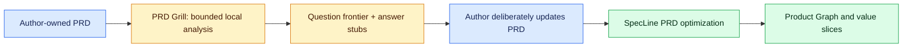

# PRD Grill

PRD Grill is the local clarification pass that runs before PRD optimization,
Product Graph compilation, or app scaffolding. It turns the deterministic gaps
already observed in a source PRD into a small, dependency-safe question
frontier. It does not generate answers, rewrite the PRD, call a model, or grant
implementation, release, or external-effect authority.

```powershell
factory prd grill .\PRD.md --root . --mode quick --json
```

The default **quick** pass asks at most three current questions. **Deep** asks
at most five and includes user-experience-state gaps. Questions are ordered by
their explicit dependencies, so a journey question waits for its primary actor
and an acceptance question waits for a concrete requirement.



## What it writes

For a PRD named `PRD.md`, the command writes only local, source-bound
artifacts below `.factory/prd-grills/<project>/`:

- `<source-digest>.source.md` — an immutable source copy used for verification;
- `<source-digest>.json` — the receipt, observed gaps, selected questions,
  deferred dependencies, local allowlisted repository-file hashes, and authority
  boundary;
- `<source-digest>.md` — the answer sheet with recommendations and answer
  stubs.

The source digest is SHA-256 of the exact UTF-8 input bytes. Re-running the
same PRD reuses its receipt. A changed source produces a different artifact;
`--force` is required only to replace a conflicting artifact at an explicitly
chosen output path.

```powershell
factory prd grill .\PRD.md --root . --mode deep
factory prd verify .\.factory\prd-grills\my-product\<source-digest>.json --json
```

## Review and confirmation boundary

Each question names its target PRD section, observed source evidence, and a
recommended starting point. Recommendations are prompts for a human decision,
not facts or implementation instructions. Deferred questions identify the
question or round limit that blocks them.

After the author updates the source, rerun the pass. A human can record the
limited shared-understanding marker only when the PRD has no observed gaps:

```powershell
factory prd grill .\PRD.md --root . --mode deep --confirm --json
```

`--confirm` never starts implementation. It writes
`PRD_GRILL_SHARED_UNDERSTANDING_CONFIRMED` only; creating a scaffold, executing
a mission, merging, publishing, deploying, signing, sending messages, using
credentials, or granting connectors remains separately governed.

## Recommended path

```powershell
factory prd grill .\PRD.md --root . --mode quick
# Answer the current frontier in PRD.md, then rerun until gaps are resolved.
specline optimize-prd .\PRD.md
factory product compile .\PRD.md --root . --json
factory product slices .\.factory\products\<project>\product_graph.json --root . --json
```

For a first MVP, this saves a novice from discovering essential PRD decisions
only after a scaffold exists. For an experienced team, it makes the unresolved
product contract explicit, source-bound, and reviewable before dependent
automation proceeds.
