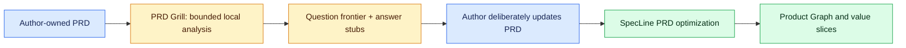

# PRD Grill

## Build an app when you are new to coding

Tell your agent who the app helps and one thing you want those people to do.
Ask it to capture that idea in `PRD.md`, keeping unknown choices explicit.
You do not need to choose a framework or learn CF's internal vocabulary first.

Run `factory prd grill PRD.md --root . --mode deep --json`. The agent reads
`interview.next_question_id` and asks that ready question in everyday language,
with a recommendation and example. You can accept, change, or reject the proposal.
It records your answer in the PRD and reruns clarification before asking a
dependent question. No answer is inferred from silence.

For example, instead of asking you to write an "acceptance contract", it asks:
"After someone saves a note, what should they see?" Your answer becomes a
visible behavior the developer agent must demonstrate. Include the failure
case too: what happens if saving fails, and how can the user recover?

This adapts [Matt Pocock's Grill-Me / grilling](https://github.com/mattpocock/skills/tree/main/skills/productivity/grilling)
decision tree to CF's saved, bounded question frontier. Upstream grilling asks
independent questions in rounds; CF's beginner agent presents one at a time.
Repository facts should be inspected by the agent; product choices stay yours.

Before building, review the first useful journey, expected result, error
recovery, data access and human approval boundaries with your agent. Confirm
shared understanding explicitly. An empty detected frontier means the current
section checks found no gaps; it does not prove the PRD is complete or correct.
The build then follows the existing optimization, compilation, small value
slices and CF/FL audit route below. Findings lead to repair and another check;
missing evidence remains visible. This helps guide development but does not
guarantee a good app or authorize deployment.

PRD Grill is the local clarification pass that runs before PRD optimization,
Product Graph compilation, or app scaffolding. It turns the deterministic gaps
already observed in a source PRD into a small, dependency-safe question
frontier. It does not generate answers, rewrite the PRD, call a model, or grant
implementation, release, or external-effect authority.

```powershell
factory prd grill .\PRD.md --root . --mode quick --json
```

The default **quick** pass asks at most three current questions. **Deep** asks
at most five and includes user-experience-state gaps. Questions are ordered by
their explicit dependencies, so a journey question waits for its primary actor
and an acceptance question waits for a concrete requirement.


```mermaid
flowchart LR
    A["Author-owned PRD"] --> B["PRD Grill: bounded local analysis"]
    B --> C["Question frontier + answer stubs"]
    C --> D["Author deliberately updates PRD"]
    D --> E["SpecLine PRD optimization"]
    E --> F["Product Graph and value slices"]
    classDef source fill:#dbeafe,stroke:#2563eb,color:#172554
    classDef clarify fill:#fef3c7,stroke:#d97706,color:#451a03
    classDef proof fill:#dcfce7,stroke:#16a34a,color:#052e16
    class A,D source
    class B,C clarify
    class E,F proof
```

## What it writes

For a PRD named `PRD.md`, the command writes only local, source-bound
artifacts below `.factory/prd-grills/<project>/`:

- `<source-digest>.source.md` — an immutable source copy used for verification;
- `<source-digest>.json` — the receipt, observed gaps, selected questions,
  deferred dependencies, local allowlisted repository-file hashes, and authority
  boundary;
- `<source-digest>.md` — the answer sheet with recommendations and answer
  stubs.

The source digest is SHA-256 of the exact UTF-8 input bytes. Re-running the
same PRD reuses its receipt. A changed source produces a different artifact;
`--force` is required only to replace a conflicting artifact at an explicitly
chosen output path.

```powershell
factory prd grill .\PRD.md --root . --mode deep
factory prd verify .\.factory\prd-grills\my-product\<source-digest>.json --json
```

## Review and confirmation boundary

Each question names its target PRD section, observed source evidence, and a
recommended starting point. Recommendations are prompts for a human decision,
not facts or implementation instructions. Deferred questions identify the
question or round limit that blocks them.

After the author updates the source, rerun the pass. A human can record the
limited shared-understanding marker only when the PRD has no observed gaps:

```powershell
factory prd grill .\PRD.md --root . --mode deep --confirm --json
```

`--confirm` never starts implementation. It writes
`PRD_GRILL_SHARED_UNDERSTANDING_CONFIRMED` only; creating a scaffold, executing
a mission, merging, publishing, deploying, signing, sending messages, using
credentials, or granting connectors remains separately governed.

## Recommended path

```powershell
factory prd grill .\PRD.md --root . --mode quick
# Answer the current frontier in PRD.md, then rerun until gaps are resolved.
specline optimize-prd .\PRD.md
factory product compile .\PRD.md --root . --json
factory product slices .\.factory\products\<project>\product_graph.json --root . --json
```

For a first MVP, this saves a novice from discovering essential PRD decisions
only after a scaffold exists. For an experienced team, it makes the unresolved
product contract explicit, source-bound, and reviewable before dependent
automation proceeds.
