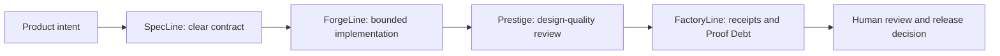

# Prestige Design Review

**Design is part of the review, not a promise that an interface is done.**

Prestige is Code Factory's optional design-quality companion for UI-scoped
work. It helps a builder or reviewer make the visual and interaction decisions
around a change inspectable before the team accepts it.

## What it adds

- A purpose-led design brief, so a developer tool, SaaS interface, or
  marketplace is evaluated against its intended job instead of a generic
  "looks good" standard.
- Reviewer-visible checks for hierarchy, responsive behavior, affordances,
  visual consistency, and declared design tokens.
- A distinction between deterministic findings that can inform a local gate and
  heuristic critique that remains a human review prompt.
- Local adoption artifacts that a team can attach to its own pull-request or
  release process.

Prestige does **not** measure conversion, certify WCAG conformance, replace
usability testing, approve a pull request, publish an interface, or declare a
product production-ready.

## Add the lane deliberately

```powershell
pip install code-factory-4-design
prestige init --root .
prestige pr app.html --design DESIGN.md --root . --out-dir .prestige/pr
```

Use the design document and artifacts as review inputs. For a public UI, run
the design package's strict audit and challenge steps as part of the team's
normal validation policy; do not turn a heuristic critique into an automatic
release decision.

## How it fits FactoryLine

When UI scope is declared and the `prestige` CLI is installed, the FactoryLine
assembly chain includes its design-quality score stage. The resulting receipt
is one piece of a broader proof path:



The design lane is optional because not every feature has a UI. It is never an
authority escalation: Code Factory does not upload source, alter a design,
start a browser session, approve a change, merge, deploy, or publish on its own.

## Use it at the right level

| Situation | Use Prestige for | Keep with the human team |
| --- | --- | --- |
| New MVP screen | Purpose, hierarchy, primary action, responsive review | Product fit and user research |
| Existing UI change | Visible regression and design-token review inputs | Acceptance criteria and release risk |
| Enterprise workflow | A repeatable artifact alongside Proof Debt | Policy, accessibility assessment, security, and merge authority |

For the complete team flow, read the [Teams and Enterprise Operations Manual](ENTERPRISE_TEAMS_OPERATIONS.md).
