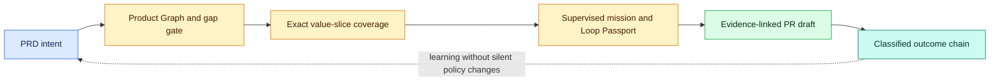

# Product Missions

Product Missions turn a PRD into a reviewable path from requirement to outcome.
The compiler is deterministic and local: it makes no model calls, runs no agent,
and grants no merge, publish, deploy, connector, credential, or external-message
authority.

The optional durable runtime stores accepted mission transitions in a
transactional, hash-linked SQLite ledger. Human pause/revise/resume,
independent validation, hard budget exhaustion, and release decisions remain
explicit events with local receipts. LangGraph can checkpoint the adapter, but
the Code Factory event/receipt chain remains authoritative. See
[Receipt-Backed Mission Graph Operations](LANGGRAPH_OPS.md).


## Why this layer exists

Most coding loops begin with a ticket and end when tests pass. Product Missions
add the missing product-engineering structure:

- **Product Graph:** stable requirement IDs; actors, jobs, pains, desired
  outcomes, journeys, and business rules; functional and non-functional
  requirements; assumptions and unknowns; UX states including accessibility;
  data ownership, trust boundaries, external effects, approvals, and success events.
- **Value slices:** every requirement is assigned exactly once to a bounded,
  dependency-ordered vertical slice joining UI, behavior, API/data, tests,
  observability, and rollback. Priority is a deterministic score over user
  value, uncertainty retired, dependency unlock, security/change risk, and
  implementation/review cost.
- **Mission Passport:** one slice is bound to immutable inputs, hard iteration,
  wall-time, token, and cost ceilings, one branch/worktree, minimal context,
  separate builder/checker/UX-review permissions, and human approval boundaries.
- **No-finish hypotheses:** every completion criterion has a falsifiable
  hypothesis, a verification kind, and a local evidence contract. User-facing
  slices require structured computer-control evidence with exact URL, click
  ceiling, assertions, and hashed screenshots.
- **PR draft:** requirement coverage, local evidence hashes, risk, rollback,
  architecture/data changes, screenshots, responsive and accessibility proof,
  tests, mutations, gates, traces, budgets, security, rollout, rollback,
  outcome events, and unproven claims in one reviewer packet.
- **Outcome chain:** measured, observed, modeled, and unknown evidence stay
  distinct in an append-only hash chain.
- **Meter v2:** local flow time, queue time, review time, rework, cache hits,
  invalidation, exact/estimated/unknown token and cost quality, first-pass rate,
  retries, throughput, escaped defects, rollback, and outcome status remain live
  without converting unknowns to zero.

## CLI quick start

```powershell
factory product compile .\PRD.md --root . --json
factory product slices .\.factory\products\my-product\product_graph.json --root . --json
factory mission create .\.factory\products\my-product\value_slices.json `
  slice-core-12345678 --root . --owner engineering-lead --executor codex --json
factory mission verify .\.factory\missions\my-product-slice-core-12345678\mission.json --json
factory mission decide .\.factory\missions\my-product-slice-core-12345678\mission.json `
  --root . --owner engineering-lead --decision approved_execution `
  --rationale "The bounded slice and budget are ready for execution." --json
factory pr draft .\.factory\missions\my-product-slice-core-12345678\mission.json `
  --root . --evidence .\test-results.json --json
```

Use the emitted `path` and slice `id` fields rather than guessing filenames in
automation. The example names show the artifact layout only.

For a large migration, bind a `factory.migration.readiness.v1` receipt with
`--readiness`. Mission creation fails until all eight readiness lanes have
executed proof; registration alone cannot turn the gate green.

## Product Graph gate

Compilation stops mission creation when the PRD has no testable requirements or
no Gherkin acceptance scenario. Missing actors, journeys, outcomes, ownership,
trust boundaries, approvals, success events, or user-facing loading, empty,
error, success, permission, offline, recovery, and accessibility states are
explicit advisories. They remain visible in the PR draft as unproven claims.

Requirement IDs are stable content hashes unless the PRD supplies an explicit
`REQ-*`, `FR-*`, or `NFR-*` ID. Dependencies come only from explicit requirement
references; proximity and model inference never create hidden ordering.

## Mission authority

Each mission uses the `supervised` governance gradient. The executor label can be
`manual`, `codex`, `copilot`, `claude`, or `custom`, but the label does not start
or authorize that tool. The generated Loop Passport:

- denies network access by default;
- allows repository reads, isolated workspace writes, and tests;
- requires a distinct approver for destructive or external effects;
- caps iterations at 5, wall time at 3,600 seconds, tokens at 100,000, and cost
  at $25; callers may lower but never raise those ceilings;
- binds the Product Graph, value slices, manifest, and passport by SHA-256.
- binds one `codex/<mission>` branch to one `.factory/worktrees/<mission>`
  worktree and records that provisioning itself requires execution approval;
- gives builder, checker, and UX reviewer distinct role permissions and only the
  selected requirement/acceptance context needed for the slice.

Any source, slice, mission, manifest, or passport drift makes verification fail
with `MISSION_INPUT_DRIFT` before a PR packet is generated.

Each retry requires a fresh external adapter session. The Mission allows only
the selected context packet and a hash-bound result summary across attempts;
creator transcripts, hidden reasoning, and failed-attempt history are forbidden.
The deterministic risk map chooses economy, balanced, or frontier capability
tiers without naming a provider, while the Mission's hard cost ceiling remains
authoritative. This is a contract an adapter must attest to, not proof that an
arbitrary model host honored the boundary.

Studio presents the same decision as an approval-ready panel with risk, owner,
budgets, completion criteria, and approve/defer/reject actions. **Auto-resolve
safe gaps** can handle only deterministic local corrections. It cannot invent
requirements, UX intent, acceptance criteria, owner decisions, or release
authority. Every rejection includes its causal stage, reason, evidence, and
next corrective action in `factory.failure_summary.v1`.

## Outcome evidence

```powershell
factory outcome record .\.factory\missions\<id>\mission.json --root . `
  --metric task_completion_rate --value 0.82 --target 0.75 `
  --evidence-class measured --source analytics/run-42 --json
factory outcome summary --root . --mission-id <id> --json
```

`measured` requires a named source. `modeled` and `observed` records never become
measured claims through aggregation. The summary verifies the hash chain and
reports evidence classes separately.

## Studio and IDEs

Run `factory studio`, choose **Product mission**, paste a PRD, and compile. The
same mode is available through **FactoryLine: Open Product Missions** in VS Code
and **Tools > FactoryLine > Open Product Missions** in IntelliJ IDEA, PyCharm,
WebStorm, Rider, CLion, GoLand, RustRover, and DataGrip. Every editor action asks
for workspace confirmation and opens only the loopback Studio URL. Requirement
IDs also receive read-only CodeLens or gutter links into local tests and receipts.

The [complete architecture map](ARCHITECTURE.md) shows how Product Missions
connect to signals, capability packs, migration readiness, independent
verification, release authority, Meter v2, Studio, and both IDE families.



## Scope boundary

Product Missions are a product-planning and evidence layer, not a hosted agent
runtime, autonomous product manager, analytics provider, or release approver.
External execution and promotion stay explicit, independently reviewable human
actions.
