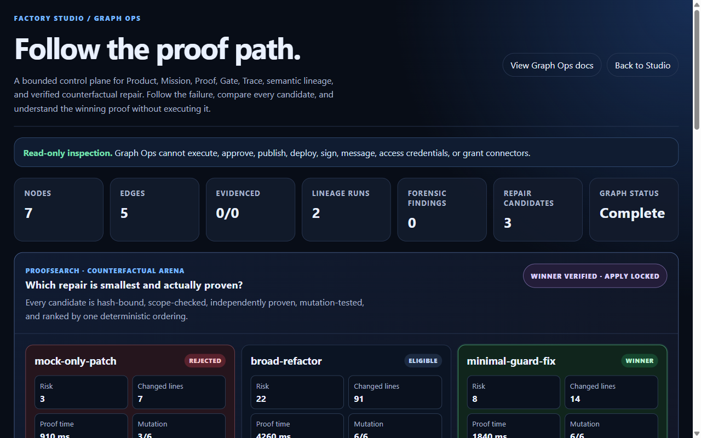
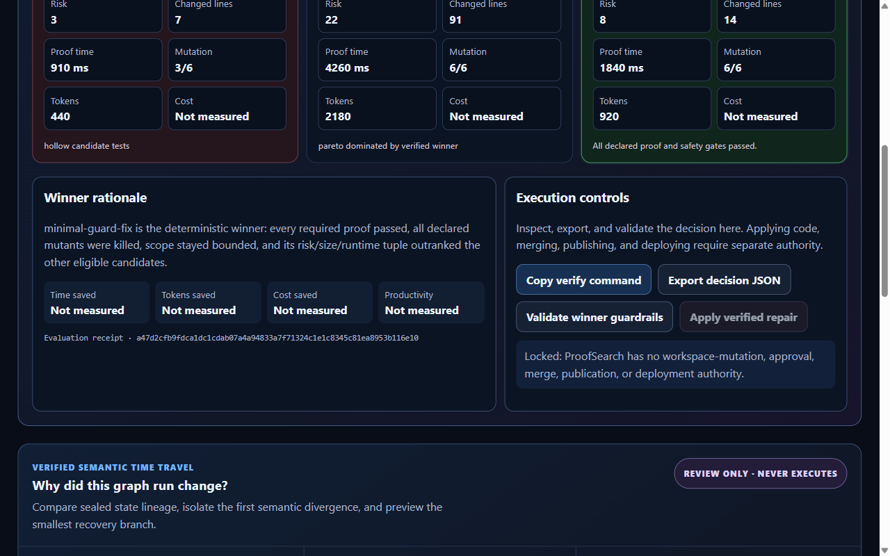
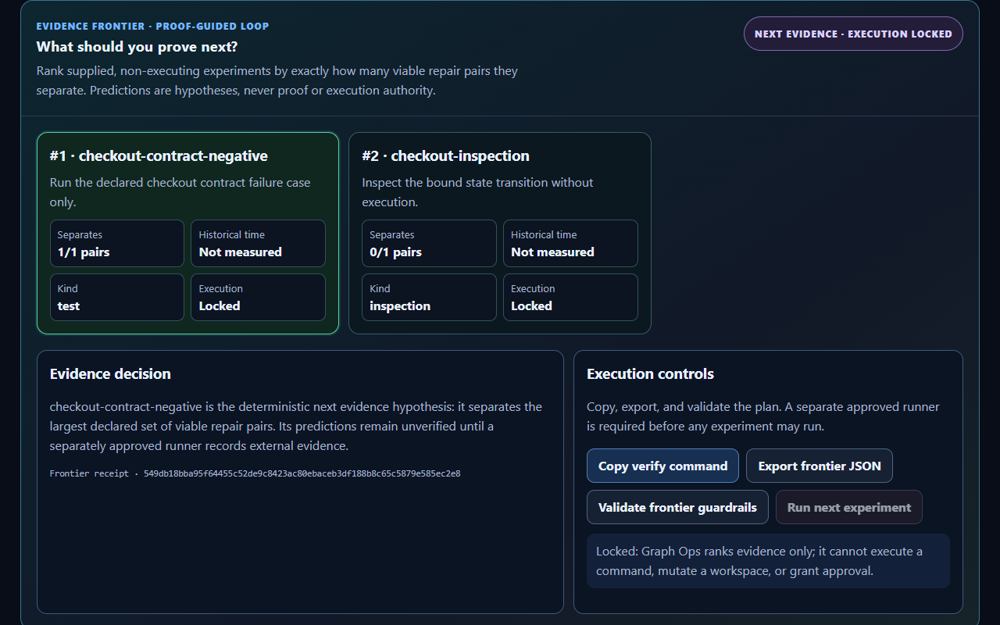
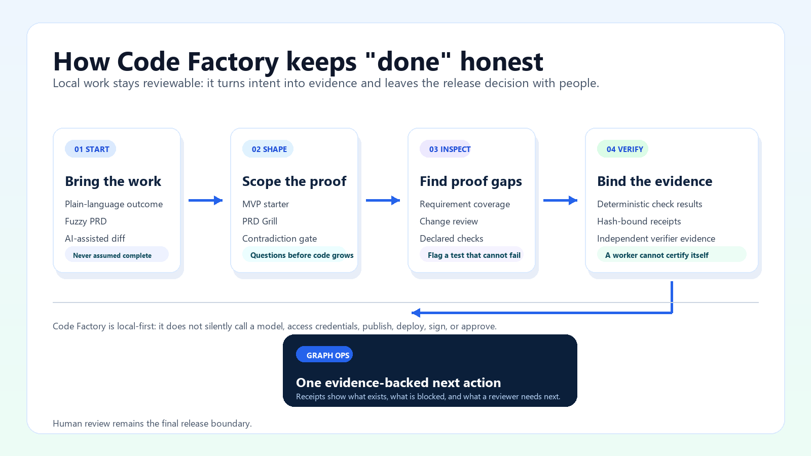

# Current product visuals

This is the approved public visual set for the current Code Factory listing,
GitHub social preview handoff, Hugging Face product page, and explanatory
community posts. Product surfaces use actual local product captures and the
current FactoryLine identity asset—never
concept art, recreated dashboards, or made-up activity counts. The operational
proof loop is explicitly an editorial workflow diagram, never a recreated
product interface.

## 1. FactoryLine identity

Use as the listing logo or product icon. It establishes identity; it does not
claim a Marketplace approval, download count, or readiness result.

## 2. Factory Studio: start an MVP

Use for the first-screen story: describe a local outcome, create a contained
MVP, and keep the authority boundary explicit.

## 3. Graph Ops: compare repair candidates

Use for the second-screen story: Graph Ops reports the evidence state, compares
supplied candidates, and shows the next supported action. It is not a simulated green result;
rejected candidates preserve the incomplete proof state.

## 4. Graph Ops: review the winner controls

Use for the authority story: evidence can be copied, exported, and validated,
while repair application remains visibly locked for human review.

## 5. Graph Ops: choose the next discriminating proof

Use for the loop story: Evidence Frontier ranks supplied, non-executing
experiments by how many viable repair pairs they distinguish. Predictions stay
explicitly unverified, and the UI permits copy, export, and validation only.

## 6. Operational proof loop

Use this **editorial diagram** in articles, comments, and documentation when a
reader needs the workflow before they need a UI walkthrough. It summarizes the
current local-first boundary: Code Factory scopes work, finds proof gaps, binds
supplied evidence, and presents Graph Ops for a human decision. It is not a
product capture, runtime dashboard, or claim that the system independently
publishes, deploys, signs, or approves work.

## Placement rules

- Use the logo plus all four captures, in this order, for Product Hunt or other
  product galleries.
- Use the operational proof loop for explanatory community posts, with the
  caption: "Code Factory turns a prompt, fuzzy PRD, or risky AI-assisted diff
  into inspectable local evidence. The release decision stays with the
  reviewer."
- Use the first Factory Studio capture on a landing page. Use the Graph Ops
  capture only where the proof boundary is explained.
- Use native IDE captures—not these Studio captures—for JetBrains Marketplace
  screenshots. See [the Marketplace screenshot brief](JETBRAINS_MARKETPLACE_SCREENSHOTS.md).
- Do not attach the retired v0.17 walkthrough, blank-dashboard captures, or
  conceptual artwork to a current release or public listing.

The captures show product behavior. They are not evidence of time, token, cost,
productivity, conversion, Marketplace approval, or production readiness.
