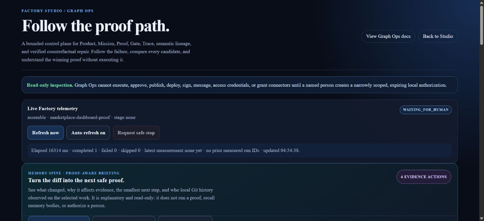
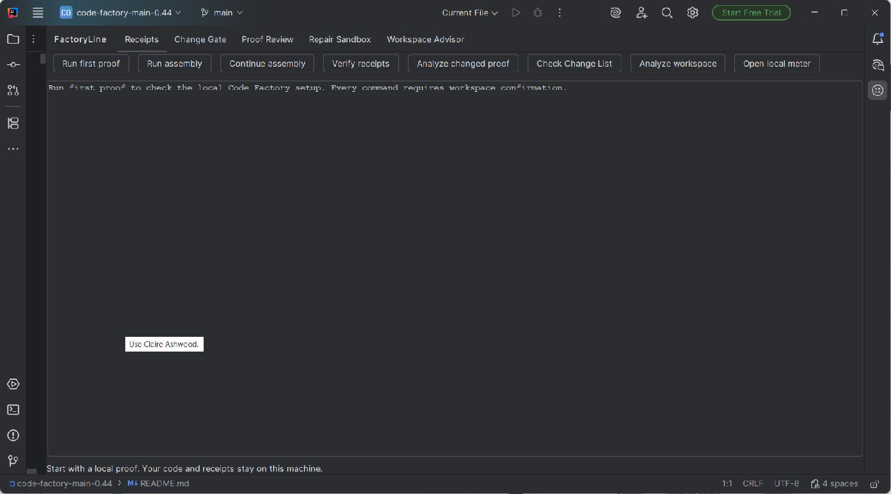
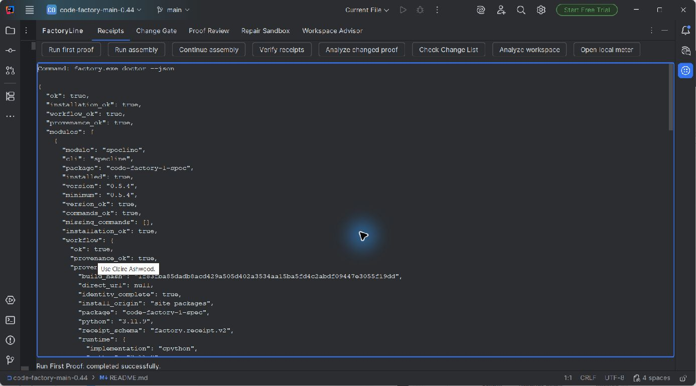

# Current product visuals

This is the approved public visual set for FactoryLine 0.44 and FactoryLine AI
Proof 0.8.19 across the current Code Factory listing,
GitHub social preview handoff, Hugging Face product page, and explanatory
community posts. Product surfaces use actual local product captures and the
current FactoryLine identity asset—never
concept art, recreated dashboards, or made-up activity counts. The operational
proof loop is explicitly an editorial workflow diagram, never a recreated
product interface.

## 1. FactoryLine identity

Use as the listing logo or product icon. It establishes identity; it does not
claim a Marketplace approval, download count, or readiness result.

## 2. Graph Ops: full lineage and forensic dashboard

The GitHub README leads with this actual dashboard capture. It shows a bounded
local result and a proposed recovery path whose execution remains locked.

### Updated audit and individual test results

This current local capture shows the new labeled audit surface and individual
test reporting. A missing scan or signed lane result remains marked not run;
the JUnit report is local and has no current-candidate binding.

### Supplement: FactoryLine 0.44 live Assembly telemetry

The GitHub README includes this labeled explainer only as a supplement. The
labels were added to the actual capture below; use the original when exact UI
pixels are required.

Use for the current operations story: follow a local Assembly, see its exact
waiting boundary, and turn changed work into evidence-backed next actions.

## 3. Personal 60-day case study

Use only as a one-user case study. The observed metadata and modeled capacity
range are visually separated; neither is a universal benchmark or guaranteed
ROI claim.

## 4. FactoryLine AI Proof 0.8.19: complete IDE controls

Use for the JetBrains capability story: the current control surface shows the
complete local workflow without implying that every action has already run.

## 5. FactoryLine AI Proof 0.8.19: local IDE proof

Use for the JetBrains story: the real IDE tool window, explicit controls, local
JSON result, and successful First Proof status are visible together.

## 6. Factory Studio: start an MVP

Use for the first-screen story: describe a local outcome, create a contained
MVP, and keep the authority boundary explicit.

## 7. Graph Ops: compare repair candidates

Use for the second-screen story: Graph Ops reports the evidence state, compares
supplied candidates, and shows the next supported action. It is not a simulated green result;
rejected candidates preserve the incomplete proof state.

## 8. Graph Ops: review the winner controls

Use for the authority story: evidence can be copied, exported, and validated,
while repair application remains visibly locked for human review.

## 9. Graph Ops: choose the next discriminating proof

Use for the loop story: Evidence Frontier ranks supplied, non-executing
experiments by how many viable repair pairs they distinguish. Predictions stay
explicitly unverified, and the UI permits copy, export, and validation only.

## 10. Operational proof loop

Use this **editorial diagram** in articles, comments, and documentation when a
reader needs the workflow before they need a UI walkthrough. It summarizes the
current local-first boundary: Code Factory scopes work, finds proof gaps, binds
supplied evidence, and presents Graph Ops for a human decision. It is not a
product capture, runtime dashboard, or claim that the system independently
publishes, deploys, signs, or approves work.

## Placement rules

- Use the logo plus all four captures, in this order, for Product Hunt or other
  product galleries.
- Use the operational proof loop for explanatory community posts, with the
  caption: "Code Factory turns a prompt, fuzzy PRD, or risky AI-assisted diff
  into inspectable local evidence. The release decision stays with the
  reviewer."
- Use the first Factory Studio capture on a landing page. Use the Graph Ops
  capture only where the proof boundary is explained.
- Lead the JetBrains Marketplace gallery with the current IDE capture, then use
  the current 0.44 live dashboard to show the broader local operations surface.
  See [the Marketplace screenshot brief](JETBRAINS_MARKETPLACE_SCREENSHOTS.md).
- Do not attach the retired v0.17 walkthrough, blank-dashboard captures, or
  conceptual artwork to a current release or public listing.

The captures show product behavior. They are not evidence of time, token, cost,
productivity, conversion, Marketplace approval, or production readiness.
