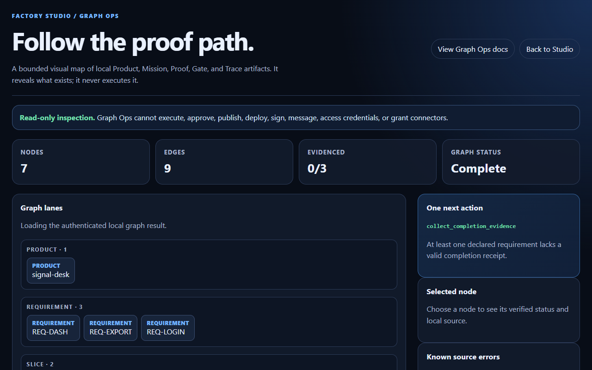

# Current product visuals

This is the only approved public visual set for the current Code Factory
listing, GitHub social preview handoff, and Hugging Face product page. It uses
actual local product captures and the current FactoryLine identity asset—never
concept art, recreated dashboards, or made-up activity counts.

## 1. FactoryLine identity

Use as the listing logo or product icon. It establishes identity; it does not
claim a Marketplace approval, download count, or readiness result.

## 2. Factory Studio: start an MVP

Use for the first-screen story: describe a local outcome, create a contained
MVP, and keep the authority boundary explicit.

## 3. Factory Studio: inspect the proof path

Use for the second-screen story: Graph Ops reports the evidence state and the
next supported action. The capture intentionally includes an incomplete proof state;
it is not a simulated green result.

## Placement rules

- Use the logo plus both captures, in this order, for Product Hunt or other
  product galleries.
- Use the first Factory Studio capture on a landing page. Use the Graph Ops
  capture only where the proof boundary is explained.
- Use native IDE captures—not these Studio captures—for JetBrains Marketplace
  screenshots. See [the Marketplace screenshot brief](JETBRAINS_MARKETPLACE_SCREENSHOTS.md).
- Do not attach the retired v0.17 walkthrough, blank-dashboard captures, or
  conceptual artwork to a current release or public listing.

The captures show product behavior. They are not evidence of time, token, cost,
productivity, conversion, Marketplace approval, or production readiness.
