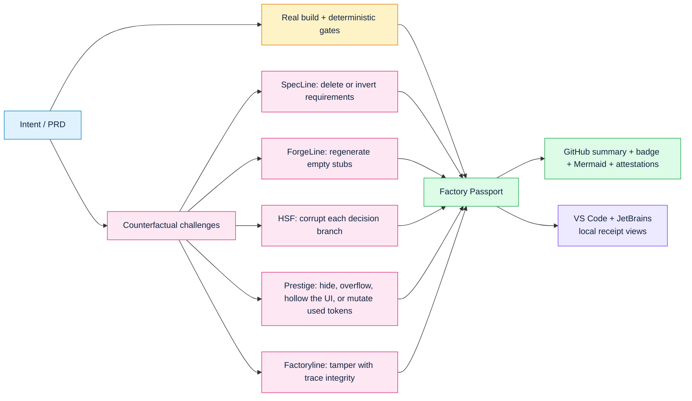

# ProofLab and the Factory Passport

Most CI proves that the current code passes. ProofLab first proves that each
gate rejects a deliberately sabotaged version. The resulting Factory Passport
hash-links the real trace, counterfactual challenge receipts, a badge, and this
Mermaid proof graph.



The diagram is also generated for every run as
`.factory/passports/<feature>.passport.mmd`. It is evidence-owned: challenge
counts and brick labels come from the same receipts as the JSON passport.

For UI work, the `prestige:design_tokens` receipt also proves the committed
`DESIGN.md` contract catches removal of every CSS token the page exercises.
ProofLab uses the interoperable YAML-front-matter form of
[`DESIGN.md`](https://github.com/google-labs-code/design.md); Prestige retains
support for its earlier fenced-JSON contracts.

## Commands

```bash
specline challenge checkout --out .factory/challenges/specline.json
forge challenge checkout checkout.ssat.yaml --out .factory/challenges/forgeline.json
hsf challenge specs/checkout.yaml --output .factory/challenges/hsf.json
prestige challenge app.html --feature checkout --out .factory/challenges/prestige.json
prestige tokens lint app.html --design DESIGN.md --strict
prestige verify-tokens app.html --design DESIGN.md --out .factory/challenges/prestige-tokens.json
factory challenge checkout --trace .factory/traces/checkout.trace.json --out .factory/challenges/factoryline.json

factory passport checkout \
  --trace .factory/traces/checkout.trace.json \
  --challenge .factory/challenges/specline.json \
  --challenge .factory/challenges/forgeline.json \
  --challenge .factory/challenges/hsf.json \
  --challenge .factory/challenges/prestige.json \
  --challenge .factory/challenges/prestige-tokens.json \
  --challenge .factory/challenges/factoryline.json

factory verify-passport .factory/passports/checkout.passport.json
```

A passport proves only what its receipts observed. It does not grant merge,
deployment, publication, or production authority.

## One decision for reviewers

`factory verify <feature> --root <root>` summarizes the receipts already
present for the feature into `SPEC`, `FORGE`, `COMPILE`, `DESIGN`, and
`FACTORY` status lines plus one executable next action. It refuses to call a
feature shippable when required receipts are absent. It does not run missing
gates or grant merge authority.

For UI work, pair it with Prestige's adoption artifacts:

```bash
prestige init --root . --out DESIGN.md
prestige pr app.html --design DESIGN.md --root . --out-dir .prestige/pr
factory verify checkout --root .
```

See the [Prestige adoption guide](https://github.com/zrk222/code-factory-4-design/blob/main/docs/ADOPTION.md)
for CI templates, the static proof viewer, and the benchmark evidence boundary.
