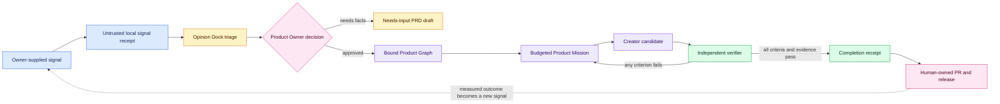

# Signal Loop

Signal Loop turns supplied environmental evidence into an owner-approved Product
Graph without turning external content into instructions or granting deployment
authority. It is the local control layer between incoming signals and Product
Missions.


## Control flow



See [Code Factory Architecture](ARCHITECTURE.md) for the full cross-component
topology and live control-room interaction map.

## Quick start

```powershell
factory opinion init --root . --owner product-owner --json
factory signal capture --root . --source github --authorization owner_supplied `
  --title "Export audit evidence" --body "Operators need a local export." `
  --requirement "REQ-EXPORT: The operator must export a selected audit report." `
  --outcome "Reduce manual audit preparation time." `
  --acceptance "Scenario: Export report`n  Given an operator`n  When export runs`n  Then the audit report is written" --json
factory signal triage <signal.json> <opinion_dock.json> --root . --json
factory signal decide <triage.json> --root . --owner product-owner `
  --decision approved --rationale "The supplied outcome and acceptance are testable." --json
factory signal promote <decision.json> --root . --json
```

Use the emitted paths. A complete approved signal produces only a Product Graph;
execution still needs a separately approved mission. An incomplete approved
signal produces a needs-input draft and no mission.

After deployment, measured evidence can re-enter the same local queue without
granting a connector or scheduler:

```powershell
factory signal feedback --root . --mission-id <id> `
  --metric completion_rate --observed 0.72 --target 0.80 `
  --evidence .\artifacts\telemetry.json --json
```

The feedback receipt binds the evidence hash and resulting telemetry signal.
It still requires normal Opinion Dock triage and Product Owner approval.

## Opinion Dock

The Opinion Dock is a compact, owner-controlled cognitive anchor with a hard
2,000-line limit. Each rule declares its type, statement, match terms, weight,
and action. Corrections replace the active rule while appending the previous
rule hash, new rule hash, rationale, owner, and correction-chain hash.

Actions are deterministic:

- `consider`: contribute to the explainable score;
- `review`: raise the reasoning profile while retaining owner control;
- `block`: enforce a hands-off recommendation that needs an explicit named
  owner override before approval.

Routing profiles are abstract (`economy`, `balanced`, `critical`). They do not
name, invoke, purchase, or benchmark a provider. Runtime model mapping belongs
to a separately authorized adapter with measured quality and cost evidence.

## Independent completion

The mission declares exact completion criteria. A validator manifest must name
different creator and verifier identities and may expose only the mission,
candidate diff, evidence manifest, test output, browser artifacts, and
architecture receipts. Creator scratchpads, hidden reasoning, conversation
history, and intermediate failed attempts remain outside the verifier context.

```powershell
factory mission close <mission.json> <validation.json> --root . --json
factory mission verify-completion <completion.json> --json
```

Completion fails closed when a criterion is missing, duplicated, false, lacks
evidence, points outside the workspace, or when any bound artifact later drifts.
The receipt confirms declared completion evidence only; it cannot merge,
publish, deploy, send messages, or authorize connectors.

## Connector and autonomy boundary

Slack, GitHub, Sentry, social, telemetry, and internal-conversation values are
accepted only through explicit local capture. This release does not scrape,
poll, schedule, message, or authenticate those services. Production connector
adapters must add entitlement checks, provenance, rate limits, secret handling,
egress controls, and separate approval before they can supply signals.

AutoWiki and Lore now generate local, Git-tracked context plus a planned video
storyboard through `factory context build`; no video is claimed until an
authorized renderer and TTS provider succeed. Continuous authenticated polling
remains an adapter responsibility. Competitive or threatening prompts are not
governance. Hard budgets, independent roles, mutation-tested validators, and
hash-bound evidence are the controls.
