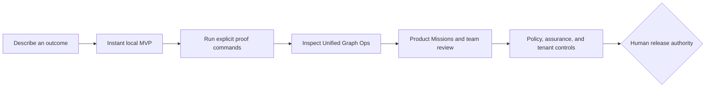

# Start Here: from idea to enterprise evidence

Code Factory uses one local evidence model at every level. You can begin with
an outcome instead of a framework, then add rigor only when the work needs it.



## 1. Instant MVP — no factory vocabulary required

```powershell
factory mvp "Build an approval tracker for a small team" --root .
```

This produces one contained web starter in `./my-mvp`, explains its explicit
next proof commands, and leaves deploy, publish, credentials, connectors, and
messages unavailable. Open `factory studio --root .` for the same outcome-first
flow; **Instant MVP** is its default mode.

If you already have a PRD, clarify its current unknowns before scaffolding:

```powershell
factory prd grill .\PRD.md --root . --mode quick
```

The local answer sheet is source-bound and capped at three current questions;
it does not modify the PRD or grant build authority. See [PRD Grill](PRD_GRILL.md).

The starter is deliberately `compiled_blocked`: it is useful code and a
concrete product shape, not an unsupported claim that it is production-ready.

## 2. Professional workflow — proof without slowing down

Use the same project directory to add requirements, test coverage, proof reuse,
and a clear stateful next action:

```powershell
factory coverage --root .\my-mvp --json
factory graph ops --root .\my-mvp --json
factory graph ops --root .\my-mvp --mermaid
```

Graph Ops gives a bounded, read-only map of the facts already present. It can
recommend the next validation or evidence step but never runs it on your
behalf. Use `factory continue`, Product Missions, and content-addressed proof
reuse when the project needs more structured delivery.

## 3. Enterprise controls — add governance, not friction

Teams can retain the exact same traceability while adding independent
verification, approval boundaries, signed capability packs, policy challenges,
tenant-scoped evidence, and supervised hosted adapters. These controls do not
turn a local MVP into an autonomous publisher: merge, publish, deploy, signing,
credentials, connectors, and external messages remain explicitly human-owned.

## What Code Factory will and will not optimize

The factory optimizes for a small, fact-derived next action, reuse of verified
read-only proof, and less reconstruction of context. It does not claim time,
token, cost, productivity, conversion, security certification, or production
readiness without a corresponding measured or hash-bound receipt.
