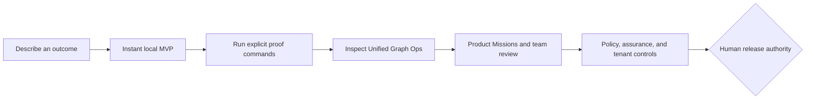

# Start Here: from idea to enterprise evidence

Code Factory uses one local evidence model at every level. You can begin with
an outcome instead of a framework, then add rigor only when the work needs it.

## 0. Run your first repository scan

```powershell
pip install factoryline-code-factory
factory scan --root .
```

This is the zero-config starting point for an existing repository. It records
relative file metadata and reads eligible Python source for bounded AST security
and test-oracle analysis. Add `--deep` to run every applicable local audit lane.
Quality findings are actionable review items, distinct from high-risk security
patterns or analyzer failures. Missing project test, dependency, tenant-scope,
and runtime evidence remains incomplete. It does not execute, modify, or upload
project source unless you explicitly configure native workers.

You do not need ForgeLine, a feature contract, or a prior adoption step to run
this scan. Add deeper workflow structure only when you want it.

To see the sealed demonstration in a disposable local sandbox, run:

```powershell
factory first-proof --root .
```

The positive control must pass; the negative control is intentionally hollow
and must be caught as `HOLLOW_E2E_TEST`. A successful demo writes verified
JSON/Markdown evidence plus an optional, privacy-safe Proof Card under
`.factory/`. It does not execute or certify the repository.

To share a card from another verified E2E receipt, opt in explicitly:

```powershell
factory proof-card .factory/e2e-proof/<receipt>.json --root .
```

The card contains only the bounded result and source-receipt hash. Commands,
paths, repository names, prompts, logs, and user identity are excluded.


```mermaid
flowchart LR
    I["Describe an outcome"] --> M["Instant local MVP"]
    M --> V["Run explicit proof commands"]
    V --> G["Inspect Unified Graph Ops"]
    G --> T["Product Missions and team review"]
    T --> E["Policy, assurance, and tenant controls"]
    E --> H{"Human release authority"}
```

## 1. Instant MVP — no factory vocabulary required

```powershell
factory mvp "Build an approval tracker for a small team" --root .
```

This produces one contained web starter in `./my-mvp`, explains its explicit
next proof commands, and leaves deploy, publish, credentials, connectors, and
messages unavailable. Open `factory studio --root .` for the same outcome-first
flow; **Instant MVP** is its default mode.

If you already have a PRD, clarify its current unknowns before scaffolding:

```powershell
factory prd grill .\PRD.md --root . --mode quick
```

The local answer sheet is source-bound and capped at three current questions;
it does not modify the PRD or grant build authority. See [PRD Grill](PRD_GRILL.md).

The starter is deliberately `compiled_blocked`: it is useful code and a
concrete product shape, not an unsupported claim that it is production-ready.

## Terms in plain language

| Term | Meaning in Code Factory |
|---|---|
| **Intent** | A short statement of the goal, non-goals, and failure conditions. It explains why a change is being made; it is not required for the first scan. |
| **SSAT** | State Space Adoption Tree: a feature-level contract for expected states, requirements, architecture, and proof gates. Review it before using it to structure existing work. |
| **DAG** | Directed acyclic graph: a dependency map with no circular steps. Code Factory uses one to show a safe order for checks; the map does not run them. |
| **Verifier Plane** | A receipt-based check of evidence from a worker and a separate verifier. Code Factory validates the supplied evidence; an external runner must actually execute and isolate those agents. |

ForgeLine is the deeper feature workflow and architecture engine. It is an
optional next step after the simple repository scan, not a prerequisite for
trying Code Factory.

## Adopt an existing project only when you want feature tracking

The non-invasive inventory above is enough to explore. For a feature-scoped
baseline, follow [First Use on an Existing Repository](FIRST_USE.md). That path
records a reviewed contract; it does not claim Code Factory created your
existing code. Review the generated SSAT before continuing. The
`forge architect ... --adopt-existing` mode checks current target hashes and
creates only missing targets. Avoid `--force` during adoption:
`forge architect --force` overwrites existing targets after creating backups.
Use `--dry-run` first when you need to inspect proposed scaffold operations.

## 2. Professional workflow — proof without slowing down

Use the same project directory to add requirements, test coverage, proof reuse,
and a clear stateful next action:

```powershell
factory coverage --root .\my-mvp --json
factory graph ops --root .\my-mvp --json
factory graph ops --root .\my-mvp --mermaid
factory graph portfolio --root .\my-mvp --json
```

Graph Ops gives a bounded, read-only map of the facts already present. It can
recommend the next validation or evidence step but never runs it on your
behalf. Use `factory continue`, Product Missions, and content-addressed proof
reuse when the project needs more structured delivery.

For work where a passing happy-path test is not enough, add three small,
deterministic planning layers: compile the negative cases your requirements must
reject, activate only independently promoted and scope-matched memory metadata
as a redacted guardrail, and derive stateful replay risks from sealed lineage.
They remain plans, not execution authority. See [Counterexamples, Guardrails,
and Temporal Resilience](COUNTEREXAMPLE_GUARDRAIL_RESILIENCE.md).

When several proof or delivery slices exist, use `factory graph portfolio` to
see the deterministic critical path, safe proposal-only parallel waves, and
blocker chains. Teams that use an external harness can seal a short-lived Run
Admission Packet from a reviewed Loop Passport; the harness must re-verify it
before use. See [Graph Portfolio and Run Admission](GRAPH_PORTFOLIO_ADMISSION.md).

## 3. Enterprise controls — add governance, not friction

Teams can retain the exact same traceability while adding independent
verification, approval boundaries, signed capability packs, policy challenges,
tenant-scoped evidence, and supervised hosted adapters. These controls do not
turn a local MVP into an autonomous publisher: merge, publish, deploy, signing,
credentials, connectors, and external messages remain explicitly human-owned.

## CI/CD integration: what is supported

The CLI can run in a build job, but a successful process exit is not the same
as a passing audit: an honest `INCOMPLETE` result can exit successfully. Save
the JSON output and have pipeline policy inspect its `state` and `verdict`; do
not promote `INCOMPLETE` or `NOT_RUN` to green. For a custom runner, the
deep-scan entry point is:

```powershell
factory scan --root . --deep --json > factory-scan.json
```

Retain `factory-scan.json` as a job artifact and make the pipeline's gate policy
explicit; the command's exit code alone is insufficient.

GitHub Actions is the maintained first-party integration in this repository.
`factory ci init --feature <feature>` writes a simple opt-in pull-request
comment and JSON-artifact workflow; it is not a release gate. The documented
proof-review workflow can also produce a neutral GitHub Check and a hash-bound
PR walkthrough; it does not approve or merge. The signed-receipts workflow
demonstrates CI-generated receipts and Sigstore verification against the
expected workflow identity. See [GitHub Proof
Review](GITHUB_PROOF_REVIEW.md) and [Signed Factory
Receipts](SIGNED_RECEIPTS.md).

This repository does not currently provide maintained Jenkins or GitLab CI
templates. Those systems can invoke the CLI as a custom job, but the team must
define its own JSON-result policy and artifact retention. Do not treat a local
receipt as CI-signed evidence or a release approval; add and verify the
provider's identity and signing boundary separately.

## Experimental Jev evidence review

The optional Node.js trial runner compares a frozen labelled corpus with
`typesafe-ai/jev` through Vercel AI Gateway. It evaluates defect support and
evidence sufficiency separately. It can review a CF finding or compare a report
with raw source and execution observations. Expected labels are not sent to the
model; missing evidence, uncertain answers and transport failures stay unresolved.

From a source checkout, prepare cases as a JSON array of
`{id, category, expected, state}` records. `state` can contain `requirement`,
`candidate`, `evidence` and `cf_output`. The packaged judging framework defines
the evidence and evaluation protocol:

```powershell
node scripts/evaluate_jev.mjs --cases cases.json --rubric factoryline/data/judge_framework.json --out trial-dry-run.json
```

This defaults to no network and reports `NOT_RUN`. Add `--live` only when you
intend to transmit the supplied evidence and have configured
`AI_GATEWAY_API_KEY`. Live calls request zero data retention and restrict the
provider to TypeSafe AI. The runner records costs only when the provider reports
them; it cannot independently verify provider retention or immutable model weights.

Freeze development and holdout cases separately, retain disagreements, and
compare precision, recall, abstentions and coverage by audit category. Confidence
is not correctness. The trial cannot override scanner findings, approve a release
or establish production accuracy. The wheel includes the runner under
`share/code-factory/evaluation` and the framework in `factoryline/data`.

## Measured optimization

Repeated scans in the same Python process reuse source-bound oracle context.
This local cache expires after five minutes and is limited to 16 entries and
4 MiB. Every scan still reads and verifies current sources and recomputes
findings; it does not reuse verdicts. Separate CLI processes do not share it.
Python callers can pass `cache_enabled=False` to `security_scan` for comparison.

The factory optimizes for a small, fact-derived next action, reuse of verified
read-only proof, and less reconstruction of context. It does not claim time,
token, cost, productivity, conversion, security certification, or production
readiness without a corresponding measured or hash-bound receipt.
