# Regulated automation opportunity portfolio

## Selection method

The first wave is ranked by a deterministic product score: regulatory urgency and evidence fit receive the highest weights, followed by source fragmentation and workflow repeatability, then current integration readiness. The scoring registry is implemented in `src/regulatedOpportunities.ts`; it is a product prioritization aid, not a claim of measured market size.

| Priority lane | Why Agent Oven fits | Initial buyer |
|---|---|---|
| Trade Compliance Command | Party, goods, route, end-use, license, tariff, and official-list evidence must be reconciled repeatedly | Exporters, manufacturers, logistics, marketplaces |
| Environmental Obligation Monitor | Facility identity, permits, rules, monitoring, enforcement, GIS, and deadlines are split across programs and governments | Industrial operators, utilities, consultants, lenders |
| Provider Credentialing Sentinel | Identity, enrollment, licenses, exclusions, privileges, insurance, and certifications are different facts from different authorities | Health systems, payers, staffing and virtual-care networks |
| Drug Safety Signal Desk | Product identity must be resolved across adverse events, labels, approvals, recalls, shortages, and internal cases | Life-science safety and regulatory teams |
| Food Recall Response Desk | The regulator signal is only the start; response requires lot genealogy, supplier, inventory, shipment, site, and customer coordination | Manufacturers, distributors, retailers, food services |
| UAS Mission Compliance | Flight legality and safety are time-and-place dependent across dynamic airspace, authorization, weather, pilot, aircraft, and site facts | Commercial drone fleets and operators |
| Energy Interconnection Navigator | Utilities, tariffs, queues, hosting capacity, land, permits, incentives, engineering, and schedules change independently | Distributed-energy developers and site owners |
| Chemical & Workplace Compliance | Chemical identity, SDS, tasks, quantities, worker roles, exposure rules, controls, training, incidents, and waste duties meet at the site | Manufacturing, laboratories, construction, warehousing |

## Common novice experience

Each recipe uses the same six-part interaction contract:

1. **Choose an outcome**, such as “check a new trading party” or “prepare tomorrow’s flight.”
2. **Answer four business questions** in plain language. The user never selects orchestration primitives.
3. **Connect where the facts live** using least-privilege, purpose-scoped connectors.
4. **Preview the work line**, including source checks, contradictions, and the named decision owner.
5. **Run in proposal mode**. The agent prepares evidence and recommendations but cannot grant regulated approval.
6. **Monitor the approved facts**. A material source or business-data change invalidates the dependent decision and opens a bounded re-review.

Every preset automation declares:

- a business trigger;
- four bounded processing stages;
- the accountable human role;
- the exact deliverable;
- at least three stop conditions.

The implementation is in `src/templateAutomationPacks.ts` and appears under **Included automations** in the recipe catalog.

## Source evidence supporting the lanes

### Trade controls

The U.S. Consolidated Screening List combines multiple Commerce, State, and Treasury restricted-party lists and offers an API, but it explicitly requires further due diligence and checking official publications before action. That is precisely why the automation produces a review packet rather than an automatic clearance. See the [International Trade Administration CSL](https://www.trade.gov/consolidated-screening-list).

### Environmental compliance

EPA ECHO exposes facility, air, water, waste, enforcement, discharge, and related services sourced from multiple national systems. The Agent Oven value is resolving the facility and obligations, linking evidence owners, and preserving program-specific limitations. See [EPA ECHO web services](https://echo.epa.gov/tools/web-services).

### Provider credentialing

CMS states that issuance of an NPI does not validate licensure or credentialing. NPPES, PECOS/public enrollment, exclusions, licensing boards, privileges, insurance, and certifications must remain separate evidence classes. See [CMS NPPES files](https://download.cms.gov/nppes/NPI_Files.html) and [CMS provider enrollment](https://www.cms.gov/medicare/enrollment-renewal/providers-suppliers/chain-ownership-system-pecos).

### Drug and device safety

openFDA exposes distinct APIs for adverse events, labeling, product identifiers, approvals, recalls, shortages, and other datasets. FDA also warns that the public data is not validated for clinical use and must not drive medical decisions. The automation therefore assists qualified safety review rather than asserting causation. See [openFDA APIs](https://open.fda.gov/apis/) and [drug endpoints](https://open.fda.gov/apis/drug/).

### Food recall response

USDA FSIS provides a structured recall API, while CFIA explains that a recall incident may generate multiple downstream recalls and that industry is responsible for effective product removal under CFIA oversight. Internal traceability and completion evidence are therefore as important as the initial alert. See the [FSIS Recall API](https://www.fsis.usda.gov/science-data/developer-resources/recall-api) and [CFIA recall statistics and process](https://inspection.canada.ca/en/food-safety-consumers/canadas-food-safety-system/food-recall-incidents-and-food-recalls).

### UAS operations

FAA LAANC evaluates authorization requests using facility maps, airspace classes, special-use airspace, TFRs, and NOTAMs. FAA also warns that a facility map is a planning aid, not authorization. The Agent Oven workflow rechecks dynamic sources and leaves go/no-go authority with the remote pilot. See [FAA LAANC](https://www.faa.gov/uas/getting_started/laanc) and the [UAS Facility Map FAQ](https://www.faa.gov/uas/commercial_operators/uas_facility_maps/faq).

## Product architecture

```mermaid
flowchart LR
    Event[Business or regulator event] --> Resolve[Resolve entities, products, sites, and jurisdiction]
    Resolve --> Sources[Retrieve approved primary and operational sources]
    Sources --> Normalize[Normalize without erasing source meaning]
    Normalize --> Reconcile[Detect conflicts, gaps, staleness, and changes]
    Reconcile --> Packet[Build decision packet and next actions]
    Packet --> Human[Named qualified human decides]
    Human --> Receipt[Digest-bound decision and evidence receipt]
    Receipt --> Watch[Watch only the facts that decision depends on]
    Watch -->|Material change| Resolve
```

## Build order

1. Launch Trade Compliance Command and Food Recall Response first: public authoritative sources are comparatively accessible and workflows have crisp transaction/incident boundaries.
2. Pilot Environmental Obligations and UAS with a small jurisdiction and operating footprint because local and dynamic source adapters require careful golden fixtures.
3. Launch Provider Credentialing and Drug Safety only with design partners and qualified reviewers because identity resolution, licensed sources, privacy, and adverse-action handling raise the implementation burden.
4. Add Energy Interconnection and Chemical/Workplace packs after utility/site and SDS/EHS connector partnerships are secured.

No lane should be marketed as autonomous compliance. Agent Oven sells faster evidence assembly, continuous monitoring, accountable coordination, and reproducible decisions.
